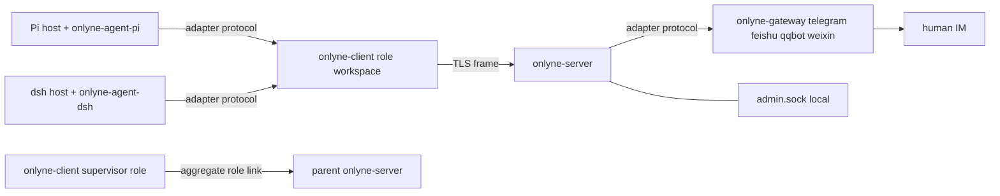

# Onlyne

Onlyne is a local channel and routing layer for agents: `onlyne-server` routes messages and holds the ledger, `onlyne-client` runs one role's sessions per workspace, `onlyne-gateway` translates one chat platform, and coding-agent plugins attach over one adapter protocol.

中文说明见 [README.zh-CN.md](README.zh-CN.md).

## Process picture



## Binaries

- `onlyne-server`: server-root daemon for spec loading, routing, ledger state, faults, admin socket, gateway hosting, and workspace generation.
- `onlyne-client`: workspace daemon for one role, session lifecycle, process backend, local intents, and agent adapter socket.
- `onlyne-gateway`: platform process for one IM gateway, run as `onlyne-gateway --platform telegram|feishu|qqbot|weixin --server-root <dir>`.
- `onlyne`: thin human entrypoint for daemon execs, socket commands, message verbs, status, watch, repair, generate, and completions.
- `onlyne-tui`: ratatui observation TUI over the admin socket, with a live role network graph and a swarm-style history and per-task detail page.
- `onlyne-agent-fake`: testkit artifact used by e2e verification.
- v1.0.0 refuses legacy workspace layouts, unsupported schemas, and old wire formats with hard errors. No migration tool ships.

## Quickstart

```bash
set -euo pipefail
cargo build --workspace
SRC=$(pwd); tmp=$(mktemp -d)
"$SRC/target/debug/onlyne-server" init --root "$tmp/server" \
  --listen 127.0.0.1:7899
"$SRC/target/debug/onlyne-server" run --root "$tmp/server" &
"$SRC/target/debug/onlyne" --server-root "$tmp/server" wait-ready
"$SRC/target/debug/onlyne-client" init --workspace "$tmp/planner" --role planner \
  --server-root "$tmp/server" > "$tmp/planner.spec.toml"
cat "$tmp/planner.spec.toml" >> "$tmp/server/.onlyne/spec.toml"
"$SRC/target/debug/onlyne" --server-root "$tmp/server" reload
"$SRC/target/debug/onlyne-client" run --workspace "$tmp/planner" &
"$SRC/target/debug/onlyne-agent-fake" --workspace "$tmp/planner" --script \
  "$SRC/crates/onlyne-testkit/scripts/echo-complete.json" &
"$SRC/target/debug/onlyne" --server-root "$tmp/server" send --from planner --to planner --text "hello v1"
```

Expected result of plan verification case 1: `send` prints one JSON response with `ok = true`, a UUID task, and `data.state = "in_flight"`; the ledger for that task reaches `acked`, and the session projection reaches `public_lifecycle = "exited"` with `outcome = "done"`. The landed `crates/onlyne-testkit/e2e/local-task.sh` drives that sequence against server, client, fake agent, `ledger`, and `sessions`.

## Directory layout

Server root selected by `onlyne-server run --root <dir>`:

```text
<server-root>/.onlyne/
  spec.toml                 # single central source of truth
  state.db                  # server ledger in SQLite WAL mode
  run/s                     # admin unix socket, 0600
  run/server.pid
  logs/server.log
  keys/server.key           # ed25519 and TLS private key, PEM, 0600
  templates/<topology>/<role>/
  ws/<topology>/<role>/     # default generate output, relocatable as a directory
  cache/                    # gateway render scratch space
```

Role workspace selected by `onlyne-client run --workspace <dir>`:

```text
<workspace>/.onlyne/
  config.toml               # role identity, server endpoint, local plugins
  client.db                 # sessions, intents, out_head and prose caches, local events
  run/s                     # client unix socket for adapter plugins and CLI
  run/client.pid
  logs/client.log
  keys/role.key             # private key for the role registered in spec.toml
  agent/<pkg>/              # vendored coding-agent plugin package from generate
```

A legacy workspace layout exits 2 with `onlyne: legacy workspace layout; v1.0.0 does not migrate`. An unsupported schema exits through the hard schema gate with `onlyne: unsupported schema; v1.0.0 does not migrate`.

## Configuration

`<server-root>/.onlyne/spec.toml` is the single source of truth for role names, public keys, ACLs, prose, session concurrency, timeouts, routes, gateways, and `session_command`.

`onlyne-server run` fully parses `spec.toml` at startup. Unknown keys and type errors refuse startup with `spec.toml:<line>: <message>`. `onlyne reload` and `SIGHUP` parse into a temporary config, validate it, then replace the live spec, the ACL table, and the role rows, and announce `spec_reloaded`. A failed reload records `fault{kind:"spec_reload_failed"}`, keeps the active config, and answers with `invalid`.

Role registration flows through a TOML fragment. `onlyne-client init --workspace W --role R --server-root S` creates `W/.onlyne/keys/role.key`, writes `W/.onlyne/config.toml`, and prints a fragment whose first line is `[[client]]` with `role` and `key = "ed25519/<base64>"`. The operator appends that fragment to `spec.toml` and runs `onlyne reload`.

Socket resolution is fixed: `--socket <path>` wins, `--server-root <dir>` maps to `<dir>/.onlyne/run/s`, and `--workspace <dir>` or upward discovery maps to `<workspace>/.onlyne/run/s`. A missing socket exits 3 with `onlyne: no onlyne socket found; pass --socket, --server-root, or --workspace`.

## What changed in 1.0.0

- Removed FIFO channel I/O → length-prefixed JSON frames over sockets and the shared adapter protocol.
- Removed `loopback` → self-addressed `note` delivery through `onlyne send --to <own-role> --note`.
- Removed `---swarm` body headers → `Envelope`, `MsgKind`, `Causality`, and `ControlOp` fields.
- Removed adapter start/stop ops → supervisor-managed `onlyne-gateway` processes.
- Removed the four-platform factory inside the daemon → feature-gated gateway plugin crates loaded by `onlyne-gateway`.
- Removed offline delivery mesh → server-ledger queuing for control-plane messages and `recipient_offline` for offline `note`.
- Removed automatic retry and recovery tasks → durable client intents plus explicit supervisor/admin repair verbs.
- Removed the web/admin surface → local admin unix socket with `status`, `ledger`, `watch`, `repair_*`, `reload`, and `spec_diff`.
- Removed `harness/` submodules → adapter SDK, protocol schemas, conformance fixtures, and external plugin packages.

## Pointers

- `docs/v1-PLAN.md`: authoritative v1.0.0 design and verification cases.
- `docs/v1-CONTRACT.md`: work split, crate ownership, socket resolution, and exit codes.
- `docs/v1-ARCHITECTURE.md`: engineer onboarding map for crates, sockets, ledger, lifecycle, generation, and federation.
- `crates/onlyne-adapter/PROTOCOL.md`: adapter protocol for coding-agent plugins and IM gateways.
