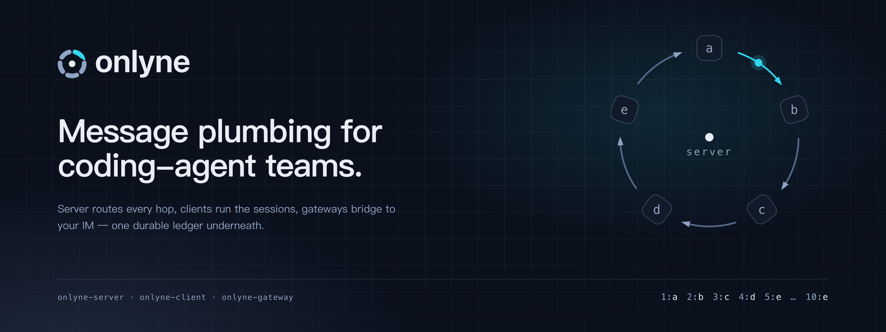
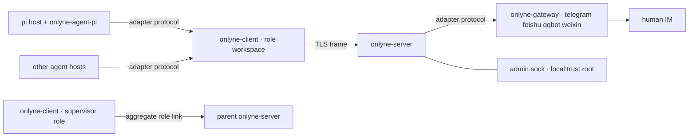

# Onlyne

**Message plumbing for coding-agent teams, running on your own machines.**

Onlyne ties a fleet of coding agents into one working cluster. A **server** routes every message between agent roles, and records each delivery in a durable ledger. A **client** per workspace runs that role's coding-agent sessions. **Gateway** processes turn Telegram / Feishu / QQ / WeChat chats into the same message model. Your agents keep their own runtimes; Onlyne gives them hands that reach each other, plus a paper trail you can audit. The cluster spans machines: a client reaches the server over TLS from anywhere, a generated workspace relocates with a plain `mv`, and clusters nest into larger clusters.

   


## See it run

```bash
cargo build --workspace
cd examples/supervisor && ./run.py up
```

Five real [pi](https://github.com/badlogic/pi-mono) coding agents take the ring roles `a → b → c → d → e` in Orca tabs. A supervisor agent mounted on the cluster takes your chat, dispatches the ring, and watches the record file `lights.txt`. Each hop appends one line; ten lines close the circuit:

```text
$ onlyne --server-root /tmp/onlyne-sup ledger --task <root-task>
{"kind":"completion","from":"e","to":"_supervisor","state":"queued",
 "out_head":"1:a 2:b 3:c 4:d 5:e 6:a 7:b 8:c 9:d 10:e"}
```

The TUI draws the same picture live — page 1 is the role network, page 2 the swarm ledger:

```text
 ╭── a ──╮    ╭── b ──╮    ╭── c ──╮
 │ pi ●1 │───▶│ pi    │───▶│ pi  ◐ │        ● busy   ◐ hop in flight
 ╰───────╯    ╰───────╯    ╰───────╯
      ▲                          │
 ╭────┴──╮    ╭── d ──╮          ▼
 │ pi    │◀───│ pi    │◀─────────┘
 ╰── e ──╯    ╰───────╯
```

`hjkl` walks the edges, `l` follows one, the arrow keys pan, `e` reveals the supervisor's dispatch edges, and `a` toggles the active-only view. One task per round, one finished tab per session: tabs reclaim themselves when their agent exits.

## The pieces

| Binary | Job |
|---|---|
| `onlyne-server` | Routing, ledger, delivery queue, faults, admin socket, workspace generation. One per cluster. |
| `onlyne-client` | One role's runtime per workspace: session lifecycle, process backend, durable intents, agent adapter socket. |
| `onlyne-gateway` | One chat platform per process: telegram · feishu · qqbot · weixin, feature-gated at compile time. |
| `onlyne` | Thin human entry: forwards to the daemons, speaks the sockets, prints JSON. |
| `onlyne-tui` | Two-page observation board over the admin socket. |
| `onlyne-agent-fake` | Scripted agent for the twelve e2e proofs under `crates/onlyne-testkit/e2e/`. |



## What you get

**Delivery you can audit.** Control-plane messages (task, completion, control) travel at-least-once, each carrying an `op_id` idempotency key. The ledger keeps every row, so `onlyne server ledger` reads like a bank statement. Observation (heartbeats, events) runs at-most-once with cursor resync, so a slow watcher never slows a worker.

**Sessions that own their lives.** Each role spawns its coding agent through a screen backend: Orca tabs, zellij sessions, headless exec, or the fake used in tests. Discovery follows the screen you are actually in. A session's lifecycle is a proven reducer — 21 events over five state axes, table-tested — feeding both the ledger mirror and the TUI stars.

**Truth under disconnect.** A client that loses the server keeps running its sessions to their final state, writes every outbound message to a durable intent queue, and flushes in order on reconnect. Nothing drops silently: a stuck intent ends as a named fault.

**ACL the server enforces.** Each role registers an ed25519 key, and the spec declares who may message whom. A role without such an edge gets `acl_denied` before any ledger row exists. Task receipts are the one built-in exception: a completion always reaches the origin recorded in the durable ledger, so reporting upward needs zero standing edges.

**Clusters all the way up.** A supervisor's own client connects to a parent server as a plain aggregate role. Tasks flow in, completions flow out, and the parent ledger never sees a child role name. The wire protocol contains zero federation code.

**One protocol, two mounts.** pi and the Telegram gateway speak the same adapter protocol: `hello` handshake, capability bits, `report` observations, `assign` payloads. To add a coding agent or a chat platform, implement that same small surface (`crates/onlyne-adapter/PROTOCOL.md`).

## Design notes

Two commitments shape the codebase.

**Transport, not runtime.** Onlyne owns routing, receipts, and recovery. Judgment stays with the agents on either side of a socket: the daemons carry no prompt logic, no scheduler, no model calls. Every feature decision answers one question first — does this belong to the message bus or to an agent? — and delivery truth alone enters the bus.

**Context is a lossy channel, by design.** Anything that must survive lives in SQLite: the server ledger, the client intent queue, the durable outbox. Each hop's agent context receives only what that hop needs — text plus at most one image, one task per session, prose refetched from its single source. The lighter the carried context, the deeper the cluster can run.

The second commitment has machine-checked backing. `proofs/` is a core Lean 4 development (toolchain 4.33.1, zero dependencies, `lake build` green, zero `sorry`). Three axioms state the rot: a context-carried fact's reliability decays monotonically with depth, and reaches zero on any deepening trace. Twelve theorems do the rest. An impossibility result covers every protocol that carries coordination state inside context, and a rescue theorem keeps a violation bound that depends only on transport steps. Each design decision gets one combinator lemma (carrier minimality, authority split, content by reference, idempotent redelivery, delivery creates the task, file-truth reload, single-source prose, one-shot sessions), and a closing theorem exhibits this repository's design as a model of the safe side. `proofs/BRIEF.md` is the contract the prover worked to.

## Concepts in one table

| Kind | Purpose | Delivery |
|---|---|---|
| `task` | Deliver work to a role; spawns or reuses a session | at-least-once, queued while offline |
| `completion` | Terminal receipt for a task; carries the result summary | at-least-once, queued while offline |
| `note` | Free chat between humans and agents | fire and forget, refused while offline |
| `control` | `recycle · probe · snapshot · cancel` on a task | admin or task owner only |

A message body is text plus at most one inline image. Media pipelines live beside Onlyne, inside your agents; what Onlyne owns is delivery and accounting.

## The supervisor doctrine

Dispatch flows downhill. The supervisor sends tasks to roles, and roles answer by completing them. A role's completion lands in the ledger, and the supervisor polls the ledger, so reports arrive with proof attached. A role messaging its supervisor directly is the flat queue you already have elsewhere — the demo ACLs refuse it, and each role's `allowed_targets` stays inside the working ring. When a role genuinely needs to reach the operator mid-task, the supervisor grants a route for that one task, and the grant dies with the task.

```bash
onlyne --server-root <root> send --from _supervisor --to a --text "RING=a,b,c,d,e K=10"
onlyne --server-root <root> ledger --task <id>      # the receipts queue up here
onlyne --server-root <root> sessions --task <id>    # lifecycle, per hop
```

Root receipts addressed to `_supervisor` queue by design. Attach the supervisor's own client, and the backlog lands in its inbox. That queue is the operator's pull-inbox: `ledger` reads it, delivery settles it.

## Quickstart, the manual way

```bash
SRC=$(pwd); tmp=$(mktemp -d)
target/debug/onlyne-server init --root "$tmp/server" --listen 127.0.0.1:7899
target/debug/onlyne-server run --root "$tmp/server" &
target/debug/onlyne --server-root "$tmp/server" wait-ready
target/debug/onlyne-client init --workspace "$tmp/planner" --role planner \
    --server-root "$tmp/server" >> "$tmp/server/.onlyne/spec.toml"   # prints a ready fragment
target/debug/onlyne --server-root "$tmp/server" reload
target/debug/onlyne-client run --workspace "$tmp/planner" &
target/debug/onlyne-agent-fake --workspace "$tmp/planner" --script \
    crates/onlyne-testkit/scripts/echo-complete.json &
target/debug/onlyne --server-root "$tmp/server" send --from planner --to planner --text "hello v1"
```

One JSON line answers with `data.state = "in_flight"`. The task's ledger row then settles to `acked`, and its session projects to `exited` with `outcome = "done"`. The same sequence ships as an executable proof, `crates/onlyne-testkit/e2e/local-task.sh`, joined by eleven siblings covering ACL rejects, idempotency, reconnect requeue, gateway mount, relocation, and two-cluster federation.

Copying the binaries onto `PATH` takes one extra step on macOS: a copied binary
whose code signature no longer matches its file is killed at exec, so re-sign it
ad-hoc after copying (`codesign --force --sign - ~/.cargo/bin/onlyne*`).

## Where things live

```text
<server-root>/.onlyne/          spec.toml · state.db · run/s (admin) · keys/ · templates/ · logs/
<workspace>/.onlyne/            config.toml · client.db · run/s (adapter) · keys/ · logs/ · agent/
```

Every workspace is self-contained and portable. `onlyne server generate` lays a role's work out from templates, the generated tree carries no absolute paths, and after an `mv`, `onlyne client run` reconnects from anywhere. Legacy layouts and old databases exit 2 at the door: v1.0.0 speaks one wire, one schema, one layout.

## Status

Release `v1.0.0-beta.4`, on branch `v1.0.0-dev-super-redesign`. The full e2e suite, the ring TUI, the supervisor demo, and the pi adapter plugin run green on macOS; the four IM gateways ship as feature-gated crates awaiting live-platform soak. `cargo build --workspace` needs Rust 1.85 and nothing heavier.

## Reading

- `docs/v1-PLAN.md` — the authoritative design and its nine verification cases.
- `docs/v1-ARCHITECTURE.md` — crate map, sockets, ledger, lifecycle, generation, federation.
- `crates/onlyne-adapter/PROTOCOL.md` — the adapter surface both agents and gateways implement.
- `examples/supervisor/README.md` — the live ring demo, told in the operator's voice.
- `skills/onlyne-supervisor/SKILL.md` — the operating manual for a cluster supervisor agent.
- `skills/onlyne-role/SKILL.md` — the handbook for a role working its task.
- `.agents/skills/onlyne/SKILL.md` — development guidance for this repository.

MIT © dbydd
