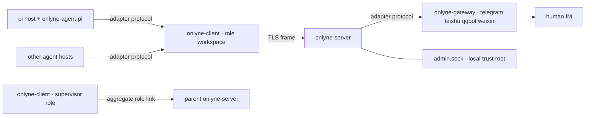

# Onlyne

**Message plumbing for coding-agent teams, running on your own machines.**

Onlyne ties a fleet of coding agents into one working cluster. A **server** routes every message between agent roles, and records each delivery in a durable ledger. A **client** per workspace runs that role's coding-agent sessions. **Gateway** processes turn Telegram / Feishu / QQ / WeChat chats into the same message model. Your agents keep their own runtimes; Onlyne gives them hands that reach each other, plus a paper trail you can audit. The cluster spans machines: a client reaches the server over TLS from anywhere, a generated workspace relocates with a plain `mv`, and clusters nest into larger clusters.

  


## Install

Everything ships to [crates.io](https://crates.io); a plain `cargo install` takes the latest release. The thin entry is `onlyne-cli` (binary `onlyne`); the four daemons install the same way and `onlyne` finds them in the cargo bin directory.

```bash
cargo install onlyne-cli
cargo install onlyne-server onlyne-client onlyne-gateway onlyne-tui
```

`onlyne` is the thin forwarder (`server`/`client`/`gateway`/`admin` verbs); the TUI runs separately as `onlyne-tui`. For a pi agent role, the adapter plugin lives on npm:

```bash
pi install npm:pi-onlyne
```

## See it run

```bash
cargo build --workspace
cd examples/supervisor && ./run.py up
```

Five real [pi](https://github.com/badlogic/pi-mono) coding agents take the ring roles `a → b → c → d → e` in Orca tabs. A supervisor agent mounted on the cluster takes your chat, dispatches the ring, and watches the record file `lights.txt`. Each hop appends one line; ten lines close the circuit:

```text
$ onlyne --server-root /tmp/onlyne-sup ledger --task <root-task>
{"kind":"completion","from":"e","to":"_supervisor","state":"queued",
 "out_head":"1:a 2:b 3:c 4:d 5:e 6:a 7:b 8:c 9:d 10:e"}
```

The TUI draws the same picture live — page 1 is the role network, page 2 the swarm ledger:

```text
 ╭── a ──╮    ╭── b ──╮    ╭── c ──╮    ╭── d ──╮    ╭── e ──╮
▶│ pi ●1 │───▶│ pi    │───▶│ pi  ◐ │───▶│ pi    │───▶│ pi    │   ● busy   ◐ hop in flight
 ╰───────╯    ╰───────╯    ╰───────╯    ╰───────╯    ╰───────╯
└─────────────────────────────────────────────────────────────┘
```

`hjkl` walks the edges, `l` follows one, the arrow keys pan, `+`/`-` widen and tighten the map, `e` reveals the supervisor's dispatch edges, and `a` toggles the active-only view. One task per round, one finished tab per session: tabs reclaim themselves when their agent exits.

## Showcase: research-flywheel

[research-flywheel](https://github.com/dbydd/research-flywheel) is a live agent ring built on Onlyne. Clone the template tree, tell your agent 「帮我看看这棵树」, and the opening protocol asks four questions — topic, role topology, single machine or distributed, compute budget — then runs the nine-point assembly check and powers the ring. Five roles, each one Onlyne session with its own workspace; handoffs are relay-guarded, and every verdict lands on the ledger. The full procedure lives in its `BOOTSTRAP.md`.

## The pieces

| Binary | Job |
|---|---|
| `onlyne-server` | Routing, ledger, delivery queue, faults, admin socket, workspace generation. One per cluster. |
| `onlyne-client` | One role's runtime per workspace: session lifecycle, process backend, durable intents, agent adapter socket. |
| `onlyne-gateway` | One chat platform per process: telegram · feishu · qqbot · weixin, feature-gated at compile time. |
| `onlyne` | Thin human entry: forwards to the daemons, speaks the sockets, prints JSON. |
| `onlyne-tui` | Two-page observation board over the admin socket. |
| `onlyne-agent-fake` | Scripted agent for the seventeen e2e proofs under `crates/onlyne-testkit/e2e/`. |



## What you get

**Delivery you can audit.** Control-plane messages (task, completion, control) travel at-least-once, each carrying an `op_id` idempotency key. The ledger keeps every row, so `onlyne server ledger` reads like a bank statement. Observation (heartbeats, events) runs at-most-once with cursor resync, so a slow watcher never slows a worker.

**Sessions that own their lives.** Each role spawns its coding agent through a backend: herdr panes, Orca tabs, zellij sessions, headless exec, an ACP agent the client drives over its own protocol, or the fake used in tests. Backend selection is env `ONLYNE_BACKEND` (nonempty) > workspace `config.toml` `backend` > auto. `ONLYNE_BACKEND` and the config field take `herdr | orca | zellij | exec | acp | fake | auto`; `headless` is a parse alias for `exec`, and projections still name the backend `exec`. A nonempty value that names `herdr`, `orca`, `zellij`, `exec`/`headless`, `acp`, or `fake` selects that backend. An empty value or `auto` probes herdr, then orca, then zellij. `exec`, `acp` and `fake` enable only when the env or the config field names them. With no match, `onlyne-client run` exits 5 and prints `onlyne: no supported host detected; run inside herdr, orca, or zellij, or set ONLYNE_BACKEND`. On exec exit the probe detail may carry `output_tail` (at most 200 lines / 16 KiB of the session log). A session's lifecycle is a proven reducer — 21 events over five state axes, table-tested — feeding both the ledger mirror and the TUI stars.

| Host | Local socket | Session backends |
| --- | --- | --- |
| macOS, Linux | filesystem UDS (mode `0600`) at the canonical `.onlyne/run/s` while that path fits 103 bytes; past the bound a short derived path under the system temporary directory, with the served path recorded in `.onlyne/run/socket` | herdr, orca, zellij, exec (`headless` alias), acp, fake |
| Windows (x86_64 / aarch64 MSVC) | named pipe; `.onlyne/run/s` is a `v1:onlyne-<32hex>` marker | exec (`headless` alias), acp, fake; pane hosts when the host binary is present |

On Windows, `acp` is a compile-reachable backend: `onlyne-acp` carries a Windows process-group path, the Windows CI job does not cover that crate, and every recorded ACP run happened on macOS.

A pane backend opens a terminal and reads its screen. A `session_command` that speaks its own protocol on stdio — a rendered argv carrying `--acp`, `--mode=rpc`, or `--mode rpc` — is refused by `herdr`, `orca`, and `zellij` before any pane opens: the JSON-RPC frames would print into the pane and reach no reader. The delivery settles `rejected` and the refusal lands verbatim in the ledger row's `reason` column, as the live ring recorded it for an Orca role running `pi --mode rpc`:

> orca backend cannot host a protocol session: --mode rpc speaks JSON-RPC on its own stdio and the pane would print the frames; set backend = "exec" or backend = "acp" in the workspace config

The message names the acting backend and the token that matched. The fix lives in the workspace `config.toml`: `backend = "exec"` or `backend = "acp"`. The client never swaps the backend at spawn time.

An ACP session ends on a one-line report: each prompt carries the absolute path of a report file under `<workspace>/.onlyne/out/`, the agent writes `hop-done:` or `hop-failed:` there before it stops, and the client reads that line once at the turn's end, deletes the file, and files the task's completion from it.

The herdr map is: session inherited from the client environment (a pi child inherits it), workspace = one server root/topology labelled `onlyne:<cluster>`, tab = role, pane = one onlyne session. `<cluster>` is the server's own `[server] name`, which the client reads from `welcome.cluster` and hands each pane it creates as `ONLYNE_CLUSTER`; a pane spawned before the first welcome carries no such variable and herdr keeps its own default-labelled workspace. Close is `herdr pane close`. Ids look like `wF` / `wF:t1` / `wF:p1`. A named session such as `onlyne-test` is the `HERDR_SESSION` value already in the client environment. `backend_ref` on the client `sessions` row stores `workspace_id`, `tab_id`, `pane_id`, `agent`, `workspace_label`, and the recorded split (`base_pane`, `split_direction`). The backend addresses a herdr workspace by the label `onlyne:<cluster>` and a tab by the role's own name. An operator who wants a particular workspace or tab used renames it before the client spawns sessions: `herdr workspace rename <WORKSPACE_ID> onlyne:<cluster>` and `herdr tab rename <TAB_ID> <role>`. A workspace label that differs yields a second workspace, a tab name that differs yields a second tab, and the client logs a warning naming the label and the created workspace each time it takes that create path. The create warning carries the label, the new `workspace_id`, and the remedy `herdr workspace rename <WORKSPACE_ID> onlyne:<cluster>`, and `--cwd` reaches herdr as an absolute path in `workspace create`, `tab create`, and `pane split` — the spelling herdr resolves against its own working directory.

Spawn: the first token of `session_command` matching a known agent name (`pi`, `omp`, and the rest of herdr's `--kind` table) runs `herdr agent start <name> --kind <k> --pane <id> --timeout 25000 -- --session-id <id> --session-dir .pi/sessions`: `--kind` selects the executable named by token 0, and the remaining `session_command` tokens travel after the `--` separator, the call shape herdr 0.9.0 documents. Commands whose first token is absent from that table run `herdr pane run <pane_id> '<one shell line>'`. `pane run` emits no JSON. The command is `shell_quote`d into a single argv token. Split uses `PanePlacement::from_pane_count`: `(count+1).is_power_of_two()` maps to `right`; remaining counts map to `down`; ratio is `0.5`. `count` is `result.tabs[].pane_count` from `herdr tab list --workspace W`. A missing field is 0. Production spawn passes `placement: None`.

Focus issues `herdr workspace focus <W>`, then `herdr tab focus <T>` (positional; the tab restores its last focused pane). A managed-agent pane then takes `herdr agent focus <pane_id>`. `agent focus` accepts a managed agent. A shell pane from `pane run` answers `agent_not_found`. Herdr's `pane focus` form is `--pane <base_pane> --direction <split_direction>` and moves to the neighbor of that anchor, so the two values the split recorded are what carry a plain shell pane. `herdr pane get <pane_id>` is the confirmation step: `result.pane.focused` must be true, and a hop that landed elsewhere answers with an error naming the pane that holds focus. Entries: `onlyne control focus --task <id>` and the TUI `F` key. A failed `focus()` records `Report::Fault{kind:"focus"}`.

Commands reach a role that holds no free session. `pull` carries an optional `control_only`, and a client at `max_sessions` asks with it, so `focus`, `recycle`, and `cancel` arrive while the work queue keeps its rows `queued` with no ticket spent.

`onlyne-client doctor` is a read-only verb. It prints one JSON object (`host`, `backend_selection`, `explicit`, `binary`, `session`, `workspace_id`, `tab_id`, `pane_id`, `refusal`) and exits 0. A missing host yields `host: null` with `refusal`. It is a pre-deploy check.

**Truth under disconnect.** A client that loses the server keeps running its sessions to their final state, writes every outbound message to a durable intent queue, and flushes in order on reconnect. Nothing drops silently: a stuck intent ends as a named fault.

**ACL the server enforces.** Each role registers an ed25519 key, and the spec declares who may message whom. A role without such an edge gets `acl_denied` before any ledger row exists. Task receipts are the one built-in exception: a completion always reaches the origin recorded in the durable ledger, so reporting upward needs zero standing edges.

**Clusters all the way up.** A supervisor's own client connects to a parent server as a plain aggregate role. Tasks flow in, completions flow out, and the parent ledger never sees a child role name. The wire protocol contains zero federation code.

**One protocol, two mounts.** pi and the Telegram gateway speak the same adapter protocol: `hello` handshake, capability bits, `report` observations, `assign` payloads. To add a coding agent or a chat platform, implement that same small surface (`crates/onlyne-adapter/PROTOCOL.md`).

## Design notes

Two commitments shape the codebase.

**Transport, not runtime.** Onlyne owns routing, receipts, and recovery. Judgment stays with the agents on either side of a socket: the daemons carry no prompt logic, no scheduler, no model calls. Every feature decision answers one question first — does this belong to the message bus or to an agent? — and delivery truth alone enters the bus.

**Context is a lossy channel, by design.** Anything that must survive lives in SQLite: the server ledger, the client intent queue, the durable outbox. Each hop's agent context receives only what that hop needs — text plus at most one image, one task per session, prose refetched from its single source. The lighter the carried context, the deeper the cluster can run.

The second commitment has machine-checked backing. `proofs/` is a core Lean 4 development (toolchain 4.33.1, zero dependencies, `lake build` green, zero `sorry`). Three axioms state the rot: a context-carried fact's reliability decays monotonically with depth, and reaches zero on any deepening trace. Twelve theorems do the rest. An impossibility result covers every protocol that carries coordination state inside context, and a rescue theorem keeps a violation bound that depends only on transport steps. Each design decision gets one combinator lemma (carrier minimality, authority split, content by reference, idempotent redelivery, delivery creates the task, file-truth reload, single-source prose, one-shot sessions), and a closing theorem exhibits this repository's design as a model of the safe side. `proofs/BRIEF.md` is the contract the prover worked to.

## Concepts in one table

| Kind | Purpose | Delivery |
|---|---|---|
| `task` | Deliver work to a role; spawns or reuses a session | at-least-once, queued while offline |
| `completion` | Terminal receipt for a task; carries the result summary | at-least-once, queued while offline |
| `note` | Free chat between humans and agents | fire and forget, needs a session already running on its role; `note_queue` holds one that waits |
| `control` | `recycle · probe · snapshot · cancel` on a task | admin or task owner only |

A message body is text plus at most one inline image. Media pipelines live beside Onlyne, inside your agents; what Onlyne owns is delivery and accounting.

A delivery settles by msg id: `onlyne ack --msg-id <id> --reason <text>` accepts it, and `onlyne reject --msg-id <id> --reason <text>` refuses it. Both take an optional `--op-id`, and `onlyne control --task <id> recycle|cancel --reason <text>` carries the same required reason.

Every ledger row records why it settled. The `reason` column ships with the row: `onlyne ledger` prints rows with the keys `msg_id`, `task`, `state`, `reason`, `out_head`, `body`, and the TUI task panel on page 2 appends `reason=<text>` to its ledger line. A row without a value omits the key, so rows written before the column still read unchanged. Values seen in live runs: `requeue_exhausted`, `requeue_ttl`, `expired`, `session_dead`, and the pane-refusal sentence quoted above. The `--reason` text an operator types into `onlyne reject` or `onlyne repair fail` lands in the row verbatim; an accepted `onlyne ack` travels the settlement event with its text and leaves the row's `reason` as it stood. The string `operator ack` is faults-suite test data for the faults table's own `reason` column (`crates/onlyne-store/src/tests.rs`); the ledger never recorded it.

## The supervisor doctrine

Dispatch flows downhill. The supervisor sends tasks to roles, and roles answer by completing them. A role's completion lands in the ledger, and the supervisor polls the ledger, so reports arrive with proof attached. A role messaging its supervisor directly is the flat queue you already have elsewhere — the demo ACLs refuse it, and each role's `allowed_targets` stays inside the working ring. When a role genuinely needs to reach the operator mid-task, the supervisor grants a route for that one task, and the grant dies with the task.

```bash
onlyne --server-root <root> send --from _supervisor --to a --text "RING=a,b,c,d,e K=10"
onlyne --server-root <root> ledger --task <id>      # the receipts queue up here
onlyne --server-root <root> sessions --task <id>    # lifecycle, per hop
```

Root receipts addressed to `_supervisor` queue by design. Attach the supervisor's own client, and the backlog lands in its inbox. That queue is the operator's pull-inbox: `ledger` reads it, delivery settles it.

## Quickstart, the manual way

```bash
SRC=$(pwd); tmp=$(mktemp -d)
target/debug/onlyne-server init --root "$tmp/server" --listen 127.0.0.1:7899
target/debug/onlyne-server run --root "$tmp/server" &
target/debug/onlyne --server-root "$tmp/server" wait-ready
target/debug/onlyne-client init --workspace "$tmp/planner" --role planner \
    --server-root "$tmp/server" >> "$tmp/server/.onlyne/spec.toml"   # prints a ready fragment
target/debug/onlyne --server-root "$tmp/server" reload
target/debug/onlyne-client run --workspace "$tmp/planner" &
target/debug/onlyne-agent-fake --workspace "$tmp/planner" --script \
    crates/onlyne-testkit/scripts/echo-complete.json &
target/debug/onlyne --server-root "$tmp/server" send --from planner --to planner --text "hello v1"
```

One JSON line answers with `data.state = "in_flight"`. The task's ledger row then settles to `acked`, and its session projects to `exited` with `outcome = "done"`. The same sequence ships as an executable proof, `crates/onlyne-testkit/e2e/local-task.sh`, joined by sixteen siblings covering ACL rejects, idempotency, reconnect requeue, the hello claim across a server restart, gateway mount, relocation, two-cluster federation, the heartbeat watch, the headless exec path (`exec-headless.sh`), the deep-workspace socket (`socket-path-length.sh`), and the ACP backend driven by a scripted agent (`acp-session.sh`).

Copying the binaries onto `PATH` takes one extra step on macOS: a copied binary
whose code signature no longer matches its file is killed at exec, so re-sign it
ad-hoc after copying (`codesign --force --sign - ~/.cargo/bin/onlyne*`).

## Where things live

```text
<server-root>/.onlyne/          spec.toml · state.db · run/s (admin local socket, canonical) · run/socket (names the served path) · keys/ · templates/ · logs/
<workspace>/.onlyne/            config.toml · client.db · run/s (adapter local socket, canonical) · run/socket (names the served path) · keys/ · logs/ · agent/
```

On unix each daemon binds the canonical `run/s` while that path fits 103 bytes; a tree deeper than the bound serves from a short derived path under the system temporary directory, and the `run/socket` marker names the path actually served.

Every workspace is self-contained and portable. `onlyne server generate` lays a role's work out from templates, the generated tree carries no absolute paths, and after an `mv`, `onlyne client run` reconnects from anywhere. Legacy layouts and old databases exit 2 at the door: v1.0.0 speaks one wire, one schema, one layout.

## Status

The release line lives in `CHANGELOG.md`. Every release moves all nineteen crates together and each manifest keeps a matching registry floor, so a plain `cargo install` takes a consistent set. Newest session host beside the panes: `backend = "acp"` drives an ACP v1 agent as a child process through the client, with the workspace `[acp]` table carrying mode, model, reasoning effort, and permission, and the conversation landing in `<workspace>/.onlyne/logs/session-<task>.log` plus `session-<task>.events.jsonl`. Each ACP turn closes on a one-line report the agent writes to `<workspace>/.onlyne/out/<task-id>.md`, and that line decides what reaches the ledger. Three behaviours hold the boundary: an `initialize` always carries the client version, a `herdr`, `orca`, or `zellij` backend refuses a `session_command` that speaks a protocol on its own stdio before any pane opens, and the settlement `reason` on a ledger row reaches `onlyne ledger` and the TUI task panel. Every settled task files a `completion` row, including the ones that end with no result line. Fake-backend e2e covers the local, exec, idempotency, requeue, ACL, and acp paths, and a five-role ring closes its circuit with every row `acked`. `cargo build --workspace` needs Rust 1.85.

## Reading

- `docs/v1-PLAN.md` — the authoritative design and its nine verification cases.
- `docs/v1-ARCHITECTURE.md` — crate map, sockets, ledger, lifecycle, generation, federation.
- `docs/operations.md` — operator entries, the repair family, and session-shadow ownership rules.
- `crates/onlyne-adapter/PROTOCOL.md` — the adapter surface both agents and gateways implement.
- `examples/supervisor/README.md` — the live ring demo, told in the operator's voice.
- `skills/onlyne-supervisor/SKILL.md` — the operating manual for a cluster supervisor agent.
- `skills/onlyne-role/SKILL.md` — the handbook for a role working its task.
- `.agents/skills/onlyne/SKILL.md` — development guidance for this repository.

MIT © dbydd
