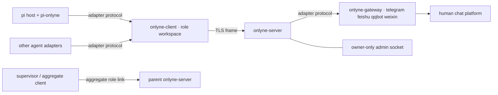

# Onlyne

**Message plumbing for coding-agent teams, running on your own machines.**

Onlyne ties a fleet of coding agents into a durable cluster. A **server** routes messages between roles and records every delivery in an append-only ledger. A **client** in each role workspace runs that role's coding-agent sessions. Optional **gateway** processes connect Telegram, Feishu, QQ, or WeChat through the same message model. Agents keep their own runtimes and make the decisions; Onlyne provides routing, queueing, session transport, receipts, and an auditable record.

[中文文档](README.zh-CN.md) · English is the default reading copy.

Clients can run on different machines over TLS. Generated workspaces are relocatable, and a supervisor client can expose a child cluster to a parent server as one aggregate role.

  


## Choose a starting path

| Path | Use it when | Extra requirements |
|---|---|---|
| **Installed binaries** | You are integrating Onlyne with an existing agent, host, or service manager. | A matching Onlyne build and your own agent adapter or ACP command. |
| **Source checkout: fake quickstart** | You want the shortest local end-to-end task without a model or terminal host. | Rust 1.85+, a POSIX shell, and the source checkout. `onlyne-agent-fake` is built from `onlyne-testkit`; it is not installed with the release binaries. |
| **Source checkout: pi + Orca demo** | You want real pi sessions visible as Orca tabs. | The fake-path prerequisites plus Python 3, pi, model credentials, the Orca app, and the `orca` CLI. Run it from an Orca tab for the visible path. |

The fake and Orca examples below intentionally use `target/debug/...`; the launcher checks those source-built binaries directly.

## Install

### Prerequisites

- **Registry install:** Cargo and Rust 1.85 or newer.
- **Default-feature gateway build:** install `protoc` and keep it on `PATH`. The server, client, CLI, and TUI do not require `protoc`.
- **Runtime:** an address and port reachable by every role client. The local admin and adapter sockets require a writable owner tree.
- **Agent host:** a supported backend and an adapter. The real pi path needs the [pi coding agent](https://github.com/badlogic/pi-mono); use pi 0.85.1 for the path documented here.
- **Services:** installation does not register a service. Run a daemon in the foreground or use `onlyne server start`.

### Registry packages

Install the CLI, daemons, and TUI from the current published packages. Keep the package set together so the sibling binaries share one build:

```bash
cargo install \
  onlyne-cli onlyne-server onlyne-client onlyne-gateway onlyne-tui
```

That produces five commands:

| Command | Role |
|---|---|
| `onlyne` | Thin operator entry point. It forwards lifecycle commands to sibling binaries and reads or writes the local admin/adapter sockets directly. |
| `onlyne-server` | One cluster's router, delivery queue, durable ledger, fault record, gateway host, and admin socket. |
| `onlyne-client` | One role workspace's server link, session lifecycle, backend host, adapter socket, and durable outbound intents. |
| `onlyne-gateway` | One chat-platform process: `telegram`, `feishu`, `qqbot`, or `weixin`. |
| `onlyne-tui` | Two-page observation board over the server's local admin socket. |

`onlyne-agent-fake` is an additional source/testkit-only command. It is absent from the five registry-installed binaries and is built by the fake quickstart below.

### Release binaries

Every tag also carries a GitHub Release with five platform archives, their checksums, and a
combined `SHA256SUMS`. The installer picks the archive for this machine and verifies it against
that list before it writes a binary:

```bash
curl -fsSL https://raw.githubusercontent.com/dbydd/onlyne/main/packaging/install.sh | sh
# PREFIX=~/.local sh packaging/install.sh v1.4.1
```

The release's Homebrew formula lives at [`packaging/homebrew/onlyne.rb`](packaging/homebrew/onlyne.rb),
rendered from the same checksum list by the release pipeline. Homebrew takes formulae from a tap,
so `brew install` reads that file through a tap that carries it as `Formula/onlyne.rb`.

### Agent handbooks

The installed `onlyne` binary carries handbooks matching its own version:

```bash
onlyne skill export                         # all sets under .agents/skills
onlyne skill export --set role              # role workspace handbooks
onlyne skill export --set supervisor        # supervisor handbook
onlyne skill export --dest /path/to/skills
```

`skill export` writes every handbook as an ordinary regular file. The repository's compiled copies use the same rule, and a repository test keeps all four byte-identical to their source manuals. Matching files are left unchanged. A differing file stops the export; pass `--force` to replace it. `npx skills add dbydd/onlyne` and `npx skills add ./` install the same repository documents through the skills CLI.

## Shortest local task: fake backend

Run this block from the repository root. It builds only the packages needed for the local fake path, creates a temporary cluster, and uses the checked-in scripted agent. The fake completes the task from its assignment text; it calls no model.

```bash
cargo build -p onlyne-cli -p onlyne-server -p onlyne-client -p onlyne-testkit

tmp=$(mktemp -d)
server_pid=
client_pid=
fake_pid=

target/debug/onlyne-server init \
  --root "$tmp/server" --listen 127.0.0.1:17899
target/debug/onlyne-server run --root "$tmp/server" >"$tmp/server.log" 2>&1 &
server_pid=$!
target/debug/onlyne --server-root "$tmp/server" wait-ready

target/debug/onlyne-client init \
  --workspace "$tmp/planner" \
  --role planner \
  --server-root "$tmp/server" \
  --prose "v1 smoke prose" >>"$tmp/server/.onlyne/spec.toml"
target/debug/onlyne --server-root "$tmp/server" reload

ONLYNE_BACKEND=fake target/debug/onlyne-client run \
  --workspace "$tmp/planner" >"$tmp/client-process.log" 2>&1 &
client_pid=$!
target/debug/onlyne-agent-fake \
  --workspace "$tmp/planner" \
  --script crates/onlyne-testkit/scripts/echo-complete.json \
  >"$tmp/fake.log" 2>&1 &
fake_pid=$!

until target/debug/onlyne --server-root "$tmp/server" roles --json \
  | grep -q '"state":"online"'; do
  sleep 0.2
done

send=$(
  target/debug/onlyne --server-root "$tmp/server" send \
    --from planner --to planner --text "hello v1" \
    --force --yes-i-am-supervisor-not-other-role
)
printf '%s\n' "$send"
task=$(printf '%s\n' "$send" | sed -n 's/.*"task":"\([^"]*\)".*/\1/p')

until target/debug/onlyne --server-root "$tmp/server" ledger \
  --task "$task" --json | grep -q '"state":"acked"'; do
  sleep 0.2
done

target/debug/onlyne --server-root "$tmp/server" ledger --task "$task" --json
target/debug/onlyne --server-root "$tmp/server" sessions --task "$task" --json
```

The task row settles to `acked` with `hello v1` in `out_head`. Its session projects to `exited` with outcome `done`. When finished:

Change `17899` in the init command if that port is already occupied.

```bash
kill "$fake_pid" "$client_pid" "$server_pid" 2>/dev/null || true
wait "$fake_pid" "$client_pid" "$server_pid" 2>/dev/null || true
rm -rf "$tmp"
```

### Use a real agent with the exec backend

The same server/client topology works without a terminal host. Install a working pi setup and the adapter. At the point where the fake block starts the client and fake agent, run only the client command below and omit the fake agent:

```bash
pi install npm:pi-onlyne
ONLYNE_BACKEND=exec target/debug/onlyne-client run --workspace "$tmp/planner"
```

The role's `session_command` already names pi. The client starts one pi process per task, holds its stdin open, and captures stdout/stderr in `<workspace>/.onlyne/logs/session-<task>.log`. The send, ledger, and session commands stay the same. This path needs working model/provider credentials.

For a generated workspace, `onlyne server generate` can vendor the repository's `plugins/onlyne-agent-pi` package and write the project-scoped `.pi/settings.json` entry. A user-wide npm install remains inert in ordinary pi sessions because the extension activates only when Onlyne injects `ONLYNE_ROLE`, `ONLYNE_SESSION_ID`, and `ONLYNE_TASK_ID`.

## Real pi + Orca demo

The repository includes a five-role running-lights demo. It generates a cluster, starts five real pi workers, opens a supervisor pi session, and shows each worker in an Orca tab. Tabs retire when their tasks finish.

From an Orca tab in the repository:

```bash
cargo build -p onlyne-cli -p onlyne-server -p onlyne-client -p onlyne-tui
python3 examples/supervisor/run.py up
python3 examples/supervisor/run.py status
python3 examples/supervisor/run.py stop
```

The Orca path requires:

- the Orca desktop app running and its `orca` CLI on `PATH`;
- a shell inside an Orca tab, so `ORCA_WORKTREE_ID` selects the host worktree;
- pi on `PATH` and configured model/provider credentials;
- Python 3; the launcher uses only its standard library.

The launcher uses the repository's local pi adapter package and the binaries under `target/debug`. To run the same real-agent demo headlessly outside Orca:

```bash
ONLYNE_BACKEND=exec python3 examples/supervisor/run.py up
```

The supervisor output is then written under the demo root instead of opening a visible supervisor tab. In another terminal, inspect the demo with:

```bash
target/debug/onlyne-tui --server-root /tmp/onlyne-sup
```

The full walkthrough is [`examples/supervisor/README.md`](examples/supervisor/README.md). The [research-flywheel](https://github.com/dbydd/research-flywheel) project is a larger agent-ring example built on Onlyne.

## Follow one task end to end

```mermaid
sequenceDiagram
  participant O as Operator / supervisor
  participant S as onlyne-server
  participant C as Role client
  participant A as Agent adapter
  participant R as Origin client

  O->>S: send task (ACL + op_id)
  S->>S: append ledger row: queued or in_flight
  C->>S: pull delivery
  S-->>C: envelope; mark in_flight
  C->>A: ready, then assign task
  A-->>C: assign_ack + progress
  A-->>C: complete(outcome, head)
  C->>C: settle local task; enqueue delivery ack + receipt
  C->>S: ack original delivery
  S-->>C: accepted receipt
  C->>S: completion to task origin
  R->>S: pull completion
  S-->>R: receipt envelope
  R->>S: ack receipt
```

1. **Send.** The gated `send` verb opens the server's local admin socket, names the sender and target, and carries an `op_id` idempotency key. A repeat of the same operation returns the durable receipt; a different body under the same key is a conflict.
2. **Accept and record.** The server validates the envelope, sender, target, and ACL before touching the ledger. An accepted send appends one row and publishes its receipt. The row is `in_flight` when immediately deliverable and `queued` while the role is offline or at capacity.
3. **Pull and assign.** The role client pulls the oldest eligible task, so the server marks it `in_flight` and binds a delivery ticket. The client accepts capacity, starts the selected backend, and waits for the session's `ready` barrier before sending `assign`. The task text travels in the assignment frame; `{task}` in `session_command` renders the task id, not the message body.
4. **Complete.** An adapter reports a terminal outcome and summary. The pi plugin's `onlyne_complete` tool supplies both. The client records the local task verdict, queues an acknowledgement of the original delivery, releases the session slot, and builds a separate completion envelope for the task's recorded origin.
5. **Receipt.** Durable client intents flush over TLS in order. The original task row becomes `acked`; the completion receipt is `queued` until the origin client pulls it, then acked without starting another session.

At family start, the gated `send` form accepts `--hop-budget <n>`, `--deadline <rfc3339>`, and repeatable `--label <key=value>` for up to eight labels. The server records the minted family and root task id, hop budget, origin, RFC3339 deadline, and labels. A role can continue that family with `onlyne_handoff`; the server mints a child task under the parent, and every handoff inherits the complete family metadata. Completion receipts always return to the task origin even when ordinary role-to-role ACL has no return edge.

Onlyne's four core message kinds are:

| Kind | Purpose | Delivery |
|---|---|---|
| `task` | Hands work to a role and creates one session. | At least once; queued while offline. |
| `completion` | Carries the terminal result for a task. | At least once; queued at the origin. |
| `note` | Carries free text between humans, agents, and gateways. | Best effort by default; `note_queue` can hold one while a role session is absent. |
| `control` | Applies `recycle`, `probe`, `snapshot`, `cancel`, or `focus` to a task. | Owner or admin only. |

## Configuration and stored data

### Server root

`<server-root>/.onlyne/spec.toml` is the protocol source of truth: server endpoint and certificate pin, registered role keys, ACL edges, prose, concurrency, timeouts, relay policy, session commands, routes, and gateways. Onlyne never edits this file through a runtime API. Append `onlyne-client init` fragments or use `onlyne server generate`, then run `onlyne reload`.

The automatic requeue age gate is `[server].requeue_ttl_secs`. It defaults to `0`, which leaves the gate off, and measures queued-row age from `enqueued_at`. When an automatic requeue would happen after that age, the row settles as `expired` with reason `requeue_ttl`; operator-led `repair retry` bypasses the age gate.

```text
<server-root>/.onlyne/
  spec.toml                 protocol and role truth
  state.db                  ledger, faults, events, ghost-sweep audit
  run/s                     owner-only admin/gateway socket (canonical spelling)
  run/socket                actual short socket path, when needed
  run/server.pid            detached server pid
  keys/server.key           TLS and server identity key
  templates/                role content used by generate
  ws/                       default generated workspaces
  cache/                    gateway scratch state
  logs/server.log           detached server log
```

### Role workspace

`<workspace>/.onlyne/config.toml` is the role-local configuration: identity, server endpoint, certificate pin, key path, backend, Orca policy, ACP options, and reconnect/stall timers. `cert_pin`, `key_path`, and `server.host` may contain `$NAME` environment references resolved at startup.

```text
<workspace>/.onlyne/
  config.toml                 role and backend configuration
  client.db                   task/session state and durable intents
  run/s                       owner-only agent adapter socket (canonical spelling)
  run/socket                  actual short socket path, when needed
  keys/role.key               role identity key
  agent/                      workspace-scoped agent packages
  logs/client.log             client process log
  logs/session-<task>.log     rendered exec/ACP session output
  logs/session-<task>.events.jsonl
  logs/content.index.jsonl    durable content offsets
  out/<task>.md               ACP closing report, read and removed by the client
```

`onlyne server generate` writes relocatable workspaces: move the directory, then run `onlyne client run --workspace <new-path>`. Server and role clients must run the same Onlyne build. Older schemas and legacy layouts are refused at the door; Onlyne does not migrate them in place.

Print the compiled configuration schemas with:

```bash
onlyne schema spec --pretty
onlyne schema client --pretty
```

### Socket discovery

On macOS and Linux, the canonical local endpoint is `<owner>/.onlyne/run/s` with mode `0600`. It is bound directly while the complete path fits 103 bytes. Longer trees bind a short derived path under the system temporary directory and record the served path in `.onlyne/run/socket`. Windows uses a named pipe; `.onlyne/run/s` is a `v1:onlyne-<32hex>` marker.

The client injects the actual served path as `ONLYNE_SOCKET` into every session. Socket selection is:

```text
--socket → ONLYNE_SOCKET → --server-root → --workspace or current-directory walk
```

## Operate a cluster

### Lifecycle and observation

```bash
# Server: foreground, detached, and stopped explicitly
onlyne server run   --root <server-root>
onlyne server start --root <server-root>
onlyne server stop  --root <server-root>

# Client: foreground; this daemon has no start/stop verb
onlyne client run    --workspace <workspace>
onlyne client status --workspace <workspace>
onlyne-client doctor                         # host detection JSON; always exits 0

# Admin reads
onlyne --server-root <root> status
onlyne --server-root <root> roles
onlyne --server-root <root> sessions --task <task-id>
onlyne --server-root <root> sessions --fresh --task <task-id>
onlyne --server-root <root> ledger --task <task-id>
onlyne --server-root <root> faults --open-only
onlyne --server-root <root> watch --follow --tier durable
onlyne --server-root <root> history
onlyne --server-root <root> spec_diff
onlyne --server-root <root> reload

# TUI: interactive board, or one plain-text frame
onlyne tui --server-root <root>
onlyne tui --server-root <root> --once --page 1 --state active
onlyne tui --server-root <root> --once --page 2 --state all
```

TUI page 1 is the role network and live sessions. Page 2 is the task/session graph with faults, history, ledger rows, and task detail. A one-frame snapshot names its state filter explicitly: `active` is the default and keeps the live view, while `all` also includes settled sessions and ledger rows. On page 2, `--state all` makes a settled row's `reason=<text>` visible. The TUI observes the admin socket and does not carry messages.

### Supervisor gate

The shell forms of `send`, `reply`, `handoff`, `complete`, `ack`, `reject`, and `control` require both flags:

```text
--force --yes-i-am-supervisor-not-other-role
```

The pair declares that the command is operating a role from outside its plugin session. A missing flag exits 2 before socket resolution. Inside a pi session, the plugin mapping is `send` → `onlyne_send`, `handoff` → `onlyne_handoff`, and `complete` → `onlyne_complete`; those tools keep the session's own record authoritative.

`ack` and `reject` require `--msg-id` and `--reason`; `control recycle` and `control cancel` require `--reason`, while `probe`, `snapshot`, and `focus` reject it.

`repair` is the operator recovery surface. It records operator decisions without silently changing delivery policy:

```bash
onlyne --server-root <root> repair inspect --task <task-id>
onlyne --server-root <root> repair retry  --task <task-id> --reason <text>
onlyne --server-root <root> repair fail   --task <task-id> --reason <text>
onlyne --server-root <root> repair close  --task <task-id> --reason <text>
onlyne --server-root <root> repair adopt  --task <task-id> --backend <name> --reason <text>
onlyne --server-root <root> repair rebind --task <task-id> --session-id <id> --backend <name> --reason <text>
onlyne --server-root <root> repair ack    --fault-id <id> --reason <text>
```

`onlyne --help` lists the socket backends and exit codes. In short: `0` success, `1` runtime/daemon failure, `2` local validation, `3` no socket, `4` operator-input refusal, `5` no supported session host, and `127` a missing sibling binary.

### Gateways

Declare a `[[gateway]]` entry in `spec.toml`, provide its credential through a literal token or environment-backed config, then run one platform per process:

```bash
onlyne-gateway --server-root <root> list
onlyne-gateway --server-root <root> auth telegram
onlyne-gateway --server-root <root> run telegram --token "$TELEGRAM_TOKEN"
```

Feishu, QQ, and WeChat use the same `auth` and `run` shape. See the gateway's onboarding output for its platform-specific credential steps.

## Architecture

### Process and protocol map



The server enforces ACL before ledger writes and owns cross-machine routing. Each client owns its role's session execution and writes outbound messages to a durable intent queue before transmission. If the TLS link drops, running sessions keep their local state; queued intents flush in order after reconnection. The gateway host contains platform SDK dependencies; server and client daemons do not.

### Session backends

Backend selection is:

```text
nonempty ONLYNE_BACKEND → workspace config.toml backend → auto detection
```

| Backend | Host behavior |
|---|---|
| `orca` | Runs the role command in an Orca terminal/tab and retires the tab when the task ends. |
| `exec` (`headless` alias) | Runs `session_command` as a child process, holds stdin open, and captures output in the task log. |
| `acp` | Speaks Agent Client Protocol v1 to a child agent. The client owns prompts, streamed updates, permissions, and the closing report file. |
| `fake` | Runs sessions in process through scripted lifecycle facts; source/testkit use. |
| `herdr` | Runs sessions in herdr panes. |
| `zellij` | Runs sessions in zellij panes. |

Auto detection probes `herdr`, `orca`, then `zellij`. It never selects `exec`, `acp`, or `fake`; name one explicitly. `headless` parses as `exec`, and stored projections use the name `exec`.

A pane backend refuses a `session_command` that speaks JSON-RPC on its own stdio (`--acp`, `--mode=rpc`, or `--mode rpc`) before opening a pane. The delivery settles `rejected`, and the complete reason is stored on the ledger row. Configure `backend = "exec"` or `backend = "acp"` for those commands.

ACP roles read their local `[acp]` table: `mode`, `model`, `reasoning_effort`, and `permission = "deny" | "allow"` (deny by default). Their conversation lands in the task log and events journal, and every terminal turn writes `<workspace>/.onlyne/out/<task-id>.md`; the client parses that report, routes any handoffs, removes the file, and files the completion.

### Adapter protocol

Agent adapters and gateways use one length-prefixed JSON protocol: a four-byte big-endian body length followed by one UTF-8 JSON object. The first frame is `hello`; the host answers `welcome`. Capabilities govern registration, lifecycle reports, assignment injection, recycling, and probes; a live agent connection can also hand work to another role.

The normal pi assignment is:

```text
hello → welcome → report.ready → assign → assign_ack
      → heartbeat/progress → report.complete → detach
```

External adapters implement [`crates/onlyne-adapter/PROTOCOL.md`](crates/onlyne-adapter/PROTOCOL.md). The shipped TypeScript implementation is [`plugins/onlyne-agent-pi`](plugins/onlyne-agent-pi/README.md).

### Delivery and trust

- Tasks, completions, and control operations carry idempotency keys and are delivered at least once. Observation events use cursor resync and never slow a worker.
- Each registered role owns an ed25519 identity. Clients pin the server certificate and authenticate over TLS 1.3.
- A denied message writes no ledger row. A completion has one built-in return path to the task's durable origin.
- One client session serves one task. Once the task settles, the session stops consuming `max_sessions` capacity; the client keeps a settled slot only while its plugin transport is attached, then retires the slot and host resource. An unsettled task-bound session is also retired when its transport disconnects past the grace window or remains attached but silent for three heartbeat intervals; the client then settles the task `failed`, refuses its held delivery with `session_dead`, and publishes the exit.
- Aggregate roles expose a child cluster to a parent without adding child role names or federation operations to the wire protocol.

The deeper crate map, lifecycle model, and formal design rationale live in [`docs/v1-ARCHITECTURE.md`](docs/v1-ARCHITECTURE.md) and [`proofs/BRIEF.md`](proofs/BRIEF.md).

## Further reading

### User and operator guides

- [`docs/operations.md`](docs/operations.md) — socket paths, configuration, fault inspection, recovery, requeue policy, exec/ACP sessions, and session ownership.
- [`crates/onlyne-adapter/PROTOCOL.md`](crates/onlyne-adapter/PROTOCOL.md) — the external agent/gateway wire contract.
- [`examples/supervisor/README.md`](examples/supervisor/README.md) — the real pi/Orca running-lights demo.
- [`skills/onlyne-supervisor/SKILL.md`](skills/onlyne-supervisor/SKILL.md) — the operating handbook for a cluster supervisor agent.
- [`skills/onlyne-role/SKILL.md`](skills/onlyne-role/SKILL.md) and [`skills/onlyne-role-payload-v2/SKILL.md`](skills/onlyne-role-payload-v2/SKILL.md) — role-side task and completion handbooks.
- [`.agents/skills/onlyne/SKILL.md`](.agents/skills/onlyne/SKILL.md) — development guidance for this repository.

### Project records

README stays on deployment and operation. Release history, development status, live acceptance evidence, and chronological development notes live here:

- [`CHANGELOG.md`](CHANGELOG.md) — release-by-release product changes.
- [`docs/STATUS.md`](docs/STATUS.md) — current implementation and verification status.
- `docs/` — recorded live acceptance evidence.
- [`Devlogs.md`](Devlogs.md) — chronological development log.

MIT © dbydd
