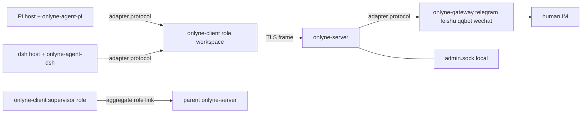

# Onlyne

Onlyne 是 agent 的本地 channel 与 routing 层：`onlyne-server` 路由消息并持有 ledger，`onlyne-client` 在每个工作区运行一个 role 的 session，`onlyne-gateway` 翻译一个聊天平台，coding-agent 插件通过同一份 adapter protocol 接入。

English README: [README.md](README.md).

## Process picture



## Binaries

- `onlyne-server`：server-root daemon，负责 spec 加载、路由、ledger、fault、admin socket、gateway host、workspace generate。
- `onlyne-client`：workspace daemon，负责一个 role 的 session lifecycle、process backend、本地 intent、agent adapter socket。
- `onlyne-gateway`：单个平台 gateway 进程，通过 `telegram`、`feishu`、`qqbot`、`weixin` 选择平台。
- `onlyne`：瘦人机入口，负责 daemon exec、socket 命令、消息动词、status、watch、repair、generate、completions。
- `onlyne-agent-fake`：testkit 产物，用于 e2e verification。
- v1.0.0 以硬错误拒绝 legacy workspace layout、unsupported schema、old wire format。发行包无 migration tool。

## Quickstart

```bash
set -euo pipefail
cargo build --workspace
SRC=$(pwd); tmp=$(mktemp -d)
"$SRC/target/debug/onlyne-server" init --root "$tmp/server" \
  --listen 127.0.0.1:7899
"$SRC/target/debug/onlyne-server" run --root "$tmp/server" &
"$SRC/target/debug/onlyne" --server-root "$tmp/server" wait-ready
"$SRC/target/debug/onlyne-client" init --workspace "$tmp/planner" --role planner \
  --server-root "$tmp/server" > "$tmp/planner.spec.toml"
cat "$tmp/planner.spec.toml" >> "$tmp/server/.onlyne/spec.toml"
"$SRC/target/debug/onlyne" --server-root "$tmp/server" reload
"$SRC/target/debug/onlyne-client" run --workspace "$tmp/planner" &
"$SRC/target/debug/onlyne-agent-fake" --workspace "$tmp/planner" --script \
  "$SRC/crates/onlyne-testkit/scripts/echo-complete.json" &
"$SRC/target/debug/onlyne" --server-root "$tmp/server" send --from planner --to planner --text "hello v1"
```

期望结果：`send` 输出一行 JSON，`ok = true`，任务为 UUID，`data.state = "in_flight"`；该任务的 ledger 达到 `acked`，session projection 达到 `public_lifecycle = "exited"` 和 `outcome = "done"`。

## Directory layout

由 `onlyne-server run --root <dir>` 选择的 server root：

```text
<server-root>/.onlyne/
  spec.toml                 # 单一中央真相
  state.db                  # server ledger，SQLite WAL
  run/s                     # admin unix socket，0600
  run/server.pid
  logs/server.log
  keys/server.key           # ed25519 与 TLS 私钥，PEM，0600
  templates/<topology>/<role>/
  ws/<topology>/<role>/     # generate 默认输出，整个目录可搬迁
  cache/                    # gateway render 临时空间
```

由 `onlyne-client run --workspace <dir>` 选择的 role workspace：

```text
<workspace>/.onlyne/
  config.toml               # role 身份、server endpoint、本地 plugins
  client.db                 # sessions、intents、inbox cursors、本地 caches
  run/s                     # client unix socket，供 adapter plugins 与 CLI 使用
  run/client.pid
  logs/client.log
  keys/role.key             # spec.toml 中登记 role 的私钥
  agent/<pkg>/              # generate vendor 的 coding-agent plugin package
```

Legacy workspace layout 以 exit 2 结束，并输出 `onlyne: legacy workspace layout; v1.0.0 does not migrate`。Unsupported schema 通过 schema gate 硬拒，并输出 `onlyne: unsupported schema; v1.0.0 does not migrate`。

## Configuration

`<server-root>/.onlyne/spec.toml` 是 role 名、公钥、ACL、prose、session concurrency、timeouts、routes、gateways、`session_command` 的单一真相。

`onlyne-server run` 在启动时完整解析 `spec.toml`。任何未知键或类型错误会拒绝启动，并输出 `spec.toml:<line>: <message>`。`onlyne server reload` 和 `SIGHUP` 会解析到临时 config，校验通过后原子替换 live config。校验失败会保留 active config，并记录 `fault{kind:"spec_reload_failed"}`。

Role registration 使用 TOML fragment。`onlyne-client init --workspace W --role R --server-root S` 创建 `W/.onlyne/keys/role.key`，写入 `W/.onlyne/config.toml`，并打印首行为 `[[client]]` 的 fragment，包含 `role` 与 `key = "ed25519/<base64>"`。操作员追加 fragment 到 `spec.toml` 后运行 `onlyne reload`。

Socket resolution 固定为：`--socket <path>` 优先，`--server-root <dir>` 映射到 `<dir>/.onlyne/run/s`，`--workspace <dir>` 或向上发现映射到 `<workspace>/.onlyne/run/s`。缺少 socket 时 exit 3，并输出 `onlyne: no onlyne socket found; pass --socket, --server-root, or --workspace`。

## What changed in 1.0.0

- 移除 FIFO channel I/O → socket 上的 length-prefixed JSON frames 与 shared adapter protocol。
- 移除 `loopback` → 通过 `onlyne send --to <own-role> --note` 向自身 role 投递 `note`。
- 移除 `---swarm` body headers → `Envelope`、`MsgKind`、`Causality`、`ControlOp` 字段。
- 移除 adapter start/stop ops → supervisor 管理 `onlyne-gateway` 进程。
- 移除 daemon 内的四平台 factory → `onlyne-gateway` 加载 feature-gated gateway plugin crates。
- 移除 offline delivery mesh → server-ledger 为 control-plane messages 排队，offline `note` 返回 `recipient_offline`。
- 移除 automatic retry 与 recovery tasks → durable client intents 加 explicit supervisor/admin repair verbs。
- 移除 web/admin surface → local admin unix socket 提供 `status`、`ledger`、`watch`、`repair_*`、`reload`、`spec_diff`。
- 移除 `harness/` submodules → adapter SDK、protocol schemas、conformance fixtures、external plugin packages。

## Pointers

- `docs/v1-PLAN.md`：权威 v1.0.0 design 与 verification cases。
- `docs/v1-CONTRACT.md`：work split、crate ownership、socket resolution、exit codes。
- `docs/v1-ARCHITECTURE.md`：crates、sockets、ledger、lifecycle、generation、federation 的 engineer onboarding map。
- `crates/onlyne-adapter/PROTOCOL.md`：coding-agent plugins 与 IM gateways 共用的 adapter protocol。
