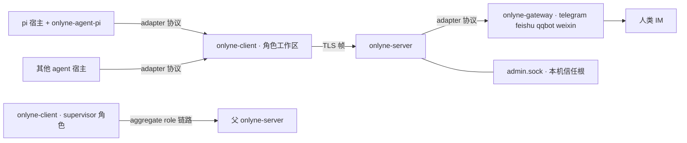

# Onlyne

**给 coding-agent 团队用的本地消息骨干。**

Onlyne 把一台机器变成一个小集群：**server** 在各 agent 角色之间路由消息并持久记账（ledger）；每个工作区各跑一个 **client**，负责本角色全部 coding-agent 会话；**gateway** 进程把 Telegram / 飞书 / QQ / 微信的聊天翻译成同一套消息模型。agent 的运行时保持原样，Onlyne 负责让它们的手互相够得着，并且每一步都留有可审计的凭证。

   

## 先看它跑起来

```bash
cargo build --workspace
cd examples/supervisor && ./run.py up
```

五个真实的 [pi](https://github.com/badlogic/pi-mono) coding agent 在 Orca 标签页里扮演环上的 `a → b → c → d → e`；挂在集群上的 supervisor agent 接收你的聊天、向环派活、盯记录文件。每一跳给 `lights.txt` 添一行，十行即整圈闭合：

```text
$ onlyne --server-root /tmp/onlyne-sup ledger --task <根任务id>
{"kind":"completion","from":"e","to":"_supervisor","state":"queued",
 "out_head":"1:a 2:b 3:c 4:d 5:e 6:a 7:b 8:c 9:d 10:e"}
```

TUI 把同一件事画成活图——第 1 页是角色网络，第 2 页是集群账本：

```text
 ╭── a ──╮    ╭── b ──╮    ╭── c ──╮
 │ pi ●1 │───▶│ pi    │───▶│ pi  ◐ │        ● 忙碌   ◐ 在飞一跳
 ╰───────╯    ╰───────╯    ╰───────╯
      ▲                          │
 ╭────┴──╮    ╭── d ──╮          ▼
 │ pi    │◀───│ pi    │◀─────────┘
 ╰── e ──╯    ╰───────╯
```

`hjkl` 沿边走、`l` 跟随一跳、方向键平移镜头、`e` 显出 supervisor 的派发辐条、`a` 切换只看活跃。一轮一个任务，会话结束标签页自己收——agent 退出，tab 随之回收。

## 部件清单

| 二进制 | 职责 |
|---|---|
| `onlyne-server` | 路由、账本、投递队列、fault、admin socket、工作区生成。每集群一个。 |
| `onlyne-client` | 每工作区一个角色的运行时：session 生命周期、进程后端、持久 intent、插件 adapter socket。 |
| `onlyne-gateway` | 每进程一个聊天平台：telegram · feishu · qqbot · weixin，编译期 feature 门控。 |
| `onlyne` | 人机薄入口：转发守护进程、直连 socket、输出 JSON。 |
| `onlyne-tui` | 两页观测面板，走 admin socket。 |
| `onlyne-agent-fake` | 脚本化假 agent，喂给 `crates/onlyne-testkit/e2e/` 下的十二份端到端证明。 |



## 你拿到什么

**可审计的投递。** 控制面消息（task、completion、control）以 at-least-once 送达并带 `op_id` 幂等键；每笔投递都在账本里留行，`onlyne server ledger` 读起来像银行流水。观测面（心跳、事件）at-most-once 加游标追补，慢观察者拖不慢干活的人。

**有自己生命周期的会话。** 角色通过屏幕后端拉起 coding agent——Orca 标签页、zellij 会话、无头 exec、测试用 fake——自动发现跟随你实际所在的屏幕。会话生命周期是一张证明过的状态机：五条状态轴、21 种事件、全表测试，同时喂给账本镜像和 TUI 的星号。

**断线有真相。** client 与 server 断链后，在跑的会话继续走到终态；出向消息先落持久 intent 队列，重连后按序补发。一切失败都有名有姓：耗尽的 intent 记成 fault。

**server 硬执的 ACL。** 每个角色登记一把 ed25519 公钥，spec 声明谁能给谁发。无边角色收到的第一帧就是 `acl_denied`，账本一行不写。任务回执是唯一内建豁免：completion 永远送达账本记录的派单人，汇报上行零常驻边。

**集群可以套集群。** supervisor 自己的 client 以普通 aggregate role 身份连父 server。任务进来、回执出去，父层账本里查不到任何子层角色名。协议里为零联邦代码。

**一份协议，两侧挂载。** pi 说的 adapter 协议就是 Telegram gateway 说的同一份：`hello` 握手、能力协商、`report` 观测、`assign` 载荷。接入新 coding agent 或新聊天平台，实现的是同一个小面（`crates/onlyne-adapter/PROTOCOL.md`）。

## 设计理念

两条坚持塑造了这份代码。

**传输层，不是运行时。** Onlyne 负责路由、凭证、恢复；判断留在 socket 两端的 agent 手里。守护进程里零提示词逻辑、零调度器、零模型调用。每个特性决策先回答一个问题——这件事归消息总线还是归 agent——投递真相才进总线。

**上下文按有损信道设计。** 需要存活的状态一律住 SQLite：server 账本、client intent 队列、持久 outbox。每一跳的 agent 上下文只拿当下需要的东西：文本加至多一张图、一个会话一个任务、提示词永远从单一来源现取。驮着的上下文越轻，集群能跑的深度越大。

第二条坚持有机检背书。`proofs/` 是一份纯 core 的 Lean 4 形式化（toolchain 4.33.1、零依赖、`lake build` 全绿、零 `sorry`）。三条公理把腐烂写成前提：上下文内事实的可靠度随深度单调衰减，在任意加深轨迹上终归于零。十二枚定理完成余下的工作：对一切"协调状态驮在上下文里"的协议给出不可能性结果；拯救定理给出外部账本模型，其风险界只依赖传输步数；每条设计决策各配一枚组合子引理（载体最小性、权威拆分、内容按引用、幂等重投、投递即建任务、文件真值重载、提示词单一来源、单任务会话）；收尾定理把本仓库的设计构造为安全侧的模型。证明方的工作契约在 `proofs/BRIEF.md`。

## 四个消息种类

| Kind | 用途 | 投递语义 |
|---|---|---|
| `task` | 向角色派活；按需拉起或复用会话 | at-least-once，目标离线持久排队 |
| `completion` | 任务的终态回执，携带结果摘要 | at-least-once，目标离线持久排队 |
| `note` | 人和 agent 的自由聊天 | 即发即忘，目标离线直接拒收 |
| `control` | 对任务执行 `recycle · probe · snapshot · cancel` | 仅 admin 或该任务属主 |

消息体是文本加至多一张内联图片；媒体管线住在你的 agent 那边，归 Onlyne 管的一直只有"送达与记账"。

## supervisor 教义

派发顺流而下：supervisor 向角色发 task，角色以完成 task 作答。回执落在账本里，supervisor 拉账本读报告，汇报自带凭证。角色直接给 supervisor 发消息的形态等于把编排压平成队列——demo 的 ACL 把这条路关着，环上每个角色的 `allowed_targets` 只留环内邻居。某个任务确实需要中途够到操作者时，supervisor 为这一个任务开一条上行路，任务完结路即收回。

```bash
onlyne --server-root <root> send --from _supervisor --to a --text "RING=a,b,c,d,e K=10"
onlyne --server-root <root> ledger --task <id>      # 根回执在这里排队
onlyne --server-root <root> sessions --task <id>   # 每一跳的生命周期
```

寄给 `_supervisor` 的根回执按设计排队：挂上 supervisor 自己的 client，积压即落进它的收件箱。这条队列就是操作者的拉取信箱，`ledger` 负责读，投递负责清。

## 手动起步

```bash
SRC=$(pwd); tmp=$(mktemp -d)
target/debug/onlyne-server init --root "$tmp/server" --listen 127.0.0.1:7899
target/debug/onlyne-server run --root "$tmp/server" &
target/debug/onlyne --server-root "$tmp/server" wait-ready
target/debug/onlyne-client init --workspace "$tmp/planner" --role planner \
    --server-root "$tmp/server" >> "$tmp/server/.onlyne/spec.toml"   # init 直接打印可粘片段
target/debug/onlyne --server-root "$tmp/server" reload
target/debug/onlyne-client run --workspace "$tmp/planner" &
target/debug/onlyne-agent-fake --workspace "$tmp/planner" --script \
    crates/onlyne-testkit/scripts/echo-complete.json &
target/debug/onlyne --server-root "$tmp/server" send --from planner --to planner --text "hello v1"
```

一行 JSON 回以 `data.state = "in_flight"`；随后该任务的账本行落到 `acked`，会话投影走到 `exited` 且 `outcome = "done"`。同一序列有可执行证明：`crates/onlyne-testkit/e2e/local-task.sh`，另有十一份姊妹脚本覆盖 ACL 拒收、幂等、断连补投、gateway 挂载、目录搬迁、双集群联邦。

## 数据在哪

```text
<server-root>/.onlyne/          spec.toml · state.db · run/s（admin） · keys/ · templates/ · logs/
<workspace>/.onlyne/            config.toml · client.db · run/s（adapter） · keys/ · logs/ · agent/
```

每个工作区自包含、可整搬：`onlyne server generate` 按模板生成角色工作区，产物内零绝对路径，`mv` 之后 `onlyne client run` 在哪都能接上。旧布局与旧数据库在门口 exit 2——v1.0.0 只认一套线格式、一张 schema、一种目录。

## 状态

`v1.0.0-beta.1`，分支 `v1.0.0-dev-super-redesign`。全量 e2e、环图 TUI、supervisor demo、pi adapter 插件在 macOS 全绿；四个 IM gateway 以 feature-gated crate 交付，等待真平台浸泡。`cargo build --workspace` 需要 Rust 1.85，再无更重的依赖。

## 阅读

- `docs/v1-PLAN.md` — 权威设计与九个验收用例。
- `docs/v1-ARCHITECTURE.md` — crate 地图、socket、账本、生命周期、生成、联邦。
- `crates/onlyne-adapter/PROTOCOL.md` — agent 与 gateway 共用的 adapter 面。
- `examples/supervisor/README.md` — 活环 demo，含操作者口吻的使用记录。
- `skills/onlyne-supervisor/SKILL.md` — 集群操作 agent 的驾驶手册。
- `skills/onlyne-role/SKILL.md` — 环上角色干活的手册。
- `.agents/skills/onlyne/SKILL.md` — 本仓库的开发指导。

MIT © dbydd
