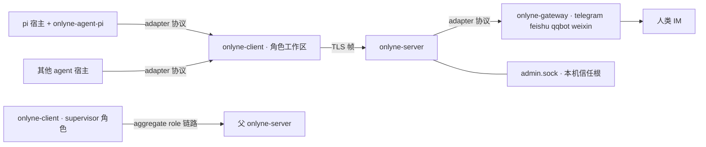

# Onlyne

**给 coding-agent 团队用的消息管道，跑在你自己的机器上。**

Onlyne 把一群 coding agent 编成一个工作集群。**server** 在 agent 角色之间路由消息，并把每次投递写进持久账本。每个工作区一个 **client**，负责本角色全部 coding-agent 会话。**gateway** 进程把 Telegram / 飞书 / QQ / 微信的聊天翻译成同一套消息模型。agent 的运行时保持原样，Onlyne 只是让它们的手互相够得着，并留下一条可审计的痕迹。集群能跨机器：client 用 TLS 从任何地方连回 server，生成好的工作区 `mv` 一下就能搬走，集群还能嵌套成更大的集群。

   


## 安装

全部 19 件 1.2.0 已上架 [crates.io](https://crates.io)。瘦入口是 `onlyne-cli`（安装出二进制 `onlyne`）；四个守护进程同样从 crates.io 装进 cargo bin，`onlyne` 在那里找兄弟件。

```bash
cargo install onlyne-cli --version 1.2.0
cargo install onlyne-server onlyne-client onlyne-gateway onlyne-tui --version 1.2.0
```

`onlyne` 是一个薄入口，两种用法。`onlyne server <verb>`、`onlyne client <verb>`、`onlyne gateway <verb>` exec 对应的守护进程；admin 那组名词住在顶层——`status`、`roles`、`sessions`、`ledger`、`faults`、`watch`、`history`、`spec_diff`、`reload`、`send`、`control`、`repair <verb>`——每个都直接问 admin socket，当场出答案。`onlyne server <verb>` 是第二个入口，既能管守护进程生命周期（`init`、`run`、`start`、`stop`、`generate`），也能走它顺带提供的查询名词：`status`、`roles`、`sessions`、`ledger`、`faults`、`watch`、`history`、`reload`、`repair <verb>`。要关停，supervisor 在 server root 所在主机上跑 `onlyne server stop`。TUI 单独叫 `onlyne-tui`。两个动词在本地作答，不碰任何 socket：`onlyne schema <client|spec> [--pretty]` 打印某一份配置文件的编译期 JSON Schema，`onlyne completions <bash|elvish|fish|powershell|zsh>` 输出 shell 补全脚本。结项报告的文法与 `report` 动词的权威在 `onlyne report --help`，帮助文本里嵌着整份文法。仓库里的 `skills/onlyne-role-payload-v2/SKILL.md` 是给操作员读的那一份；`onlyne server generate` 没有写 skill 这一步，它按角色的 `templates/<topology>/<role>/` 目录铺文件，仓库自带的模板里放的是 `AGENTS.md` 与 `.pi/` 条目。pi 角色的 adapter 插件在 npm：

```bash
pi install npm:pi-onlyne
```

## 先看它跑起来

```bash
cargo build --workspace
cd examples/supervisor && ./run.py up
```

五个真实的 [pi](https://github.com/badlogic/pi-mono) coding agent 在 Orca 标签页里扮演环上的 `a → b → c → d → e`。挂在集群上的 supervisor agent 接收你的聊天、向环派活、盯着记录文件 `lights.txt`。每一跳添一行，十行闭合成整圈：

```text
$ onlyne --server-root /tmp/onlyne-sup ledger --task <根任务id>
{"kind":"completion","from":"e","to":"_supervisor","state":"queued",
 "out_head":"1:a 2:b 3:c 4:d 5:e 6:a 7:b 8:c 9:d 10:e"}
```

TUI 把同一件事画成活图——第 1 页是角色网络，第 2 页是集群账本：

```text
 ╭── a ──╮    ╭── b ──╮    ╭── c ──╮    ╭── d ──╮    ╭── e ──╮
▶│ pi ●1 │───▶│ pi    │───▶│ pi  ◐ │───▶│ pi    │───▶│ pi    │   ● 忙碌   ◐ 在飞一跳
 ╰───────╯    ╰───────╯    ╰───────╯    ╰───────╯    ╰───────╯
└─────────────────────────────────────────────────────────────┘
```

`hjkl` 沿边走，`l` 跟随一跳，方向键平移镜头，`+`/`-` 放宽和收紧图距，`a` 切换只看活跃。supervisor 自己的位置不上图：那条 `[[client]]` 只登记操作者身份，环上不接客户端进程。一轮一个任务，一个会话结束就收一个标签页：agent 退出，tab 自己回收。

## 实战案例：research-flywheel

[research-flywheel](https://github.com/dbydd/research-flywheel) 是跑在 Onlyne 上的真实 agent 环。clone 模板树，对会话说「帮我看看这棵树」，开场协议问四个问题——主题、角色拓扑、单机或多机、算力边界——过完九项装配检查就启动这个环。五个角色各持一条 Onlyne 会话、各占一个工作区；交接受 relay guard 约束，每条 verdict 都落账本。全流程细则写在它的 `BOOTSTRAP.md`。

## 部件清单

| 二进制 | 职责 |
|---|---|
| `onlyne-server` | 路由、账本、投递队列、fault、admin socket、工作区生成。每集群一个。 |
| `onlyne-client` | 每工作区一个角色的运行时：session 生命周期、进程后端、持久 intent、插件 adapter socket。 |
| `onlyne-gateway` | 每进程一个聊天平台：telegram · feishu · qqbot · weixin，编译期 feature 门控。 |
| `onlyne` | 人机薄入口：转发守护进程、直连 socket、输出 JSON。 |
| `onlyne-tui` | 两页观测面板，走 admin socket。 |
| `onlyne-agent-fake` | 脚本化假 agent，供 `crates/onlyne-testkit/e2e/` 下的十八份端到端证明使用。 |



## 你拿到什么

**可审计的投递。** 控制面消息（task、completion、control）按 at-least-once 送达，每条都带 `op_id` 幂等键。每笔投递都在账本里留行，`onlyne server ledger` 读起来像银行流水。观测面（心跳、事件）按 at-most-once 送达，落后了用游标追补，慢观察者拖不慢干活的人。

**有自己生命周期的会话。** 角色通过一个后端拉起 coding agent：herdr pane、Orca 标签页、zellij 会话、无头 exec、client 按自有协议驱动的 acp agent，或测试用的 fake。`ONLYNE_BACKEND` 的取值是 `herdr | orca | zellij | exec | acp | fake | auto`。写出 `herdr`、`orca`、`zellij`、`exec`、`acp` 或 `fake` 即选用该后端。空值或 `auto` 按 herdr → orca → zellij 探测。`exec`、`acp` 与 `fake` 只在 `ONLYNE_BACKEND` 写出其名时启用。全无匹配时 `onlyne-client run` 以退出码 5 退出，文案为 `onlyne: no supported host detected; run inside herdr, orca, or zellij, or set ONLYNE_BACKEND`。会话生命周期是一张证明过的状态机——21 种事件走五条状态轴，有全表测试——账本镜像和 TUI 的星号都从它取数。

在 Windows 上，`acp` 属编译可达：`onlyne-acp` 备有 Windows 进程组分支，CI 的 Windows job 不覆盖该 crate，ACP 的实测全部发生在 macOS。

pane 后端开一个终端，读它的屏幕。`session_command` 在自己的 stdio 上说协议时（渲染后的 argv 携带 `--acp`、`--mode=rpc` 或 `--mode rpc`），`herdr`、`orca`、`zellij` 三个后端在开页之前拒收这条投递：JSON-RPC 帧只会打进 pane，没有读者。投递落 `rejected`，拒收文案原文进账本行的 `reason` 列，五角色环上配 Orca 后端跑 `pi --mode rpc` 的那条记录为：

> orca backend cannot host a protocol session: --mode rpc speaks JSON-RPC on its own stdio and the pane would print the frames; set backend = "exec" or backend = "acp" in the workspace config

文案点名生效的后端与命中的 token。改法在工作区 `config.toml`：写 `backend = "exec"` 或 `backend = "acp"`。运行期不会替你换后端。

herdr 层级：herdr session 由 client 进程环境继承，pane 内的 pi 子进程继续继承；workspace = 一个 server root/topology（label 为 `onlyne:<cluster>`）；tab = role；pane = 一个 onlyne session。`<cluster>` 取 server 自己的 `[server] name`：client 从 `welcome.cluster` 读到它，再以 `ONLYNE_CLUSTER` 交给它创建的每一个 pane。首个 welcome 之前拉起的 pane 没有这个变量，herdr 就用自己那个默认 label 的 workspace。关闭命令是 `herdr pane close`。id 形状为 `wF` / `wF:t1` / `wF:p1`。`onlyne-test` 这类命名 session 取 client 环境里已有的 `HERDR_SESSION`。client 的 `sessions` 行把地址记在 `backend_ref`：`workspace_id`、`tab_id`、`pane_id`、`agent`、`workspace_label`，加上传下来的分屏记录（`base_pane`、`split_direction`）。后端按 label 认 herdr workspace（`onlyne:<cluster>`），按名字认 tab（role 自己的名字）。想让后端用上现有那个 workspace 或 tab，操作者在 client 拉起 session 之前先改名：`herdr workspace rename <WORKSPACE_ID> onlyne:<cluster>`、`herdr tab rename <TAB_ID> <role>`。label 对不上的 workspace 会拿到第二个 workspace，tab 名对不上会拿到第二个 tab，这时 client 打一条 warning，点名该 label 与新建出来的 workspace。新建那一步的 warning 同时给出 label、新的 `workspace_id`，以及补救命令 `herdr workspace rename <WORKSPACE_ID> onlyne:<cluster>`；`workspace create`、`tab create`、`pane split` 的 `--cwd` 一律以绝对路径递给 herdr，herdr 按自己的工作目录解析这条路径。

spawn 双轨：`session_command` 首 token 命中已知 agent 名（`pi`、`omp` 以及 herdr `--kind` 表其余项）时执行 `herdr agent start <name> --kind <k> --pane <id> --timeout 25000 -- --session-id <id> --session-dir .pi/sessions`：`--kind` 选定 token 0 指名的可执行文件，`session_command` 余下的 token 跟在 `--` 分隔符之后传给 agent，这正是 herdr 0.9.0 文档里的调用写法。首 token 不在该表里的命令执行 `herdr pane run <pane_id> '<一条 shell 行>'`。`pane run` 无 JSON 输出。命令经 `shell_quote` 拼成单个 argv token。分屏由 `PanePlacement::from_pane_count` 决定：`(count+1).is_power_of_two()` 映射为 `right`，其余 count 映射为 `down`，ratio 为 `0.5`。`count` 取自 `herdr tab list --workspace W` 的 `result.tabs[].pane_count`，缺字段按 0。生产 spawn 传入 `placement: None`。

focus 链路：`herdr workspace focus <W>`，随后 `herdr tab focus <T>`（位置参数，恢复该 tab 上次聚焦的 pane）。managed agent 的 pane 再执行 `herdr agent focus <pane_id>`。`agent focus` 认 managed agent。`pane run` 拉起的 shell pane 会得到 `agent_not_found`。herdr 的 `pane focus` 写法是 `--pane <base_pane> --direction <split_direction>`，从该锚点走到邻居，所以分屏时记下的两个值就是把普通 shell pane 拿到的路径。`herdr pane get <pane_id>` 是确认那一步：`result.pane.focused` 要为 true，落在别的 pane 时报错并指名当前持焦的 pane。入口为 `onlyne control focus --task <id>` 与 TUI 的 `F` 键。`focus()` 失败记 `Report::Fault{kind:"focus"}`。

命令达得到没有空闲 session 的 role。`pull` 带一个可选的 `control_only`，达到 `max_sessions` 的 client 用它发问，于是 `focus`、`recycle`、`cancel` 照样送达，任务队列那边的行保持 `queued`，ticket 一分不花。

`onlyne-client doctor` 是只读子命令，打印一段 JSON（字段 `host`、`backend_selection`、`explicit`、`binary`、`session`、`workspace_id`、`tab_id`、`pane_id`、`refusal`），退出码 0。检测不到宿主时 `host` 为 `null` 并带 `refusal`。用途是部署前体检。

**断线有真相。** client 与 server 断链后，在跑的会话继续走到终态；出向消息先落持久 intent 队列，重连后按序补发。没有东西会悄悄丢：重试耗尽的 intent 记成一条有名字的 fault。

**ACL 由 server 强制执行。** 每个角色登记一把 ed25519 公钥，spec 声明谁能给谁发。没有这条边的角色，收到的第一帧就是 `acl_denied`，账本一行不写。任务回执是唯一内建豁免：completion 永远送达账本记录的派单人，所以汇报上行不需要任何常驻边。

**集群可以套集群。** supervisor 自己的 client 以普通 aggregate role 身份连父 server。任务进来，回执出去，父层账本里查不到任何子层角色名。协议里没有一行联邦代码。

**一份协议，两侧挂载。** pi 和 Telegram gateway 说的是同一份 adapter 协议：`hello` 握手、能力协商、`report` 观测、`assign` 载荷。要接新 coding agent 或新聊天平台，实现的是同一个小面（`crates/onlyne-adapter/PROTOCOL.md`）。

## 设计理念

两条坚持塑造了这份代码。

**管传输层，运行时留给两端。** Onlyne 负责路由、凭证、恢复；判断留在 socket 两端的 agent 手里。守护进程里没有提示词逻辑、没有调度器、没有模型调用。每个特性决策先回答一个问题——这件事归消息总线还是归 agent——只有投递真相才进总线。

**上下文按有损信道设计。** 需要存活的状态一律住 SQLite：server 账本、client intent 队列、持久 outbox。每一跳的 agent 上下文只拿当下需要的东西：文本加至多一张图、一个会话一个任务、提示词永远从单一来源现取。上下文越轻，集群能跑的深度越大。

第二条坚持有机检背书。`proofs/` 是一份纯 core 的 Lean 4 形式化（toolchain 4.33.1、零依赖、`lake build` 全绿、零 `sorry`）。三条公理把衰减写成前提：上下文内事实的可靠度随深度单调衰减，在任意加深轨迹上终归于零。十二枚定理完成余下的工作。对一切把协调状态放进上下文的协议，给出不可能性结果；拯救定理给出一个外部账本模型，它的风险界只依赖传输步数。每条设计决策各配一枚组合子引理：载体最小性、权威拆分、内容按引用、幂等重投、投递即建任务、文件真值重载、提示词单一来源、单任务会话。收尾定理把本仓库的设计构造为安全侧的模型。证明方的工作契约在 `proofs/BRIEF.md`。

## 四个消息种类

| Kind | 用途 | 投递语义 |
|---|---|---|
| `task` | 向角色派活；按需拉起或复用会话 | at-least-once，目标离线持久排队 |
| `completion` | 任务的终态回执，携带结果摘要 | at-least-once，目标离线持久排队 |
| `note` | 人和 agent 的自由聊天 | 即发即忘，需要目标 role 已有运行中的 session；打开 `note_queue` 才会排队等待 |
| `control` | 对任务执行 `recycle · probe · snapshot · cancel` | 仅 admin 或该任务属主 |

消息体是文本加至多一张内联图片。媒体管线住在你的 agent 那边；Onlyne 只管送达和记账。

投递按 msg id 结清：`onlyne ack --msg-id <id> --reason <text> --force --yes-i-am-supervisor-not-other-role` 收下，`onlyne reject --msg-id <id> --reason <text> --force --yes-i-am-supervisor-not-other-role` 拒收。两者都可选带 `--op-id`，`onlyne control --task <id> recycle|cancel --reason <text> --force --yes-i-am-supervisor-not-other-role` 的 reason 同样是必填。三个动词都要求带上旗标对 `--force --yes-i-am-supervisor-not-other-role`。

账本行记下自己为何结清。`reason` 列随行输出：`onlyne ledger` 的行键为 `msg_id`、`task`、`state`、`reason`、`out_head`、`body`、`family`、`hop_budget`；TUI 第二页的 task 详情面板在账本行尾追加 `reason=<text>`。没有值的行不出现该键，列加入之前写的旧行读起来与往日一致。实测出现过的取值：`requeue_exhausted`、`requeue_ttl`、`expired`、`session_dead`，以及上文 pane 拒收的整句。操作者经 `onlyne reject` 或 `onlyne repair fail` 自填的 `--reason` 文本原样进这一行；`onlyne ack` 收下时，该文本随结清事件走，行上的 `reason` 保持原样。字符串 `operator ack` 是 faults 表自己 `reason` 列的用例数据（`crates/onlyne-store/src/tests.rs`），账本列没有它的记录。

## supervisor 教义

派发顺流而下：supervisor 向角色发 task，角色做完 task 后作答。回执落在账本里，supervisor 拉账本读报告，汇报自带凭证。角色直接给 supervisor 发消息，等于把编排压平成队列——demo 的 ACL 把这条路关着，环上每个角色的 `allowed_targets` 只留环内邻居。某个任务确实需要中途够到操作者时，supervisor 就把那个角色写进 `spec.toml` 的 `allowed_targets`，跑一次 `onlyne reload`。任务完结时，用同一次编辑把这条边撤掉。

```bash
onlyne --server-root <root> send --from _supervisor --to a --text "RING=a,b,c,d,e K=10" --force --yes-i-am-supervisor-not-other-role
onlyne --server-root <root> ledger --task <id>      # 根回执在这里排队
onlyne --server-root <root> sessions --task <id>   # 每一跳的生命周期
```

寄给 `_supervisor` 的根回执按设计排队。挂上 supervisor 自己的 client，积压就落进它的收件箱。这条队列是操作者的拉取信箱：`ledger` 读它，投递清它。

## 手动起步

```bash
SRC=$(pwd); tmp=$(mktemp -d)
target/debug/onlyne-server init --root "$tmp/server" --listen 127.0.0.1:7899
target/debug/onlyne-server run --root "$tmp/server" &
target/debug/onlyne --server-root "$tmp/server" wait-ready
target/debug/onlyne-client init --workspace "$tmp/planner" --role planner \
    --server-root "$tmp/server" >> "$tmp/server/.onlyne/spec.toml"   # init 直接打印可粘片段
target/debug/onlyne --server-root "$tmp/server" reload
target/debug/onlyne-client run --workspace "$tmp/planner" &
target/debug/onlyne-agent-fake --workspace "$tmp/planner" --script \
    crates/onlyne-testkit/scripts/echo-complete.json &
target/debug/onlyne --server-root "$tmp/server" send --from planner --to planner --text "hello v1" --force --yes-i-am-supervisor-not-other-role
```

一行 JSON 回以 `data.state = "in_flight"`。随后该任务的账本行落到 `acked`，会话投影走到 `exited` 且 `outcome = "done"`。同一序列有可执行证明：`crates/onlyne-testkit/e2e/local-task.sh`。另有十七份姊妹脚本覆盖 ACL 拒收、幂等、断连补投、重启后的 hello 接管、gateway 挂载、目录搬迁、双集群联邦、心跳巡检、无头 exec 路径（`exec-headless.sh`）、深路径工作区的 socket（`socket-path-length.sh`）。还有脚本化 ACP agent 驱动的 acp 后端（`acp-session.sh`）与带回传路由的结项报告（`acp-payload-v2.sh`）。

在 macOS 上把二进制拷进 `PATH` 要多做一步：拷出来的二进制如果代码签名和文件对不上，一 exec 就被杀，所以拷完要 ad-hoc 重签一下（`codesign --force --sign - ~/.cargo/bin/onlyne*`）。

## 数据在哪

```text
<server-root>/.onlyne/          spec.toml · state.db · run/s（admin，规范名） · run/socket（记下实际服务的 socket 路径） · keys/ · templates/ · logs/
<workspace>/.onlyne/            config.toml · client.db · run/s（adapter，规范名） · run/socket（记下实际服务的 socket 路径） · keys/ · logs/ · agent/
```

unix 上每个守护进程绑定的都是规范名 `run/s`，前提是这条路径不超过 103 字节；目录树深过这条界限时，socket 落到系统临时目录下的短派生路径，`run/socket` 记下实际服务的那条路径。

每个工作区自包含、可整搬：`onlyne server generate` 按模板生成角色工作区，产物里没有绝对路径，`mv` 之后 `onlyne client run` 在哪都能接上。旧布局与旧数据库到门口就 exit 2——v1.0.0 只认一套线格式、一张 schema、一种目录。

## 状态

最新 tag 是 `v1.2.0`，19 件 crate 已上架 crates.io。本轮把无头会话后端做齐：`backend = "acp"` 让 client 以子进程方式驱动一个 ACP v1 agent，工作区 `[acp]` 表管 mode、model、reasoning_effort、permission，会话正文落 `<workspace>/.onlyne/logs/session-<task>.log` 与 `session-<task>.events.jsonl`。三条行为守住边界：`initialize` 恒带 client 版本号；`herdr`、`orca`、`zellij` 后端在开 pane 之前拒收自带 stdio 协议的 `session_command`，整句拒收理由写进账本行的 `reason`；`onlyne ledger` 与 TUI 第二页现在都读得到这一列。会话内容的查看面已撤下——`onlyne-view` 二进制、client socket 上的实时内容页、adapter 协议里的 `watch_content`——journal 与两条上报通路保留（ACP 侧 `outcomes()` 解析、pi 侧 adapter 插件）。fake e2e 14/14，含 `acp-session.sh`；五角色环跑了 11 跳，每跳的账行都是 `acked`。`cargo build --workspace` 需要 Rust 1.85。安装：`cargo install onlyne-cli --version 1.2.0`，四个守护进程同号。

## 阅读

- `docs/v1-PLAN.md` — 权威设计与九个验收用例。
- `docs/v1-ARCHITECTURE.md` — crate 地图、socket、账本、生命周期、生成、联邦。
- `crates/onlyne-adapter/PROTOCOL.md` — agent 与 gateway 共用的 adapter 面。
- `examples/supervisor/README.md` — 活环 demo，用操作者的口吻写成。
- `skills/onlyne-supervisor/SKILL.md` — 集群操作 agent 的驾驶手册。
- `skills/onlyne-role/SKILL.md` — 环上角色干活的手册。
- `skills/onlyne-role-payload-v2/SKILL.md` — 同一本手册的 acp 角色版本，讲结项报告的文法与它的回传路由。
- `.agents/skills/onlyne/SKILL.md` — 本仓库的开发指导。

MIT © dbydd
