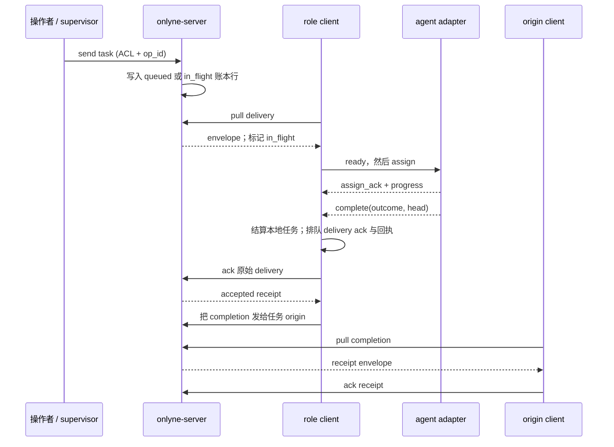
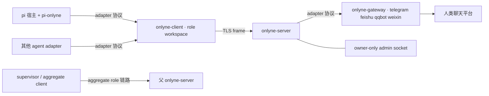

# Onlyne

**给 coding-agent 团队用的消息与传输层，跑在你自己的机器上。**

Onlyne 把 coding agent 组织成持久的工作角色。**server** 在角色之间路由消息，并把每次投递记录进持久账本。每个角色工作区运行一个 **client**，负责该角色的 coding-agent 会话。可选的 **gateway** 进程把 Telegram、飞书、QQ、微信接入同一套消息模型。agent 保留自己的运行时并负责决策；Onlyne 提供路由、排队、会话传输、回执和可审计记录。

client 可以通过 TLS 在不同机器上运行。生成的工作区可以整体搬移；supervisor client 也可以把一个子集群作为 aggregate role 暴露给父 server。

   


## 选择起点

| 路径 | 适合什么时候 | 额外要求 |
|---|---|---|
| **已安装的二进制** | 把 Onlyne 接到已有 agent、宿主或服务管理器。 | 一套匹配版本的 Onlyne，以及你自己的 agent adapter 或 ACP 命令。 |
| **源码 checkout：fake 快速开始** | 想在没有模型和终端宿主的情况下跑通最短本地任务。 | Rust 1.85+、POSIX shell 和源码 checkout。`onlyne-agent-fake` 由 `onlyne-testkit` 构建，不随发布二进制安装。 |
| **源码 checkout：pi + Orca 演示** | 想看到真实 pi 会话出现在 Orca 标签页里。 | fake 路径的要求，加上 Python 3、pi、模型凭证、Orca 应用和 `orca` CLI；可见路径应从 Orca 标签页中运行。 |

下面的 fake 和 Orca 示例使用 `target/debug/...`，因为它们直接运行源码构建出的二进制。

## 安装

### 前置条件

- **从 crates.io 安装：** Cargo 和 Rust 1.85 或更新版本。
- **构建默认功能的 gateway：** 安装 `protoc` 并把它放在 `PATH` 中。server、client、CLI 和 TUI 不需要 `protoc`。
- **运行时：** 每个 role client 都能访问的地址和端口；本地 admin socket 与 adapter socket 需要一个可写的 owner tree。
- **agent 宿主：** 一个受支持的 backend 和对应 adapter。真实 pi 路径需要 [pi coding agent](https://github.com/badlogic/pi-mono)；本文路径使用 pi 0.85.1。
- **服务：** 安装不会自动注册服务。可以在前台运行 daemon，或使用 `onlyne server start`。

### crates.io 安装

当前仓库版本为 **1.4.0**。让 CLI、daemon 和 TUI 使用同一版本：

```bash
cargo install --version 1.4.0 \
  onlyne-cli onlyne-server onlyne-client onlyne-gateway onlyne-tui
```

这会安装五个命令：

| 命令 | 职责 |
|---|---|
| `onlyne` | 薄的操作入口：转发生命周期命令，并直接读写本地 admin/adapter socket。 |
| `onlyne-server` | 一个集群的路由器、投递队列、持久账本、fault 记录、gateway 宿主和 admin socket。 |
| `onlyne-client` | 一个角色工作区的 server 链路、session 生命周期、backend 宿主、adapter socket 和持久出站 intent。 |
| `onlyne-gateway` | 一个聊天平台进程：`telegram`、`feishu`、`qqbot` 或 `weixin`。 |
| `onlyne-tui` | 通过 server 本地 admin socket 展示两页观测面板。 |

`onlyne-agent-fake` 是额外的源码/testkit 命令，不包含在这五个从 registry 安装的命令中。下面的 fake 快速路径会构建它。

### agent handbook

安装的 `onlyne` 二进制携带与自身版本匹配的 handbook：

```bash
onlyne skill export                         # 导出全部集合到 .agents/skills
onlyne skill export --set role              # 角色工作区 handbook
onlyne skill export --set supervisor        # supervisor handbook
onlyne skill export --dest /path/to/skills
```

内容相同的文件会保持不变；已有文件内容不同会停止导出，传 `--force` 才会替换。`npx skills add dbydd/onlyne` 和 `npx skills add ./` 通过 skills CLI 安装同一套仓库文档。

## 最短本地任务：fake backend

从仓库根目录运行下面的命令。它只构建本地 fake 路径需要的包，创建临时集群，并使用仓库内的脚本 agent。fake 从分配文本完成任务，不调用模型。

```bash
cargo build -p onlyne-cli -p onlyne-server -p onlyne-client -p onlyne-testkit

tmp=$(mktemp -d)
server_pid=
client_pid=
fake_pid=

target/debug/onlyne-server init \
  --root "$tmp/server" --listen 127.0.0.1:17899
target/debug/onlyne-server run --root "$tmp/server" >"$tmp/server.log" 2>&1 &
server_pid=$!
target/debug/onlyne --server-root "$tmp/server" wait-ready

target/debug/onlyne-client init \
  --workspace "$tmp/planner" \
  --role planner \
  --server-root "$tmp/server" \
  --prose "v1 smoke prose" >>"$tmp/server/.onlyne/spec.toml"
target/debug/onlyne --server-root "$tmp/server" reload

ONLYNE_BACKEND=fake target/debug/onlyne-client run \
  --workspace "$tmp/planner" >"$tmp/client-process.log" 2>&1 &
client_pid=$!
target/debug/onlyne-agent-fake \
  --workspace "$tmp/planner" \
  --script crates/onlyne-testkit/scripts/echo-complete.json \
  >"$tmp/fake.log" 2>&1 &
fake_pid=$!

until target/debug/onlyne --server-root "$tmp/server" roles --json \
  | grep -q '"state":"online"'; do
  sleep 0.2
done

send=$(
  target/debug/onlyne --server-root "$tmp/server" send \
    --from planner --to planner --text "hello v1" \
    --force --yes-i-am-supervisor-not-other-role
)
printf '%s\n' "$send"
task=$(printf '%s\n' "$send" | sed -n 's/.*"task":"\([^"]*\)".*/\1/p')

until target/debug/onlyne --server-root "$tmp/server" ledger \
  --task "$task" --json | grep -q '"state":"acked"'; do
  sleep 0.2
done

target/debug/onlyne --server-root "$tmp/server" ledger --task "$task" --json
target/debug/onlyne --server-root "$tmp/server" sessions --task "$task" --json
```

任务行最终会以 `acked` 结算，`out_head` 中包含 `hello v1`；session 投影会变成 `exited`，`outcome` 为 `done`。如果 `17899` 已被占用，请替换 init 命令中的端口。

完成后清理临时进程和目录：

```bash
kill "$fake_pid" "$client_pid" "$server_pid" 2>/dev/null || true
wait "$fake_pid" "$client_pid" "$server_pid" 2>/dev/null || true
rm -rf "$tmp"
```

### 用 exec backend 运行真实 agent

同样的 server/client 拓扑不需要终端宿主。准备可用的 pi 安装和 adapter 后，在上面启动 client 的位置只运行下面的 client 命令，并省略 fake agent：

```bash
pi install npm:pi-onlyne
ONLYNE_BACKEND=exec target/debug/onlyne-client run --workspace "$tmp/planner"
```

角色的 `session_command` 已经指向 pi。client 会为每个任务启动一个 pi 子进程，保持 stdin 打开，并把 stdout/stderr 写到 `<workspace>/.onlyne/logs/session-<task>.log`。发送、账本和 session 查询命令保持不变。这条路径需要可用的模型/提供商凭证。

对于生成的工作区，`onlyne server generate` 可以把仓库中的 `plugins/onlyne-agent-pi` 包放进工作区，并写入项目范围的 `.pi/settings.json` 配置项。普通 pi 会话不会因用户级 npm 安装而自动激活扩展；Onlyne 注入 `ONLYNE_ROLE`、`ONLYNE_SESSION_ID` 和 `ONLYNE_TASK_ID` 时它才会挂载。

## 真实 pi + Orca 演示

仓库包含一个五角色 running-lights 演示：它生成集群、启动五个真实 pi worker、打开一个 supervisor pi session，并把每个 worker 显示在 Orca 标签页中。任务完成后标签页会回收。

在仓库所在的 Orca 标签页中运行：

```bash
cargo build -p onlyne-cli -p onlyne-server -p onlyne-client -p onlyne-tui
python3 examples/supervisor/run.py up
python3 examples/supervisor/run.py status
python3 examples/supervisor/run.py stop
```

Orca 路径需要：

- Orca 桌面应用正在运行，且 `orca` CLI 在 `PATH` 中；
- 在 Orca 标签页里的 shell，让 `ORCA_WORKTREE_ID` 选中宿主 worktree；
- `pi` 在 `PATH` 中，并配置好模型/提供商凭证；
- Python 3；启动器只使用标准库。

启动器使用仓库本地的 pi adapter 包和 `target/debug` 下的二进制。要在 Orca 外以无头方式运行同一个真实 agent 演示：

```bash
ONLYNE_BACKEND=exec python3 examples/supervisor/run.py up
```

此时 supervisor 输出写入演示根目录，不打开可见的 supervisor 标签页。可以在另一个终端检查演示：

```bash
target/debug/onlyne-tui --server-root /tmp/onlyne-sup
```

完整步骤见 [`examples/supervisor/README.md`](examples/supervisor/README.md)。[research-flywheel](https://github.com/dbydd/research-flywheel) 是建立在 Onlyne 上的更大 agent 环示例。

## 跟随一个任务



1. **发送。** `onlyne send` 打开 server 的本地 admin socket，指定发送者和目标，并携带 `op_id` 幂等键。相同操作重复发送会得到持久回执；同一个键配不同正文则是 conflict。
2. **接受并记录。** server 在写账本前验证 envelope、发送者、目标和 ACL。接受后追加一行并发布回执；可立即投递时状态为 `in_flight`，角色离线或达到容量时为 `queued`。
3. **拉取并分配。** role client 拉取最老的可用任务，server 将其标记为 `in_flight` 并绑定 delivery ticket。client 检查容量、启动所选 backend，等待 session 的 `ready` barrier，再发送 `assign`。任务正文随 assignment frame 传递；`session_command` 中的 `{task}` 渲染为任务 id，不是正文。
4. **完成。** adapter 报告终态和摘要；pi 插件的 `onlyne_complete` 工具提供这两项。client 记录本地任务结论，排队原始 delivery 的 acknowledgement，释放 session slot，并为账本记录的 origin 创建 completion envelope。
5. **回执。** client 的持久 intent 在重连后按顺序通过 TLS 发出。原任务行变为 `acked`；completion receipt 在 origin client 拉取前保持 `queued`，拉取后结清，不会启动新的 session。

角色可以用 `onlyne_handoff` 延续任务家族。server 会创建挂在父任务下的子任务，并传递 family id、hop budget、origin、deadline 和 labels。即使普通角色 ACL 没有返回边，completion 也会回到任务的 origin。

### 四种核心消息

| Kind | 用途 | 投递语义 |
|---|---|---|
| `task` | 把工作交给角色并创建一个 session。 | 至少一次；角色离线时排队。 |
| `completion` | 携带任务的终态结果。 | 至少一次；在 origin 处排队。 |
| `note` | 人、agent 和 gateway 之间的自由文本。 | 默认尽力投递；`note_queue` 可以在角色没有 session 时暂存一条。 |
| `control` | 对任务执行 `recycle`、`probe`、`snapshot`、`cancel` 或 `focus`。 | 仅任务属主或 admin。 |

消息正文是文本加至多一张内联图片。媒体管线位于 agent 一侧；Onlyne 负责送达和记账。

## 配置与存储

### Server root

`<server-root>/.onlyne/spec.toml` 是协议的 source of truth：server endpoint 和证书 pin、注册角色密钥、ACL 边、角色 prose、并发、超时、relay policy、`session_command`、路由和 gateway 配置都在这里。Onlyne 不会通过运行时 API 修改它。追加 `onlyne-client init` 片段或使用 `onlyne server generate`，然后运行 `onlyne reload`。

```text
<server-root>/.onlyne/
  spec.toml                 协议与角色配置
  state.db                  账本、fault、事件、ghost-sweep 审计
  run/s                     owner-only admin/gateway socket（规范名）
  run/socket                需要时记录实际使用的短 socket 路径
  run/server.pid            detached server 的 pid
  keys/server.key           TLS 与 server 身份密钥
  templates/                generate 使用的角色内容
  ws/                       默认生成的工作区
  cache/                    gateway 临时状态
  logs/server.log           detached server 日志
```

### Role workspace

`<workspace>/.onlyne/config.toml` 是角色本地配置：身份、server endpoint、证书 pin、密钥路径、backend、Orca policy、ACP 选项，以及 reconnect/stall 定时器。`cert_pin`、`key_path` 和 `server.host` 可以使用 `$NAME` 环境引用，启动时解析。

```text
<workspace>/.onlyne/
  config.toml                 角色与 backend 配置
  client.db                   task/session 状态与持久 intent
  run/s                       owner-only agent adapter socket（规范名）
  run/socket                  需要时记录实际使用的短 socket 路径
  keys/role.key               角色身份密钥
  agent/                      工作区范围的 agent 包
  logs/client.log             client 进程日志
  logs/session-<task>.log     exec/ACP session 渲染输出
  logs/session-<task>.events.jsonl
  logs/content.index.jsonl    持久内容偏移
  out/<task>.md               ACP 结项报告，由 client 读取并删除
```

`onlyne server generate` 生成可搬移的工作区：移动目录后运行 `onlyne client run --workspace <new-path>` 即可。server 和 role client 必须使用同一版 Onlyne。旧 schema 和旧布局会在入口拒绝，不会在原地迁移。

用下面的命令打印编译期配置 schema：

```bash
onlyne schema spec --pretty
onlyne schema client --pretty
```

### Socket discovery

在 macOS 和 Linux 上，规范的本地 endpoint 是 `<owner>/.onlyne/run/s`，权限为 `0600`。完整路径不超过 103 字节时直接绑定；更深的目录树会使用系统临时目录下的短派生路径，并在 `.onlyne/run/socket` 中记录实际服务路径。Windows 使用 named pipe，`.onlyne/run/s` 是 `v1:onlyne-<32hex>` marker。

client 会把实际服务路径以 `ONLYNE_SOCKET` 注入每个 session。socket 选择顺序是：

```text
--socket → ONLYNE_SOCKET → --server-root → --workspace 或从当前目录向上查找
```

## 操作集群

### 生命周期与观测

```bash
# Server：前台、detached、显式停止
onlyne server run   --root <server-root>
onlyne server start --root <server-root>
onlyne server stop  --root <server-root>

# Client：始终在前台；没有 start/stop 动词
onlyne client run    --workspace <workspace>
onlyne client status --workspace <workspace>
onlyne-client doctor                         # 宿主检测 JSON；总是退出 0

# Admin 读取
onlyne --server-root <root> status
onlyne --server-root <root> roles
onlyne --server-root <root> sessions --task <task-id>
onlyne --server-root <root> sessions --fresh --task <task-id>
onlyne --server-root <root> ledger --task <task-id>
onlyne --server-root <root> faults --open-only
onlyne --server-root <root> watch --follow --tier durable
onlyne --server-root <root> history
onlyne --server-root <root> spec_diff
onlyne --server-root <root> reload

# TUI：交互面板或单帧文本
onlyne tui --server-root <root>
onlyne tui --server-root <root> --once --page 1
onlyne tui --server-root <root> --once --page 2
```

TUI 第 1 页是角色网络和活动 session，第 2 页是 task/session 图、fault、历史、账本行和任务详情。它只通过 admin socket 观测，不承载消息。

### 七个 supervisor 动词的门禁

从 shell 代角色发言的七个动词是 `send`、`reply`、`handoff`、`complete`、`ack`、`reject`、`control`。每个动词都必须同时带上：

```text
--force --yes-i-am-supervisor-not-other-role
```

这对 flag 表示命令是在 plugin session 之外代表该角色操作。缺少任意一个都会在解析 socket 之前以退出码 2 拒绝。pi session 内应使用 adapter 工具 `onlyne_send`、`onlyne_handoff` 和 `onlyne_complete`，让 session 自己的记录保持权威。

`ack` 和 `reject` 需要 `--msg-id` 与 `--reason`；`control` 的 `recycle`、`cancel` 需要 `--reason`，而 `probe`、`snapshot`、`focus` 不接受 reason。

`repair` 是操作员的恢复面。它记录操作员决定，不会悄悄改变投递策略：

```bash
onlyne --server-root <root> repair inspect --task <task-id>
onlyne --server-root <root> repair retry  --task <task-id> --reason <text>
onlyne --server-root <root> repair fail   --task <task-id> --reason <text>
onlyne --server-root <root> repair close  --task <task-id> --reason <text>
onlyne --server-root <root> repair adopt  --task <task-id> --backend <name> --reason <text>
onlyne --server-root <root> repair rebind --task <task-id> --session-id <id> --backend <name> --reason <text>
onlyne --server-root <root> repair ack    --fault-id <id> --reason <text>
```

`onlyne --help` 会列出 socket backend 和退出码。简表：`0` 成功，`1` daemon/运行时失败，`2` 本地校验失败，`3` 找不到 socket，`4` 操作员输入被拒绝，`5` `client run` 找不到支持的 session host，`127` 缺少兄弟二进制。

### Gateway

在 `spec.toml` 中声明 `[[gateway]]`，通过 literal token 或环境变量配置提供凭证，然后每个平台运行一个进程：

```bash
onlyne-gateway --server-root <root> list
onlyne-gateway --server-root <root> auth telegram
onlyne-gateway --server-root <root> run telegram --token "$TELEGRAM_TOKEN"
```

飞书、QQ 和微信使用同样的 `auth` 与 `run` 形状；平台特有的凭证步骤以 gateway 的 onboarding 输出为准。

## 架构

### 进程与协议地图



server 在写账本前执行 ACL，并负责跨机器路由。每个 client 负责一个角色的 session 执行，并在发送前把出站消息写入持久 intent 队列。TLS 链路断开时，运行中的 session 保留本地状态；重连后队列按顺序发出。平台 SDK 依赖留在 gateway host，server 与 client daemon 不承载它们。

### Session backend

backend 选择顺序是：

```text
非空 ONLYNE_BACKEND → workspace config.toml 的 backend → auto 探测
```

| Backend | 宿主行为 |
|---|---|
| `orca` | 在 Orca terminal/tab 中运行角色命令，任务结束后回收 tab。 |
| `exec`（`headless` 别名） | 把 `session_command` 作为子进程运行，保持 stdin 打开，并把输出写入任务日志。 |
| `acp` | 通过 Agent Client Protocol v1 与子 agent 对话；client 负责 prompt、流式更新、权限和结项报告文件。 |
| `fake` | 在进程内用脚本化生命周期事实运行 session，供源码/testkit 使用。 |
| `herdr` | 在 herdr pane 中运行 session。 |
| `zellij` | 在 zellij pane 中运行 session。 |

auto 探测顺序是 `herdr`、`orca`、`zellij`；它不会选择 `exec`、`acp` 或 `fake`，这三个要显式写出。`headless` 解析为 `exec`，存储投影也使用 `exec`。

pane backend 会在打开页面前拒绝在自己的 stdio 上讲 JSON-RPC 的 `session_command`（`--acp`、`--mode=rpc` 或 `--mode rpc`）。投递会结算为 `rejected`，完整原因写入账本行的 `reason`。这类命令应在工作区配置 `backend = "exec"` 或 `backend = "acp"`。

ACP 角色读取本地 `[acp]` 表：`mode`、`model`、`reasoning_effort` 和 `permission = "deny" | "allow"`（默认 deny）。对话写入任务日志和 events journal；每个终态回合写入 `<workspace>/.onlyne/out/<task-id>.md`，client 解析报告、路由 handoff、删除文件并登记 completion。

### Adapter 协议

agent adapter 和 gateway 使用同一种带长度前缀的 JSON 协议：四字节大端 body 长度，后跟一个 UTF-8 JSON object。第一帧必须是 `hello`，宿主返回 `welcome`。能力位决定注册、生命周期报告、assignment 注入、回收和 probe；活动 agent 连接还可以把工作交给另一个角色。

普通 pi assignment 的顺序是：

```text
hello → welcome → report.ready → assign → assign_ack
      → heartbeat/progress → report.complete → detach
```

外部 adapter 的实现契约见 [`crates/onlyne-adapter/PROTOCOL.md`](crates/onlyne-adapter/PROTOCOL.md)，仓库内的 TypeScript 实现见 [`plugins/onlyne-agent-pi`](plugins/onlyne-agent-pi/README.md)。

### 投递与信任

- task、completion 和 control 携带幂等键，至少投递一次；观测事件使用游标补发，慢观察者不会拖慢 worker。
- 每个注册角色拥有 ed25519 身份；client 固定 server 证书并通过 TLS 1.3 认证。
- 被拒绝的消息不写账本行。completion 有一条内建的返回路径，始终回到账本记录的 origin。
- 一个 client session 服务一个 task。`max_sessions` 限制并发 task session；即使角色已满，control 消息仍能送达。
- session 完成后释放 slot 和宿主资源。plugin 连接可以在配置的 grace window 内重连，超时后才回收其 task 与资源。
- aggregate role 把子集群暴露给父 server，不需要把子角色名或联邦操作加入 wire protocol。

更深的 crate 地图、session 生命周期和形式化设计理由见 [`docs/v1-ARCHITECTURE.md`](docs/v1-ARCHITECTURE.md) 与 [`proofs/BRIEF.md`](proofs/BRIEF.md)。

## 继续阅读

### 用户与操作员指南

- [`docs/v1-PLAN.md`](docs/v1-PLAN.md) — 权威设计与验收用例总览。
- [`docs/operations.md`](docs/operations.md) — socket、配置、fault 检查、恢复、requeue policy、exec/ACP session 与 session 属主。
- [`crates/onlyne-adapter/PROTOCOL.md`](crates/onlyne-adapter/PROTOCOL.md) — 外部 agent/gateway wire contract。
- [`examples/supervisor/README.md`](examples/supervisor/README.md) — 真实 pi/Orca running-lights 演示。
- [`skills/onlyne-supervisor/SKILL.md`](skills/onlyne-supervisor/SKILL.md) — supervisor agent 的操作 handbook。
- [`skills/onlyne-role/SKILL.md`](skills/onlyne-role/SKILL.md) 与 [`skills/onlyne-role-payload-v2/SKILL.md`](skills/onlyne-role-payload-v2/SKILL.md) — 角色侧任务与结项 handbook。
- [`.agents/skills/onlyne/SKILL.md`](.agents/skills/onlyne/SKILL.md) — 本仓库的开发指导。

### 项目记录

这份 README 专注于部署、操作和架构。版本记录、实现状态、实地验收证据与开发过程分别保存在：

- [`CHANGELOG.md`](CHANGELOG.md) — 按版本记录的产品变化。
- [`docs/STATUS.md`](docs/STATUS.md) — 当前实现与验证状态。
- [`docs/live-evidence-1.4.0.md`](docs/live-evidence-1.4.0.md) — 现场验收证据。
- [`Devlogs.md`](Devlogs.md) — 按时间记录的开发日志。

MIT © dbydd
