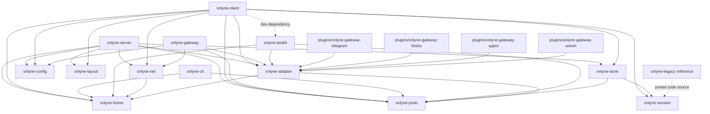

# Onlyne v1.0.0 Architecture

This map follows `docs/v1-PLAN.md` and `docs/v1-CONTRACT.md`. Each source note names the exact plan or contract section that defines a surface.

## Package graph

The workspace has fourteen crates under `crates/` plus four gateway plugins under `plugins/`. Source: `docs/v1-PLAN.md` §1 lines 53-76; `docs/v1-CONTRACT.md` Ownership lines 12-22.



| Package | Responsibility | Source |
|---|---|---|
| `onlyne-frame` | Length-prefixed JSON codec and stream multiplexing | Plan §1, §4 |
| `onlyne-proto` | Envelope, bodies, message kinds, ops, errors, events, schema export | Plan §1, §3; Contract Cross-crate decisions |
| `onlyne-config` | Server spec, client config, plugin config, TOML schema | Plan §5; Contract Ownership |
| `onlyne-layout` | Server root, workspace discovery, legacy layout refusal | Plan §2 |
| `onlyne-store` | Server ledger DB and client local DB | Plan §10 |
| `onlyne-session` | Lifecycle reducer, `SessionBackend`, reconcile bridge | Plan §6 |
| `onlyne-net` | TLS, cert pinning, ed25519 handshake, ACL, backoff | Plan D9 and S5; Contract line 39 |
| `onlyne-adapter` | Shared adapter SDK and protocol schema | Plan §7 |
| `onlyne-server` | Router, ledger relay, projections, faults, admin, generate | Plan §5, §8, §11, S6, S7 |
| `onlyne-client` | Role runloop, intents, adapter socket, accept/dispatch | Plan §6, §7, S8 |
| `onlyne-gateway` | Platform gateway host and shared rendering/auth kit | Plan S10 |
| `onlyne-cli` | Thin human entrypoint and socket forwarding | Plan §9; Contract CLI vocabulary |
| `onlyne-testkit` | Fake agent, fake gateway, conformance runner, e2e fixtures | Plan S9 and Verification |
| `onlyne-legacy` | Temporary read-only source material before S12 deletion | Contract Repo state; Plan S1, S12 |
| `plugins/onlyne-gateway-telegram` | Telegram gateway plugin crate | Plan §1, S10 |
| `plugins/onlyne-gateway-feishu` | Feishu/Lark gateway plugin crate | Plan §1, S10 |
| `plugins/onlyne-gateway-qqbot` | QQ Bot gateway plugin crate | Plan §1, S10 |
| `plugins/onlyne-gateway-weixin` | Weixin gateway plugin crate | Plan §1, S10 |

## Firewall rules

| Boundary | Rule | Source |
|---|---|---|
| Protocol crate | `onlyne-proto` has zero tokio dependency and owns the public API names. | Plan §1 line 74; Contract line 37-38 |
| Protocol crate deps | `onlyne-proto` depends on `schemars` for the `JsonSchema` derive and schema export. That subtree carries serde, serde_json, and the derive macro, with no tokio, no TLS, and no database crate. | `crates/onlyne-proto/Cargo.toml`; `cargo tree -p onlyne-proto -e normal` |
| Session crate | `onlyne-session` stays pure and exposes `SessionBackend`; store/proto/net stay outside the reducer crate. | Plan §1 line 74; Contract line 40 |
| Server and client | `onlyne-server` and `onlyne-client` share proto, frame, net, store, config, and layout, with no normal dependency between the two binaries; `onlyne-server` lists `onlyne-client` under `[dev-dependencies]` for its integration tests. | Plan §1 line 74; `crates/onlyne-server/Cargo.toml` |
| Plugins | `plugins/*` depend on `onlyne-adapter` and `onlyne-proto`; server internals stay outside plugin crates. | Plan §1 line 74 |
| Server binary | `onlyne-server` excludes platform SDKs plus `resvg` and `pulldown-cmark`. | Plan §1 line 76 |
| Gateway binary | `onlyne-gateway` excludes ledger, router, and TLS server internals. | Plan §1 line 76 |
| Client binary | `onlyne-client` excludes every platform SDK. | Plan §1 line 76 |
| CLI binary | `onlyne` resolves one socket and sends one frame for message and admin verbs; `server`, `client`, `gateway`, and `generate` exec sibling binaries. | Plan §9 lines 342-344; `run` in `crates/onlyne-cli/src/main.rs`; `exec` in `crates/onlyne-cli/src/forward.rs` |

## Message model

`Envelope` is the single cross-process message. It carries `protocol`, `id`, `op_id`, `kind`, `from`, `to`, optional `control`, optional `causality`, `body`, `ts`, optional `ttl_ms`, and `admin`. Source: Plan §3 lines 114-175; `Envelope` in `crates/onlyne-proto/src/envelope.rs`.

| Kind | Meaning | Source |
|---|---|---|
| `Task` | Delivery to a role that creates or reuses a session. | Plan §3 lines 181-182 |
| `Completion` | Terminal receipt for a task, with the result head saved in ledger. | Plan §3 line 183 |
| `Note` | Free text with no session creation and offline rejection. | Plan §3 line 184; Plan line 523 |
| `Control` | `recycle`, `probe`, `snapshot`, or `cancel`, gated by admin flag or task owner. | Plan §3 lines 131-136 and 185 |

| Tier | Members | Delivery semantics | Resync path | Source |
|---|---|---|---|---|
| Control plane | `Task`, `Completion`, `Control` | At-least-once with `op_id` idempotency and durable receipts. | Retry uses the same `op_id`; conflict text is `op_id conflict: request differs from durable receipt`. | Plan D11 lines 25; Plan §3 lines 179-185 |
| Observation plane | `report` and `ev` stream | At-most-once with monotonic `seq`. | Client sends `ping`; `pong.server_seq` beyond `resync_lag` drives `subscribe` with `since_seq`. | Plan D11 line 25; Plan §4 line 214 |

Body validation runs in the constructor and rejects bad input. Text or image must exist. Text is capped at 1 MiB, decoded image bytes are capped at 2 MiB, and the image mime must be one of `image/png`, `image/jpeg`, `image/gif`, or `image/webp`. Source: Plan §3 line 177.

Role-to-role permission is a load-time pair set: `Spec::acl_edges` emits one concrete row per permitted pair and class, `AclTable::new` refuses a `"*"` endpoint, and `acl_allows` answers one delivery. The reserved role `_supervisor` reaches every registered role on its own `allowed_targets` alone: an empty list reaches every registered role, a non-empty list names the reachable roles exactly, and no receiver `allowed_senders` is read on its rows. Source: Plan D15 line 29; Contract lines 39-44; `crates/onlyne-config/src/spec.rs`; `crates/onlyne-net/src/acl.rs`.

## Frame protocol

Frames use a `u32` big-endian length prefix plus UTF-8 JSON. A frame above `MAX_FRAME_BYTES = 8 * 1024 * 1024` produces `error{code:"frame_too_large"}` and closes the connection. Source: Plan §4 lines 191-198.

One connection carries every top-level frame variant: `req`, `res`, `ev`, `ack`, `ping`, `pong`, and `bye`. Source: Plan §4 lines 199-210.

`res.error.code` is a closed set of lowercase codes: `invalid`, `unknown_op`, `acl_denied`, `unknown_role`, `recipient_offline`, `duplicate`, `conflict`, `unauthorized`, `forbidden`, `not_admin`, `frame_too_large`, `bad_frame`, `protocol_version`, and `internal`. Source: Plan §4 line 212.

## Socket surfaces

| Surface | Endpoint | Security and handshake | Source |
|---|---|---|---|
| Client to server | TCP address from `[server].listen` | TLS 1.3 with rustls, server certificate SPKI pin, preregistered ed25519 role key, ACL before ledger write. | Plan D9 line 23; Plan §5 line 274; Plan S5 line 428 |
| Adapter local socket | Agent plugins connect to the path `RoleWorkspace::socket_path()` answers: `<workspace>/.onlyne/run/s` while that fits 103 bytes, the published short path otherwise, named in `<workspace>/.onlyne/run/socket`; gateway processes reach the server tree's socket the same way. | Shared adapter SDK and frame codec; `hello.kind` selects `agent` or `gateway`; mount carries role/session or gateway identity. | Plan §7 lines 291-306; `crates/onlyne-layout/src/lib.rs` |
| Admin local socket | `<server-root>/.onlyne/run/s`, the canonical spelling; the bound path is the one `ServerRoot::socket_path()` answers — the short derived path under the system temporary directory once the canonical spelling passes 103 bytes — and `<run>/socket` names it. | Local trust root; `hello.kind = "admin"`; admin ops use ACL with `--from <role>` on send/control. Unix: filesystem UDS mode `0600`. Windows: marker file `v1:onlyne-<32hex>` plus an NPFS pipe whose leaf is `sha256` of the lexical-absolute lowercase path (16 bytes hex); bind SDDL `D:P(A;;GA;;;OW)(A;;GA;;;SY)`. | Plan §2 lines 83-87; Plan §8 line 320; `crates/onlyne-layout/src/local_socket.rs` |

During `hello` the server listener picks the mounted surface: `agent`, `gateway`, or `admin`. `hello` times out after 5 s. Any application frame sent before `hello` returns `error{code:"invalid",message:"hello required first"}` and closes the connection. Source: Plan §7 lines 293 and 310.

CLI socket discovery is fixed. `--socket <path>` wins first, then `ONLYNE_SOCKET` — the served path the client injects into every session it spawns — then `--server-root <dir>`, then `--workspace <dir>` or the current directory walking upward. A tree owns a surface when its `.onlyne/run/s` or its `.onlyne/run/socket` marker answers, and the path comes from `socket_path()`: the canonical `run/s` while it fits 103 bytes, the short derived path recorded in the marker past that bound. A `--socket` value that starts with `\\.\pipe\` is an NPFS path and is not hashed. `ERROR_PIPE_BUSY` (231) is `WouldBlock` and retries inside `--timeout`. Tokio's `UnixStream` is `cfg(unix)` on stable 1.85, so Windows uses the named-pipe seam. When nothing resolves, the CLI exits 3 and prints `onlyne: no onlyne socket found; pass --socket, --server-root, or --workspace`. Exit codes 2, 3, 4, and 5 stay. Source: Plan §9 line 344; Contract CLI vocabulary; `connect` in `crates/onlyne-cli/src/wire.rs`; `resolve_socket` in `crates/onlyne-cli/src/socket.rs`.

`bind_socket` in `crates/onlyne-layout` owns the endpoint choice: the daemon binds the canonical `<owner>/.onlyne/run/s` while that path fits `UNIX_SOCKET_PATH_MAX` = 103 bytes (macOS `sun_path` holds 104 including its NUL; a longer string fails `bind` and `connect` with `EINVAL`), and past the bound a short derived path `<temp_dir>/onlyne-<16hex>/s` (the hex is a sha256 prefix over the canonical owner root). The bound path is published in `<owner>/.onlyne/run/socket` at mode `0600`, one absolute path plus a newline, and every finder reads the served path through `socket_path()`. A client whose bind fails exits with the error naming both candidate paths and both byte lengths. `crates/onlyne-testkit/e2e/socket-path-length.sh` proves the chain on a padded workspace.

## Operation vocabulary

| Surface | Closed op set | Source |
|---|---|---|
| Client to server | `hello`, `send`, `pull`, `ack`, `report`, `subscribe`, `query_ledger`, `query_sessions`, `query_roles`, `query_faults`, `control`, `bye` | Plan §8 line 318 |
| Admin | `status`, `roles`, `sessions`, `ledger`, `faults`, `query_ghost_sweeps`, `watch`, `history`, `spec_diff`, `reload`, `send`, `control`, `repair_inspect`, `repair_adopt`, `repair_rebind`, `repair_retry`, `repair_fail`, `repair_close`, `repair_ack`, `shutdown` | Plan §8 line 320; `AdminOp` in `crates/onlyne-proto/src/ops.rs` |
| Gateway to server | `hello`, `register_channel`, `deliver`, `health`, `bye` (`render_send` travels host to gateway; `typing` is an optional gateway capability) | Plan §8 line 322; `GatewayOp` in `crates/onlyne-proto/src/ops.rs`; `HostOp::RenderSend` and `PluginOp::Typing` in `crates/onlyne-proto/src/adapter.rs` |
| Adapter plugin to host | `hello`, `report`, `session_register`, `assign_ack`, `send`, `handoff`, `deliver`, `register_channel`, `health`, `typing`, `detach` | `PluginOp` in `crates/onlyne-proto/src/adapter.rs`; frame names in `crates/onlyne-adapter/PROTOCOL.md` |
| Host to plugin | `welcome`, `assign`, `render_send`, `probe`, `recycle`, `config_get`, `bye` | Plan §7 line 308 |

The old vocabulary is gone: `loopback`, `swarm_ready`, `swarm_recycled`, `swarm_busy`, `swarm_idle`, `mark_io_consumed`, `consume`, `start_adapter`, `stop_adapter`, `restart_adapter`, the old `fetch_history_page` shape, and raw `onlyne client '<json>'` pass-through. Source: Plan §8 line 324.

## Ledger state

The server ledger table stores `queued`, `in_flight`, `acked`, `rejected`, and `expired`; the code lives in `crates/onlyne-store/src/server.rs`. The server `ledger.body_json` column stays nullable so retention pruning can clear it. Source: Plan §10 lines 357-360.

A row also carries the family metadata its envelope named: `family`, `hop_budget`, `origin`, `deadline`, and `labels_json`. The first four are plain columns added in place, the way `expires_at` and `requeued` were, so an existing marker-4 database keeps its rows and its marker; `labels_json` holds the free-form map as text. `crates/onlyne-proto/src/ops.rs` answers the same five on a `query_ledger` row.

| Current state | Legal next states | Entry and exit meaning | Source |
|---|---|---|---|
| start | `queued` | Accepted `send` writes the durable row after ACL. | Plan §5 line 274; Plan S6 line 432 |
| `queued` | `in_flight`, `expired`, `rejected` | Pull delivery moves work to a live role; TTL expiry creates `expired`; hard route or operator failure can create `rejected`. | Plan S6 line 432; Plan §10 line 360; inference from admin repair verbs in Plan §8 line 320 |
| `in_flight` | `acked`, `queued`, `rejected` | `ack` settles successful delivery; requeue returns the row to `queued`; operator repair can fail the row. | Plan S6 line 432; `transition_allowed` in `crates/onlyne-store/src/lib.rs`; `repair_fail` in Plan §8 line 320 |
| `acked` | terminal | Completed delivery with receipt and optional `out_head`. | Plan S6 line 432; Plan Verification case 1 lines 496-498 |
| `rejected` | terminal | Durable refusal after the operation has a row. | Plan §10 line 360; inference from closed error set in Plan §4 line 212 |
| `expired` | terminal | TTL-driven terminal state. | Plan §10 line 360; Plan Verification case 6 line 505 |

Idempotency keys on `op_id`. A repeated identical request returns the durable receipt with `duplicate`. A different request under the same `op_id` returns `conflict` and `op_id conflict: request differs from durable receipt`. Source: Plan §3 line 179; Verification case 3 line 502.

## Session lifecycle

The client is the authority for execution state. The server stores projections. Source: Plan D5 line 19; Plan §6 lines 276-289.

A `sessions` read answers that mirror, and `onlyne sessions --fresh --task T` is its one opt-in exception. It adds no vocabulary: the server sends the existing `control` op `probe` to T's owning client (`control_envelope` in `crates/onlyne-server/src/router.rs`, the owning role on both ends — the shape `onlyne control --from <role>` already uses), waits inside the read's own `--timeout` for T's row to move past the `(generation, seq)` watermark the read started at, and stamps the row it answers with `fresh`: `probed` when the client's republish landed, `offline` when nothing could be asked (no `--task`, no row, no owner, or an owner that is not connected), `unanswered` when the probe went out and nothing moved inside the bound. The wait watches the `session_state` event `projection::write` already broadcasts, and the republish the client sends before its plugin answers (`sync_session` on the `probe` arm) is dropped by the `(generation, seq)` gate, so the row that ends the wait is the one carrying the probe's observation. A probe that does not land answers the stored mirror with that marker rather than an error or a longer wait; a read without the flag sends no control frame, waits for nothing, and carries no `fresh` key.

Backend selection is env `ONLYNE_BACKEND` > workspace `config.toml` `backend` > auto. `headless` parses as `exec`. zellij `probe` reads `list-sessions` (keeping the EXITED marker) then `action list-panes --json --state`, and maps `exited` / `exit_status` so an EXITED session is not alive. herdr and orca probes stay on host presence: those CLIs expose no integer pane/tab exit code.

| Dimension | Values | Source |
|---|---|---|
| `AgentState` | `Booting`, `Ready`, `Running`, `Idle`, `Gone` | Plan §6 line 280; `AgentState` in `crates/onlyne-session/src/lifecycle/state.rs` |
| `DeliveryState` | `None`, `Pending`, `Retrying`, `Accepted`, `Exhausted` | Plan §6 line 280 |
| `ResourceState` | `Detached`, `Attached`, `Closing`, `Closed` | Plan §6 line 280 |
| `RecoveryState` | `None`, `IdleWaiting`, `IdleFault`, `Draining` | Plan §6 line 280 |

Two more names in that vocabulary are not dimensions, and no tuple carries them:

- `TaskState` (`Pending`, `Done`, `Failed`, `Cancelled`) is the task's own record, held by the client's `task` table and handed to `project` as an input. Source: Plan §3 line 140.
- `PublicLifecycle` (`Created`, `Working`, `Idle`, `Exited`) is derived per read by `project(agent, delivery, resource, recovery, task_state)`; nothing stores it. Source: Plan §6 line 280.

The client task path is a fixed order: spawn `SessionBackend` for the task, record `sessions`, report `ready`, then deliver the assignment. Source: Plan §6 line 285.

Disconnect behavior is a fixed order: stop accepting new delivery, let running sessions reach a terminal state, persist completion intents, reconnect with capped backoff, then flush intents in `seq` order. Source: Plan §6 lines 287-289.

Deletion list from the lifecycle port:

- Automatic recovery task generation is deleted.
- Dead-terminal sweep re-delivery is deleted.
- `hop_timeouts` replay trigger is deleted.
- `events.rs::replay_ready_history` is deleted.
- `MAX_ATTEMPTS` automatic retry path is deleted.
- `DeliveryState::Exhausted` stays terminal.

Source: Plan §6 line 282; Plan S3 line 420; Plan line 527.

## Workspace generation

`spec.toml` is protocol truth: role name, public key, ACL, prose, concurrency, timeout, and `session_command`. Template directories hold workspace content. Source: Plan §11 lines 372-375.

Generation command:

```bash
onlyne server generate --root <server-root> [--template <relative-path>]... [--role <name>]... [--out <dir>] [--force]
```

Top-level `onlyne generate --root <server-root>` builds the same argv and execs `onlyne-server`; `onlyne server generate` forwards through the generic forward.

Source: Plan §11 lines 376-381.

Generation flow:

1. Read `<server-root>/.onlyne/spec.toml`.
2. Select all `[[client]]` rows or the intersection of `--template` and `--role` filters.
3. Map each role to a template directory whose basename equals the role name.
4. Mirror the template topology into `<out>/<template-relative-path>/<role>/`.
5. Create `.onlyne/config.toml` and `.onlyne/keys/role.key` with a new ed25519 keypair.
6. Copy template content — every file the template holds, dot-directories included, except `.onlyne` (the runtime and config tree the generator owns) and `.git` (the repository the template sits in) — and merge a template `.onlyne/config.toml` fragment with derived values taking priority.
7. Replace the closed placeholder set: `{{role}}`, `{{cluster}}`, `{{server_name}}`, `{{listen}}`, `{{cert_pin}}`, `{{admin}}`, `{{max_sessions}}`, `{{agent_package}}`.
8. Vendor `[server].agent_package` into `<ws>/.onlyne/agent/<pkg-name>/` when the template uses `{{agent_package}}`, and write its runtime settings entry — the `settings.json` directly under a top-level dot-directory, `.pi/settings.json` or `.omp/settings.json` — as `../.onlyne/agent/<pkg-name>`: pi 0.85.1 resolves a project `packages` path against the directory holding that settings file.
9. Scan output bytes for the generated output root and server root absolute prefixes.
10. Delete this generation output on absolute-path match and return `onlyne: generated workspace embeds absolute path <path>`.
11. Print a `[[client]]` TOML fragment and `<out>/.onlyne-generation.json`.
12. Leave `spec.toml` editing to the operator or supervisor, followed by `onlyne reload`.

Source: Plan §11 lines 383-397.

Generation errors with exit 4 include `onlyne: no role matches the requested templates/roles; available roles: <r1>, <r2>`, `onlyne: template for role <r> is ambiguous: <p1>, <p2>`, `onlyne: no template directory named <r> under <template_root>`, `onlyne: refusing to overwrite <path>; pass --force`, `onlyne: agent_package not set in spec.toml [server]`, and `onlyne: generated workspace embeds absolute path <path>`. Source: Plan §11 lines 383-391.

Relocation guarantee: generated workspaces derive runtime paths from their own `--workspace`; the connection to the server uses `listen` plus `cert_pin`. Source: Plan §11 line 391; Verification case 9 lines 509-518.

## Federation

`onlyne cluster export-prose` names the aggregate role whose outward prose the parent consumes. It prints one role's prose, raw by default and wrapped under `--json`. The command issues the existing role query and adds no protocol op. Source: Plan S11 line 461; Contract CLI vocabulary; `export_prose` in `crates/onlyne-cli/src/admin.rs`.

The parent consumes that prose when it composes its own role directive. Federation adds zero protocol ops. Source: Plan S11 lines 460-461; decision D14 at Plan line 28.

The full convention set for the recursion path lives in `crates/onlyne-server/FEDERATION.md`.

## CLI verbs and flags

Message and admin verbs print one JSON line; `cluster export-prose` prints raw prose unless `--json`. Source: `render_body` and `export_prose` paths in `crates/onlyne-cli/src`.

Top-level groups are `onlyne server <verb>`, `onlyne client <verb>`, and `onlyne gateway <verb>`. The `client` and `gateway` groups forward straight to `forward::exec`.

Inside the `server` group, the lifecycle verbs (`init`, `run`, `start`, `stop`, `status`, `generate`, `reload`) exec `onlyne-server` with the remaining arguments verbatim, and the admin nouns (`roles`, `sessions`, `ledger`, `faults`, `ghosts`, `watch`, `history`, `repair`) resolve against the admin socket inside the CLI process. `onlyne` has no intermediate `forward` verb. An unrecognized server verb is refused with exit 2.

`spec_diff` is primary with the `spec-diff` alias. `--timeout` is primary with the `--timeout-ms` alias. `wait-ready` takes `--interval-ms` (default 200) with the global `--timeout` bound (default 10000). `--from` is a per-verb flag on `send`, `reply`, `complete`, `handoff`, and `control` for the admin surface only. `reply --to <envelope-id>` answers that ledger row and addresses its recipient. `sessions` takes `--fresh`, which needs `--task` and asks that task's owning client to probe its plugin: the probe wait is `--timeout` less a 250ms frame reserve (`FRESH_RESERVE_MS` in `crates/onlyne-cli/src/admin.rs`), so the answer lands inside the bound the operator set; `--fresh` without `--task`, or with a `--timeout` that cannot hold a frame, is refused as local validation. Exit codes: 0 success, 1 failed daemon answer or `wait-ready` bound hit, 2 local validation, 3 no socket, 4 propagated generate-child failure, 5 no supported session host, 127 missing sibling binary. Source: `Verb` and `ServerVerb` in `crates/onlyne-cli/src/main.rs`; `forward::exec` in `crates/onlyne-cli/src/forward.rs`; `crates/onlyne-cli/tests/cli.rs`.

## Where the code lives

| Responsibility | Crate or path | Spec origin |
|---|---|---|
| Frame encode/decode | `crates/onlyne-frame/` | Plan §4 |
| Wire types and schemas | `crates/onlyne-proto/` | Plan §3; Contract line 38 |
| Server TOML and client config | `crates/onlyne-config/` | Plan §5 |
| Layout, legacy refusal, local-socket seam | `crates/onlyne-layout/` (`local_socket.rs`) | Plan §2 |
| Ledger and local databases | `crates/onlyne-store/` | Plan §10 |
| Lifecycle reducer and backend trait | `crates/onlyne-session/` | Plan §6 |
| TLS, ed25519, ACL, backoff | `crates/onlyne-net/` | Plan D9; Plan S5; Contract line 39 |
| Adapter SDK | `crates/onlyne-adapter/` | Plan §7 |
| Conformance and fake binaries | `crates/onlyne-testkit/` | Plan S9; Verification |
| Server runtime | `crates/onlyne-server/` | Plan §5, §8, §11, S6, S7 |
| Client runtime | `crates/onlyne-client/` | Plan §6, §7, S8 |
| Gateway runtime | `crates/onlyne-gateway/` | Plan §7, §8, S10 |
| Human CLI | `crates/onlyne-cli/` | Plan §9; Contract CLI vocabulary |
| Telegram plugin | `plugins/onlyne-gateway-telegram/` | Plan S10 |
| Feishu plugin | `plugins/onlyne-gateway-feishu/` | Plan S10 |
| QQ Bot plugin | `plugins/onlyne-gateway-qqbot/` | Plan S10 |
| Weixin plugin | `plugins/onlyne-gateway-weixin/` | Plan S10 |
| Temporary legacy reference | `crates/onlyne-legacy/` | Contract Repo state; Plan S1/S12 |

# Onlyne v1.0.0 架构（中文）

本映射遵循 `docs/v1-PLAN.md` 和 `docs/v1-CONTRACT.md`。每个来源说明都指出定义该表面的确切计划或合同章节。

## 包图

工作区在 `crates/` 下有十四个 crate，在 `plugins/` 下有四个 gateway 插件。来源：`docs/v1-PLAN.md` §1 行 53-76；`docs/v1-CONTRACT.md` Ownership 行 12-22。


| 包 | 职责 | 来源 |
|---|---|---|
| `onlyne-frame` | 长度前缀 JSON 编解码器和流多路复用 | Plan §1, §4 |
| `onlyne-proto` | Envelope、消息体、消息种类、操作、错误、事件、schema 导出 | Plan §1, §3；Contract Cross-crate decisions |
| `onlyne-config` | Server spec、client config、plugin config、TOML schema | Plan §5；Contract Ownership |
| `onlyne-layout` | Server root、workspace 发现、legacy layout 拒绝 | Plan §2 |
| `onlyne-store` | Server ledger DB 和 client local DB | Plan §10 |
| `onlyne-session` | 生命周期 reducer、`SessionBackend`、reconcile bridge | Plan §6 |
| `onlyne-net` | TLS、证书固定、ed25519 握手、ACL、退避 | Plan D9 和 S5；Contract 行 39 |
| `onlyne-adapter` | 共享 adapter SDK 和协议 schema | Plan §7 |
| `onlyne-server` | Router、ledger relay、投影、故障、管理、生成 | Plan §5, §8, §11, S6, S7 |
| `onlyne-client` | Role runloop、intents、adapter socket、accept/dispatch | Plan §6, §7, S8 |
| `onlyne-gateway` | 平台 gateway 主机和共享渲染/认证工具包 | Plan S10 |
| `onlyne-cli` | 精简的人类入口和 socket 转发 | Plan §9；Contract CLI vocabulary |
| `onlyne-testkit` | Fake agent、fake gateway、一致性运行器、e2e fixtures | Plan S9 和 Verification |
| `onlyne-legacy` | S12 删除前的临时只读源材料 | Contract Repo state；Plan S1, S12 |
| `plugins/onlyne-gateway-telegram` | Telegram gateway 插件 crate | Plan §1, S10 |
| `plugins/onlyne-gateway-feishu` | Feishu/Lark gateway 插件 crate | Plan §1, S10 |
| `plugins/onlyne-gateway-qqbot` | QQ Bot gateway 插件 crate | Plan §1, S10 |
| `plugins/onlyne-gateway-weixin` | Weixin gateway 插件 crate | Plan §1, S10 |

## 防火墙规则

| 边界 | 规则 | 来源 |
|---|---|---|
| Protocol crate | `onlyne-proto` 零 tokio 依赖并拥有公共 API 名称。 | Plan §1 行 74；Contract 行 37-38 |
| Protocol crate deps | `onlyne-proto` 依赖 `schemars` 以支持 `JsonSchema` derive 和 schema 导出。该子树携带 serde、serde_json 和 derive macro，不带 tokio、TLS 或数据库 crate。 | `crates/onlyne-proto/Cargo.toml`；`cargo tree -p onlyne-proto -e normal` |
| Session crate | `onlyne-session` 保持纯净并暴露 `SessionBackend`；store/proto/net 保持在 reducer crate 之外。 | Plan §1 行 74；Contract 行 40 |
| Server 和 client | `onlyne-server` 与 `onlyne-client` 共享 proto、frame、net、store、config 和 layout，两个二进制之间没有普通依赖；`onlyne-server` 在 `[dev-dependencies]` 中列出 `onlyne-client` 以供集成测试。 | Plan §1 行 74；`crates/onlyne-server/Cargo.toml` |
| Plugins | `plugins/*` 依赖 `onlyne-adapter` 和 `onlyne-proto`；server internals 保持在插件 crate 之外。 | Plan §1 行 74 |
| Server binary | `onlyne-server` 排除平台 SDK 以及 `resvg` 和 `pulldown-cmark`。 | Plan §1 行 76 |
| Gateway binary | `onlyne-gateway` 排除 ledger、router 和 TLS server internals。 | Plan §1 行 76 |
| Client binary | `onlyne-client` 排除所有平台 SDK。 | Plan §1 行 76 |
| CLI binary | `onlyne` 为消息和管理 verb 解析一个 socket 并发送一个 frame；`server`、`client`、`gateway` 和 `generate` exec 同级二进制。 | Plan §9 行 342-344；`run` in `crates/onlyne-cli/src/main.rs`；`exec` in `crates/onlyne-cli/src/forward.rs` |

## 消息模型

`Envelope` 是唯一的跨进程消息。它携带 `protocol`、`id`、`op_id`、`kind`、`from`、`to`、可选 `control`、可选 `causality`、`body`、`ts`、可选 `ttl_ms` 和 `admin`。来源：Plan §3 行 114-175；`crates/onlyne-proto/src/envelope.rs` 中的 `Envelope`。

| 种类 | 含义 | 来源 |
|---|---|---|
| `Task` | 投递给创建或复用 session 的 role。 | Plan §3 行 181-182 |
| `Completion` | task 的终结回执，结果头保存在 ledger 中。 | Plan §3 行 183 |
| `Note` | 不创建 session 的自由文本，离线时拒绝。 | Plan §3 行 184；Plan 行 523 |
| `Control` | `recycle`、`probe`、`snapshot` 或 `cancel`，由 admin flag 或 task owner 门控。 | Plan §3 行 131-136 和 185 |

| 层 | 成员 | 投递语义 | Resync 路径 | 来源 |
|---|---|---|---|---|
| Control plane | `Task`、`Completion`、`Control` | 至少一次，带 `op_id` 幂等性和持久回执。 | 重试使用相同 `op_id`；冲突文本为 `op_id conflict: request differs from durable receipt`。 | Plan D11 行 25；Plan §3 行 179-185 |
| Observation plane | `report` 和 `ev` stream | 至多一次，带单调 `seq`。 | Client 发送 `ping`；`pong.server_seq` 超出 `resync_lag` 时，以 `since_seq` 驱动 `subscribe`。 | Plan D11 行 25；Plan §4 行 214 |

消息体验证在构造函数中运行并拒绝无效输入。Text 或 image 必须存在。Text 上限为 1 MiB，解码后的 image 字节上限为 2 MiB，image mime 必须为 `image/png`、`image/jpeg`、`image/gif` 或 `image/webp` 之一。来源：Plan §3 行 177。

Role-to-role 权限是加载时的 pair set：`Spec::acl_edges` 为每个允许的 pair 和 class 发出一个具体行，`AclTable::new` 拒绝 `"*"` 端点，`acl_allows` 回答一次投递。保留 role `_supervisor` 仅凭自身 `allowed_targets` 到达每个已注册 role：空列表到达所有已注册 role，非空列表精确指定可到达的 role，其行不会读取接收方的 `allowed_senders`。来源：Plan D15 行 29；Contract 行 39-44；`crates/onlyne-config/src/spec.rs`；`crates/onlyne-net/src/acl.rs`。

## Frame 协议

Frame 使用 `u32` 大端长度前缀和 UTF-8 JSON。超过 `MAX_FRAME_BYTES = 8 * 1024 * 1024` 的 frame 会产生 `error{code:"frame_too_large"}` 并关闭连接。来源：Plan §4 行 191-198。

一个连接承载所有顶层 frame 变体：`req`、`res`、`ev`、`ack`、`ping`、`pong` 和 `bye`。来源：Plan §4 行 199-210。

`res.error.code` 是由小写代码组成的封闭集合：`invalid`、`unknown_op`、`acl_denied`、`unknown_role`、`recipient_offline`、`duplicate`、`conflict`、`unauthorized`、`forbidden`、`not_admin`、`frame_too_large`、`bad_frame`、`protocol_version` 和 `internal`。来源：Plan §4 行 212。

## Socket 表面

| 表面 | 端点 | 安全和握手 | 来源 |
|---|---|---|---|
| Client 到 server | 来自 `[server].listen` 的 TCP 地址 | 使用 rustls 的 TLS 1.3、server certificate SPKI pin、预注册 ed25519 role key，写入 ledger 前执行 ACL。 | Plan D9 行 23；Plan §5 行 274；Plan S5 行 428 |
| Adapter local socket | Agent 插件连接 `RoleWorkspace::socket_path()` 返回的路径：不超过 103 字节时为 `<workspace>/.onlyne/run/s`，否则为发布的短路径，并在 `<workspace>/.onlyne/run/socket` 中命名；gateway 进程以相同方式到达 server tree 的 socket。 | 共享 adapter SDK 和 frame codec；`hello.kind` 选择 `agent` 或 `gateway`；mount 携带 role/session 或 gateway identity。 | Plan §7 行 291-306；`crates/onlyne-layout/src/lib.rs` |
| Admin local socket | `<server-root>/.onlyne/run/s` 的规范拼写；绑定的路径由 `ServerRoot::socket_path()` 返回，即规范拼写超过 103 字节后使用系统临时目录下的短派生路径，并由 `<run>/socket` 命名。 | 本地 trust root；`hello.kind = "admin"`；admin ops 使用 ACL，并在 send/control 上使用 `--from <role>`。Unix：文件系统 UDS 模式 `0600`。Windows：marker file `v1:onlyne-<32hex>` 加上 NPFS pipe，其 leaf 是 lexical-absolute lowercase path 的 `sha256`（16 bytes hex）；bind SDDL `D:P(A;;GA;;;OW)(A;;GA;;;SY)`。 | Plan §2 行 83-87；Plan §8 行 320；`crates/onlyne-layout/src/local_socket.rs` |

在 `hello` 期间，server listener 选择挂载的表面：`agent`、`gateway` 或 `admin`。`hello` 在 5 s 后超时。在 `hello` 之前发送的任何 application frame 都返回 `error{code:"invalid",message:"hello required first"}` 并关闭连接。来源：Plan §7 行 293 和 310。

CLI socket 发现顺序固定：先是 `--socket <path>`，然后是 `ONLYNE_SOCKET`（client 注入到其创建的每个 session 的已服务路径），然后是 `--server-root <dir>`，最后是 `--workspace <dir>` 或从当前目录向上查找。当 `.onlyne/run/s` 或 `.onlyne/run/socket` marker 有响应时，树拥有一个表面，路径来自 `socket_path()`：不超过 103 字节时为规范 `run/s`，超过该界限时为 marker 中记录的短派生路径。以 `\\.\pipe\` 开头的 `--socket` 值是 NPFS 路径，不进行哈希。`ERROR_PIPE_BUSY` (231) 是 `WouldBlock`，在 `--timeout` 内重试。稳定版 1.85 中 Tokio 的 `UnixStream` 是 `cfg(unix)`，因此 Windows 使用 named-pipe seam。没有解析结果时，CLI 退出 3 并打印 `onlyne: no onlyne socket found; pass --socket, --server-root, or --workspace`。退出码 2、3、4 和 5 保持不变。来源：Plan §9 行 344；Contract CLI vocabulary；`crates/onlyne-cli/src/wire.rs` 中的 `connect`；`crates/onlyne-cli/src/socket.rs` 中的 `resolve_socket`。

`crates/onlyne-layout` 中的 `bind_socket` 负责端点选择：在规范 `<owner>/.onlyne/run/s` 不超过 `UNIX_SOCKET_PATH_MAX` = 103 字节时，daemon 绑定该路径（macOS `sun_path` 包含 NUL 共容纳 104；更长字符串会使 `bind` 和 `connect` 以 `EINVAL` 失败），超过界限后使用短派生路径 `<temp_dir>/onlyne-<16hex>/s`（hex 是规范 owner root 的 sha256 前缀）。绑定路径以模式 `0600` 发布在 `<owner>/.onlyne/run/socket` 中，内容为一个绝对路径加换行，所有 finder 通过 `socket_path()` 读取已服务路径。bind 失败的 client 退出的错误同时命名两个候选路径及其字节长度。`crates/onlyne-testkit/e2e/socket-path-length.sh` 在填充过的 workspace 上证明该链。

## 操作词汇

| 表面 | 封闭 op 集合 | 来源 |
|---|---|---|
| Client 到 server | `hello`、`send`、`pull`、`ack`、`report`、`subscribe`、`query_ledger`、`query_sessions`、`query_roles`、`query_faults`、`control`、`bye` | Plan §8 行 318 |
| Admin | `status`、`roles`、`sessions`、`ledger`、`faults`、`query_ghost_sweeps`、`watch`、`history`、`spec_diff`、`reload`、`send`、`control`、`repair_inspect`、`repair_adopt`、`repair_rebind`、`repair_retry`、`repair_fail`、`repair_close`、`repair_ack`、`shutdown` | Plan §8 行 320；`crates/onlyne-proto/src/ops.rs` 中的 `AdminOp` |
| Gateway 到 server | `hello`、`register_channel`、`deliver`、`health`、`bye`（`render_send` 从 host 到 gateway；`typing` 是可选 gateway 能力） | Plan §8 行 322；`crates/onlyne-proto/src/ops.rs` 中的 `GatewayOp`；`crates/onlyne-proto/src/adapter.rs` 中的 `HostOp::RenderSend` 和 `PluginOp::Typing` |
| Adapter plugin 到 host | `hello`、`report`、`session_register`、`assign_ack`、`send`、`handoff`、`deliver`、`register_channel`、`health`、`typing`、`detach` | `crates/onlyne-proto/src/adapter.rs` 中的 `PluginOp`；`crates/onlyne-adapter/PROTOCOL.md` 中的 frame 名称 |
| Host 到 plugin | `welcome`、`assign`、`render_send`、`probe`、`recycle`、`config_get`、`bye` | Plan §7 行 308 |

旧词汇已移除：`loopback`、`swarm_ready`、`swarm_recycled`、`swarm_busy`、`swarm_idle`、`mark_io_consumed`、`consume`、`start_adapter`、`stop_adapter`、`restart_adapter`、旧的 `fetch_history_page` 形状，以及原始 `onlyne client '<json>'` 透传。来源：Plan §8 行 324。

## Ledger 状态

Server ledger 表存储 `queued`、`in_flight`、`acked`、`rejected` 和 `expired`；代码位于 `crates/onlyne-store/src/server.rs`。Server 的 `ledger.body_json` 列保持可空，以便 retention pruning 清除它。来源：Plan §10 行 357-360。

行还携带其 envelope 指定的 family 元数据：`family`、`hop_budget`、`origin`、`deadline` 和 `labels_json`。前四项是以普通列形式原地添加的，方式与 `expires_at` 和 `requeued` 相同，因此现有 marker-4 数据库保留其行和 marker；`labels_json` 以文本保存自由形式 map。`crates/onlyne-proto/src/ops.rs` 对 `query_ledger` 行回答相同的五项。

| 当前状态 | 合法下一状态 | 进入和退出的含义 | 来源 |
|---|---|---|---|
| start | `queued` | ACL 通过后，已接受的 `send` 写入持久行。 | Plan §5 行 274；Plan S6 行 432 |
| `queued` | `in_flight`、`expired`、`rejected` | Pull delivery 将工作移至活动 role；TTL 到期产生 `expired`；硬路由或 operator 失败可产生 `rejected`。 | Plan S6 行 432；Plan §10 行 360；从 Plan §8 行 320 的 admin repair verbs 推断 |
| `in_flight` | `acked`、`queued`、`rejected` | `ack` 结算成功投递；重新排队使行回到 `queued`；operator repair 可使行失败。 | Plan S6 行 432；`crates/onlyne-store/src/lib.rs` 中的 `transition_allowed`；Plan §8 行 320 中的 `repair_fail` |
| `acked` | terminal | 已完成投递，附回执和可选 `out_head`。 | Plan S6 行 432；Plan Verification case 1 行 496-498 |
| `rejected` | terminal | 操作已有行后的持久拒绝。 | Plan §10 行 360；从 Plan §4 行 212 的封闭错误集合推断 |
| `expired` | terminal | 由 TTL 驱动的 terminal state。 | Plan §10 行 360；Plan Verification case 6 行 505 |

`op_id` 是幂等键。重复的相同请求返回持久回执并带 `duplicate`。同一 `op_id` 下的不同请求返回 `conflict` 和 `op_id conflict: request differs from durable receipt`。来源：Plan §3 行 179；Verification case 3 行 502。

## Session 生命周期

Client 是执行状态的权威。Server 存储投影。来源：Plan D5 行 19；Plan §6 行 276-289。

`sessions` 读取回答该镜像，`onlyne sessions --fresh --task T` 是唯一需要显式选择的例外。它不增加词汇：server 向 T 的 owner client 发送现有的 `control` op `probe`（`crates/onlyne-server/src/router.rs` 中的 `control_envelope`，两端均为 owner role，即 `onlyne control --from <role>` 已使用的形状），在读取自身的 `--timeout` 内等待 T 的行越过读取开始时的 `(generation, seq)` watermark，并将回答的行标记 `fresh`：client 的 republish 落地时为 `probed`，无法询问时为 `offline`（没有 `--task`、没有行、没有 owner，或 owner 未连接），探测发出但界限内没有变化时为 `unanswered`。等待监听 `session_state` event `projection::write` 已经广播的内容，而 client 在 plugin 回答前发送的 republish（`probe` 分支的 `sync_session`）会被 `(generation, seq)` gate 丢弃，因此结束等待的行携带探测观察。没有落地的探测以该 marker 回答存储镜像，而不报 error 或延长等待；没有该 flag 的读取不发送 control frame，不等待任何内容，也不携带 `fresh` key。

后端选择为 env `ONLYNE_BACKEND` > workspace `config.toml` `backend` > auto。`headless` 解析为 `exec`。zellij `probe` 读取 `list-sessions`（保留 EXITED marker），然后读取 `action list-panes --json --state`，并映射 `exited` / `exit_status`，因此 EXITED session 不算存活。herdr 和 orca probe 保持基于 host presence：这些 CLI 不提供整数 pane/tab 退出码。

| 维度 | 值 | 来源 |
|---|---|---|
| `AgentState` | `Booting`、`Ready`、`Running`、`Idle`、`Gone` | Plan §6 行 280；`crates/onlyne-session/src/lifecycle/state.rs` 中的 `AgentState` |
| `DeliveryState` | `None`、`Pending`、`Retrying`、`Accepted`、`Exhausted` | Plan §6 行 280 |
| `ResourceState` | `Detached`、`Attached`、`Closing`、`Closed` | Plan §6 行 280 |
| `RecoveryState` | `None`、`IdleWaiting`、`IdleFault`、`Draining` | Plan §6 行 280 |

词汇表中的另外两个名称不是维度，也不出现在 tuple 中：

- `TaskState`（`Pending`、`Done`、`Failed`、`Cancelled`）是 task 自身的记录，由 client 的 `task` 表保存，并作为输入传给 `project`。来源：Plan §3 行 140。
- `PublicLifecycle`（`Created`、`Working`、`Idle`、`Exited`）由 `project(agent, delivery, resource, recovery, task_state)` 在每次读取时派生；不会存储。来源：Plan §6 行 280。

Client task 路径顺序固定：为 task 创建 `SessionBackend`，记录 `sessions`，报告 `ready`，然后投递 assignment。来源：Plan §6 行 285。

断开行为顺序固定：停止接受新投递，让运行中的 session 到达 terminal state，持久化 completion intent，使用 capped backoff 重连，然后按 `seq` 顺序刷新 intents。来源：Plan §6 行 287-289。

生命周期端口的删除列表：

- 删除自动 recovery task 生成。
- 删除 dead-terminal sweep re-delivery。
- 删除 `hop_timeouts` replay trigger。
- 删除 `events.rs::replay_ready_history`。
- 删除 `MAX_ATTEMPTS` 自动重试路径。
- `DeliveryState::Exhausted` 保持 terminal。

来源：Plan §6 行 282；Plan S3 行 420；Plan 行 527。

## Workspace 生成

`spec.toml` 是协议事实：role name、public key、ACL、prose、concurrency、timeout 和 `session_command`。Template 目录保存 workspace 内容。来源：Plan §11 行 372-375。

生成命令：

```bash
onlyne server generate --root <server-root> [--template <relative-path>]... [--role <name>]... [--out <dir>] [--force]
```

顶层 `onlyne generate --root <server-root>` 构建相同 argv 并 exec `onlyne-server`；`onlyne server generate` 通过 generic forward 转发。

来源：Plan §11 行 376-381。

生成流程：

1. 读取 `<server-root>/.onlyne/spec.toml`。
2. 选择全部 `[[client]]` 行，或 `--template` 与 `--role` 过滤器的交集。
3. 将每个 role 映射到 basename 等于 role name 的 template 目录。
4. 将 template 拓扑镜像到 `<out>/<template-relative-path>/<role>/`。
5. 创建 `.onlyne/config.toml` 和 `.onlyne/keys/role.key`，并生成新的 ed25519 keypair。
6. 复制 template 内容——template 持有的每个文件，包括点目录，但 `.onlyne`（生成器拥有的 runtime 和 config tree）及 `.git`（template 所在的 repository）除外——并将 template 的 `.onlyne/config.toml` fragment 与派生值合并，派生值优先。
7. 替换封闭 placeholder 集：`{{role}}`、`{{cluster}}`、`{{server_name}}`、`{{listen}}`、`{{cert_pin}}`、`{{admin}}`、`{{max_sessions}}`、`{{agent_package}}`。
8. 当 template 使用 `{{agent_package}}` 时，将 `[server].agent_package` vendor 到 `<ws>/.onlyne/agent/<pkg-name>/`，并将其 runtime settings entry（直接位于顶层点目录下的 `settings.json`、`.pi/settings.json` 或 `.omp/settings.json`）写为 `../.onlyne/agent/<pkg-name>`：pi 0.85.1 根据保存该 settings 文件的目录解析 project `packages` 路径。
9. 扫描输出字节中的生成 output root 和 server root 绝对前缀。
10. 绝对路径匹配时删除此生成输出，并返回 `onlyne: generated workspace embeds absolute path <path>`。
11. 打印 `[[client]]` TOML fragment 和 `<out>/.onlyne-generation.json`。
12. 将 `spec.toml` 编辑留给 operator 或 supervisor，随后执行 `onlyne reload`。

来源：Plan §11 行 383-397。

退出码为 4 的生成错误包括 `onlyne: no role matches the requested templates/roles; available roles: <r1>, <r2>`、`onlyne: template for role <r> is ambiguous: <p1>, <p2>`、`onlyne: no template directory named <r> under <template_root>`、`onlyne: refusing to overwrite <path>; pass --force`、`onlyne: agent_package not set in spec.toml [server]` 和 `onlyne: generated workspace embeds absolute path <path>`。来源：Plan §11 行 383-391。

重定位保证：生成的 workspace 根据自身 `--workspace` 派生 runtime path；与 server 的连接使用 `listen` 加 `cert_pin`。来源：Plan §11 行 391；Verification case 9 行 509-518。

## Federation

`onlyne cluster export-prose` 指定 parent 消费的聚合 role 的 outward prose。它打印一个 role 的 prose，默认原样输出，在 `--json` 下包装。该命令发出现有 role query，不增加 protocol op。来源：Plan S11 行 461；Contract CLI vocabulary；`crates/onlyne-cli/src/admin.rs` 中的 `export_prose`。

Parent 在组合自己的 role directive 时消费该 prose。Federation 增加零个 protocol op。来源：Plan S11 行 460-461；Plan 行 28 的 decision D14。

递归路径的完整约定集位于 `crates/onlyne-server/FEDERATION.md`。

## CLI 动词和标志

Message 和 admin verb 打印一行 JSON；除非使用 `--json`，`cluster export-prose` 打印原样 prose。来源：`crates/onlyne-cli/src` 中的 `render_body` 和 `export_prose` 路径。

顶层组为 `onlyne server <verb>`、`onlyne client <verb>` 和 `onlyne gateway <verb>`。`client` 和 `gateway` 组直接转发到 `forward::exec`。

在 `server` 组内，生命周期动词（`init`、`run`、`start`、`stop`、`status`、`generate`、`reload`）逐字将剩余参数 exec 给 `onlyne-server`，admin 名词（`roles`、`sessions`、`ledger`、`faults`、`ghosts`、`watch`、`history`、`repair`）在 CLI 进程内针对 admin socket 解析。`onlyne` 没有中间 `forward` 动词。未识别的 server verb 以退出码 2 拒绝。

`spec_diff` 是主名称，别名为 `spec-diff`。`--timeout` 是主名称，别名为 `--timeout-ms`。`wait-ready` 接受 `--interval-ms`（默认 200）并受全局 `--timeout` 界限约束（默认 10000）。`--from` 是 `send`、`reply`、`complete`、`handoff` 和 `control` 的 per-verb 标志，仅用于 admin surface。`reply --to <envelope-id>` 回答该 ledger 行并寻址其接收方。`sessions` 接受 `--fresh`，该标志需要 `--task` 并要求该 task 的 owner client 探测其 plugin：探测等待为 `--timeout` 减去 250ms frame reserve（`crates/onlyne-cli/src/admin.rs` 中的 `FRESH_RESERVE_MS`），因此回答落在 operator 设置的界限内；没有 `--task` 的 `--fresh`，或无法容纳 frame 的 `--timeout`，均作为 local validation 拒绝。退出码：0 成功，1 daemon answer 失败或达到 `wait-ready` 界限，2 local validation，3 无 socket，4 传播的 generate-child 失败，5 无支持的 session host，127 缺少 sibling binary。来源：`crates/onlyne-cli/src/main.rs` 中的 `Verb` 和 `ServerVerb`；`crates/onlyne-cli/src/forward.rs` 中的 `forward::exec`；`crates/onlyne-cli/tests/cli.rs`。

## 代码所在位置

| 职责 | Crate 或路径 | 规范来源 |
|---|---|---|
| Frame 编码/解码 | `crates/onlyne-frame/` | Plan §4 |
| Wire 类型和 schemas | `crates/onlyne-proto/` | Plan §3；Contract 行 38 |
| Server TOML 和 client config | `crates/onlyne-config/` | Plan §5 |
| 布局、legacy 拒绝、local-socket seam | `crates/onlyne-layout/`（`local_socket.rs`） | Plan §2 |
| Ledger 和本地数据库 | `crates/onlyne-store/` | Plan §10 |
| 生命周期 reducer 和 backend trait | `crates/onlyne-session/` | Plan §6 |
| TLS、ed25519、ACL、退避 | `crates/onlyne-net/` | Plan D9；Plan S5；Contract 行 39 |
| Adapter SDK | `crates/onlyne-adapter/` | Plan §7 |
| 一致性和 fake binaries | `crates/onlyne-testkit/` | Plan S9；Verification |
| Server runtime | `crates/onlyne-server/` | Plan §5, §8, §11, S6, S7 |
| Client runtime | `crates/onlyne-client/` | Plan §6, §7, S8 |
| Gateway runtime | `crates/onlyne-gateway/` | Plan §7, §8, S10 |
| Human CLI | `crates/onlyne-cli/` | Plan §9；Contract CLI vocabulary |
| Telegram 插件 | `plugins/onlyne-gateway-telegram/` | Plan S10 |
| Feishu 插件 | `plugins/onlyne-gateway-feishu/` | Plan S10 |
| QQ Bot 插件 | `plugins/onlyne-gateway-qqbot/` | Plan S10 |
| Weixin 插件 | `plugins/onlyne-gateway-weixin/` | Plan S10 |
| 临时 legacy reference | `crates/onlyne-legacy/` | Contract Repo state；Plan S1/S12 |
