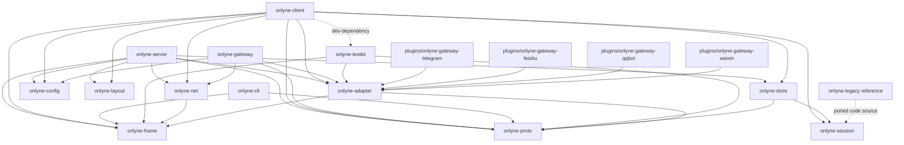

# Onlyne v1.0.0 Architecture

This map follows `docs/v1-PLAN.md` and `docs/v1-CONTRACT.md`. Each source note names the exact plan or contract section that defines a surface.

## Package graph

The workspace has fourteen crates under `crates/` plus four gateway plugins under `plugins/`. Source: `docs/v1-PLAN.md` §1 lines 53-76; `docs/v1-CONTRACT.md` Ownership lines 12-22.



| Package | Responsibility | Source |
|---|---|---|
| `onlyne-frame` | Length-prefixed JSON codec and stream multiplexing | Plan §1, §4 |
| `onlyne-proto` | Envelope, bodies, message kinds, ops, errors, events, schema export | Plan §1, §3; Contract Cross-crate decisions |
| `onlyne-config` | Server spec, client config, plugin config, TOML schema | Plan §5; Contract Ownership |
| `onlyne-layout` | Server root, workspace discovery, legacy layout refusal | Plan §2 |
| `onlyne-store` | Server ledger DB and client local DB | Plan §10 |
| `onlyne-session` | Lifecycle reducer, `SessionBackend`, reconcile bridge | Plan §6 |
| `onlyne-net` | TLS, cert pinning, ed25519 handshake, ACL, backoff | Plan D9 and S5; Contract line 39 |
| `onlyne-adapter` | Shared adapter SDK and protocol schema | Plan §7 |
| `onlyne-server` | Router, ledger relay, projections, faults, admin, generate | Plan §5, §8, §11, S6, S7 |
| `onlyne-client` | Role runloop, intents, adapter socket, accept/dispatch | Plan §6, §7, S8 |
| `onlyne-gateway` | Platform gateway host and shared rendering/auth kit | Plan S10 |
| `onlyne-cli` | Thin human entrypoint and socket forwarding | Plan §9; Contract CLI vocabulary |
| `onlyne-testkit` | Fake agent, fake gateway, conformance runner, e2e fixtures | Plan S9 and Verification |
| `onlyne-legacy` | Temporary read-only source material before S12 deletion | Contract Repo state; Plan S1, S12 |
| `plugins/onlyne-gateway-telegram` | Telegram gateway plugin crate | Plan §1, S10 |
| `plugins/onlyne-gateway-feishu` | Feishu/Lark gateway plugin crate | Plan §1, S10 |
| `plugins/onlyne-gateway-qqbot` | QQ Bot gateway plugin crate | Plan §1, S10 |
| `plugins/onlyne-gateway-weixin` | Weixin gateway plugin crate | Plan §1, S10 |

## Firewall rules

| Boundary | Rule | Source |
|---|---|---|
| Protocol crate | `onlyne-proto` has zero tokio dependency and owns the public API names. | Plan §1 line 74; Contract line 37-38 |
| Protocol crate deps | `onlyne-proto` depends on `schemars` for the `JsonSchema` derive and schema export. That subtree carries serde, serde_json, and the derive macro, with no tokio, no TLS, and no database crate. | `crates/onlyne-proto/Cargo.toml`; `cargo tree -p onlyne-proto -e normal` |
| Session crate | `onlyne-session` stays pure and exposes `SessionBackend`; store/proto/net stay outside the reducer crate. | Plan §1 line 74; Contract line 40 |
| Server and client | `onlyne-server` and `onlyne-client` share proto, frame, net, store, config, and layout, with no normal dependency between the two binaries; `onlyne-server` lists `onlyne-client` under `[dev-dependencies]` for its integration tests. | Plan §1 line 74; `crates/onlyne-server/Cargo.toml` |
| Plugins | `plugins/*` depend on `onlyne-adapter` and `onlyne-proto`; server internals stay outside plugin crates. | Plan §1 line 74 |
| Server binary | `onlyne-server` excludes platform SDKs plus `resvg` and `pulldown-cmark`. | Plan §1 line 76 |
| Gateway binary | `onlyne-gateway` excludes ledger, router, and TLS server internals. | Plan §1 line 76 |
| Client binary | `onlyne-client` excludes every platform SDK. | Plan §1 line 76 |
| CLI binary | `onlyne` resolves one socket and sends one frame for message and admin verbs; `server`, `client`, `gateway`, and `generate` exec sibling binaries. | Plan §9 lines 342-344; `run` in `crates/onlyne-cli/src/main.rs`; `exec` in `crates/onlyne-cli/src/forward.rs` |

## Message model

`Envelope` is the single cross-process message. It carries `protocol`, `id`, `op_id`, `kind`, `from`, `to`, optional `control`, optional `causality`, `body`, `ts`, optional `ttl_ms`, and `admin`. Source: Plan §3 lines 114-175; `Envelope` in `crates/onlyne-proto/src/envelope.rs`.

| Kind | Meaning | Source |
|---|---|---|
| `Task` | Delivery to a role that creates or reuses a session. | Plan §3 lines 181-182 |
| `Completion` | Terminal receipt for a task, with the result head saved in ledger. | Plan §3 line 183 |
| `Note` | Free text with no session creation and offline rejection. | Plan §3 line 184; Plan line 523 |
| `Control` | `recycle`, `probe`, `snapshot`, or `cancel`, gated by admin flag or task owner. | Plan §3 lines 131-136 and 185 |

| Tier | Members | Delivery semantics | Resync path | Source |
|---|---|---|---|---|
| Control plane | `Task`, `Completion`, `Control` | At-least-once with `op_id` idempotency and durable receipts. | Retry uses the same `op_id`; conflict text is `op_id conflict: request differs from durable receipt`. | Plan D11 lines 25; Plan §3 lines 179-185 |
| Observation plane | `report` and `ev` stream | At-most-once with monotonic `seq`. | Client sends `ping`; `pong.server_seq` beyond `resync_lag` drives `subscribe` with `since_seq`. | Plan D11 line 25; Plan §4 line 214 |

Body validation runs in the constructor and rejects bad input. Text or image must exist. Text is capped at 1 MiB, decoded image bytes are capped at 2 MiB, and the image mime must be one of `image/png`, `image/jpeg`, `image/gif`, or `image/webp`. Source: Plan §3 line 177.

## Frame protocol

Frames use a `u32` big-endian length prefix plus UTF-8 JSON. A frame above `MAX_FRAME_BYTES = 8 * 1024 * 1024` produces `error{code:"frame_too_large"}` and closes the connection. Source: Plan §4 lines 191-198.

One connection carries every top-level frame variant: `req`, `res`, `ev`, `ack`, `ping`, `pong`, and `bye`. Source: Plan §4 lines 199-210.

`res.error.code` is a closed set of lowercase codes: `invalid`, `unknown_op`, `acl_denied`, `unknown_role`, `recipient_offline`, `duplicate`, `conflict`, `unauthorized`, `forbidden`, `not_admin`, `frame_too_large`, `bad_frame`, `protocol_version`, and `internal`. Source: Plan §4 line 212.

## Socket surfaces

| Surface | Endpoint | Security and handshake | Source |
|---|---|---|---|
| Client to server | TCP address from `[server].listen` | TLS 1.3 with rustls, server certificate SPKI pin, preregistered ed25519 role key, ACL before ledger write. | Plan D9 line 23; Plan §5 line 274; Plan S5 line 428 |
| Adapter unix socket | Agent plugins connect to `<workspace>/.onlyne/run/s`; gateway processes connect to `<server-root>/.onlyne/run/s`. | Shared adapter SDK and frame codec; `hello.kind` selects `agent` or `gateway`; mount carries role/session or gateway identity. | Plan §7 lines 291-306 |
| Admin unix socket | `<server-root>/.onlyne/run/s` with mode `0600` | Local trust root; `hello.kind = "admin"`; admin ops use ACL with `--from <role>` on send/control. | Plan §2 lines 83-87; Plan §8 line 320 |

During `hello` the server listener picks the mounted surface: `agent`, `gateway`, or `admin`. `hello` times out after 5 s. Any application frame sent before `hello` returns `error{code:"invalid",message:"hello required first"}` and closes the connection. Source: Plan §7 lines 293 and 310.

CLI socket discovery is fixed. `--socket <path>` wins first, `--server-root <dir>` maps to `<dir>/.onlyne/run/s`, and `--workspace <dir>` or upward discovery maps to `.onlyne/run/s`. When nothing resolves, the CLI exits 3 and prints `onlyne: no onlyne socket found; pass --socket, --server-root, or --workspace`. Source: Plan §9 line 344; Contract CLI vocabulary.

## Operation vocabulary

| Surface | Closed op set | Source |
|---|---|---|
| Client to server | `hello`, `send`, `pull`, `ack`, `report`, `session_sync`, `subscribe`, `query_ledger`, `query_sessions`, `query_roles`, `query_faults`, `control`, `bye` | Plan §8 line 318 |
| Admin | `status`, `roles`, `sessions`, `ledger`, `faults`, `watch`, `history`, `spec_diff`, `reload`, `send`, `control`, `repair_inspect`, `repair_adopt`, `repair_rebind`, `repair_retry`, `repair_fail`, `repair_close`, `repair_ack`, `shutdown` | Plan §8 line 320; `AdminOp` in `crates/onlyne-proto/src/ops.rs` |
| Gateway to server | `hello`, `register_channel`, `deliver`, `health`, `bye` (`render_send` travels host to gateway; `typing` is an optional gateway capability) | Plan §8 line 322; `GatewayOp` in `crates/onlyne-proto/src/ops.rs`; `HostOp::RenderSend` and `PluginOp::Typing` in `crates/onlyne-proto/src/adapter.rs` |
| Adapter plugin to host | `hello`, `report`, `session_register`, `assign_ack`, `send`, `deliver`, `register_channel`, `health`, `typing`, `detach` | `PluginOp` in `crates/onlyne-proto/src/adapter.rs`; frame names in `crates/onlyne-adapter/PROTOCOL.md` |
| Host to plugin | `welcome`, `assign`, `render_send`, `probe`, `recycle`, `config_get`, `bye` | Plan §7 line 308 |

The old vocabulary is gone: `loopback`, `swarm_ready`, `swarm_recycled`, `swarm_busy`, `swarm_idle`, `mark_io_consumed`, `consume`, `start_adapter`, `stop_adapter`, `restart_adapter`, the old `fetch_history_page` shape, and raw `onlyne client '<json>'` pass-through. Source: Plan §8 line 324.

## Ledger state

The server ledger table stores `queued`, `in_flight`, `acked`, `rejected`, and `expired`; the code lives in `crates/onlyne-store/src/server.rs`. The server `ledger.body_json` column stays nullable so retention pruning can clear it. Source: Plan §10 lines 357-360.

| Current state | Legal next states | Entry and exit meaning | Source |
|---|---|---|---|
| start | `queued` | Accepted `send` writes the durable row after ACL. | Plan §5 line 274; Plan S6 line 432 |
| `queued` | `in_flight`, `expired`, `rejected` | Pull delivery moves work to a live role; TTL expiry creates `expired`; hard route or operator failure can create `rejected`. | Plan S6 line 432; Plan §10 line 360; inference from admin repair verbs in Plan §8 line 320 |
| `in_flight` | `acked`, `queued`, `rejected` | `ack` settles successful delivery; requeue returns the row to `queued`; operator repair can fail the row. | Plan S6 line 432; `transition_allowed` in `crates/onlyne-store/src/lib.rs`; `repair_fail` in Plan §8 line 320 |
| `acked` | terminal | Completed delivery with receipt and optional `out_head`. | Plan S6 line 432; Plan Verification case 1 lines 496-498 |
| `rejected` | terminal | Durable refusal after the operation has a row. | Plan §10 line 360; inference from closed error set in Plan §4 line 212 |
| `expired` | terminal | TTL-driven terminal state. | Plan §10 line 360; Plan Verification case 6 line 505 |

Idempotency keys on `op_id`. A repeated identical request returns the durable receipt with `duplicate`. A different request under the same `op_id` returns `conflict` and `op_id conflict: request differs from durable receipt`. Source: Plan §3 line 179; Verification case 3 line 502.

## Session lifecycle

The client is the authority for execution state. The server stores projections. Source: Plan D5 line 19; Plan §6 lines 276-289.

| Dimension | Values | Source |
|---|---|---|
| `AgentState` | `Booting`, `Ready`, `Running`, `Idle`, `Gone` | Plan §6 line 280; `AgentState` in `crates/onlyne-session/src/lifecycle.rs` |
| `DeliveryState` | `None`, `Pending`, `Retrying`, `Accepted`, `Exhausted` | Plan §6 line 280 |
| `ResourceState` | `Detached`, `Attached`, `Closing`, `Closed` | Plan §6 line 280 |
| `RecoveryState` | `None`, `IdleWaiting`, `IdleFault`, `Draining` | Plan §6 line 280 |
| `Outcome` | `Done`, `Failed`, `Cancelled` | Plan §3 line 140 |
| `PublicLifecycle` | `Created`, `Working`, `Idle`, `Exited` | Plan §6 line 280 |

The client task path is a fixed order: apply the reuse policy, reuse an idle session or spawn `SessionBackend`, record `sessions`, report `ready`, then deliver the assignment. Source: Plan §6 line 285.

Disconnect behavior is a fixed order: stop accepting new delivery, let running sessions reach a terminal state, persist completion intents, reconnect with capped backoff, then flush intents in `seq` order. Source: Plan §6 lines 287-289.

Deletion list from the lifecycle port:

- Automatic recovery task generation is deleted.
- Dead-terminal sweep re-delivery is deleted.
- `hop_timeouts` replay trigger is deleted.
- `events.rs::replay_ready_history` is deleted.
- `MAX_ATTEMPTS` automatic retry path is deleted.
- `DeliveryState::Exhausted` stays terminal.

Source: Plan §6 line 282; Plan S3 line 420; Plan line 527.

## Workspace generation

`spec.toml` is protocol truth: role name, public key, ACL, prose, concurrency, timeout, and `session_command`. Template directories hold workspace content. Source: Plan §11 lines 372-375.

Generation command:

```bash
onlyne server generate --root <server-root> [--template <relative-path>]... [--role <name>]... [--out <dir>] [--force]
```

Top-level `onlyne generate --root <server-root>` builds the same argv and execs `onlyne-server`; `onlyne server generate` forwards through the generic forward.

Source: Plan §11 lines 376-381.

Generation flow:

1. Read `<server-root>/.onlyne/spec.toml`.
2. Select all `[[client]]` rows or the intersection of `--template` and `--role` filters.
3. Map each role to a template directory whose basename equals the role name.
4. Mirror the template topology into `<out>/<template-relative-path>/<role>/`.
5. Create `.onlyne/config.toml` and `.onlyne/keys/role.key` with a new ed25519 keypair.
6. Copy template content and merge a template `.onlyne/config.toml` fragment with derived values taking priority.
7. Replace the closed placeholder set: `{{role}}`, `{{cluster}}`, `{{server_name}}`, `{{listen}}`, `{{cert_pin}}`, `{{admin}}`, `{{max_sessions}}`, `{{agent_package}}`.
8. Vendor `[server].agent_package` into `<ws>/.onlyne/agent/<pkg-name>/` when the template uses `{{agent_package}}`, and write its `.pi/settings.json` entry as `../.onlyne/agent/<pkg-name>`: pi 0.85.1 resolves a project `packages` path against the directory holding that settings file.
9. Scan output bytes for the generated output root and server root absolute prefixes.
10. Delete this generation output on absolute-path match and return `onlyne: generated workspace embeds absolute path <path>`.
11. Print a `[[client]]` TOML fragment and `<out>/.onlyne-generation.json`.
12. Leave `spec.toml` editing to the operator or supervisor, followed by `onlyne reload`.

Source: Plan §11 lines 383-397.

Generation errors with exit 4 include `onlyne: no role matches the requested templates/roles`, `onlyne: template for role <r> is ambiguous: <p1>, <p2>`, `onlyne: no template directory named <r> under <template_root>`, `onlyne: refusing to overwrite <path>; pass --force`, `onlyne: agent_package not set in spec.toml [server]`, and `onlyne: generated workspace embeds absolute path <path>`. Source: Plan §11 lines 383-391.

Relocation guarantee: generated workspaces derive runtime paths from their own `--workspace`; the connection to the server uses `listen` plus `cert_pin`. Source: Plan §11 line 391; Verification case 9 lines 509-518.

## Federation

`onlyne cluster export-prose` names the aggregate role whose outward prose the parent consumes. It prints one role's prose, raw by default and wrapped under `--json`. The command issues the existing role query and adds no protocol op. Source: Plan S11 line 461; Contract CLI vocabulary; `export_prose` in `crates/onlyne-cli/src/admin.rs`.

The parent consumes that prose when it composes its own role directive. Federation adds zero protocol ops. Source: Plan S11 lines 460-461; decision D14 at Plan line 28.

The full convention set for the recursion path lives in `crates/onlyne-server/FEDERATION.md`.

## CLI verbs and flags

Message and admin verbs print one JSON line; `cluster export-prose` prints raw prose unless `--json`. Source: `render_body` and `export_prose` paths in `crates/onlyne-cli/src`.

Top-level groups are `onlyne server <verb>`, `onlyne client <verb>`, and `onlyne gateway <verb>`. The `client` and `gateway` groups forward straight to `forward::exec`.

Inside the `server` group, the lifecycle verbs (`init`, `run`, `start`, `stop`, `status`, `generate`, `reload`) exec `onlyne-server` with the remaining arguments verbatim, and the admin nouns (`roles`, `sessions`, `ledger`, `faults`, `watch`, `history`, `repair`) resolve against the admin socket inside the CLI process. `onlyne` has no intermediate `forward` verb. An unrecognized server verb is refused with exit 2.

`spec_diff` is primary with the `spec-diff` alias. `--timeout` is primary with the `--timeout-ms` alias. `wait-ready` takes `--interval-ms` (default 200) with the global `--timeout` bound (default 10000). `--from` is a per-verb flag on `send`, `reply`, `complete`, `handoff`, and `control` for the admin surface only. `reply --to <envelope-id>` answers that ledger row and addresses its recipient. Exit codes: 0 success, 1 failed daemon answer or `wait-ready` bound hit, 2 local validation, 3 no socket, 127 missing sibling binary, 4 propagated generate-child failure. Source: `Verb` and `ServerVerb` in `crates/onlyne-cli/src/main.rs`; `forward::exec` in `crates/onlyne-cli/src/forward.rs`; `crates/onlyne-cli/tests/cli.rs`.

## Where the code lives

| Responsibility | Crate or path | Spec origin |
|---|---|---|
| Frame encode/decode | `crates/onlyne-frame/` | Plan §4 |
| Wire types and schemas | `crates/onlyne-proto/` | Plan §3; Contract line 38 |
| Server TOML and client config | `crates/onlyne-config/` | Plan §5 |
| Layout and legacy refusal | `crates/onlyne-layout/` | Plan §2 |
| Ledger and local databases | `crates/onlyne-store/` | Plan §10 |
| Lifecycle reducer and backend trait | `crates/onlyne-session/` | Plan §6 |
| TLS, ed25519, ACL, backoff | `crates/onlyne-net/` | Plan D9; Plan S5; Contract line 39 |
| Adapter SDK | `crates/onlyne-adapter/` | Plan §7 |
| Conformance and fake binaries | `crates/onlyne-testkit/` | Plan S9; Verification |
| Server runtime | `crates/onlyne-server/` | Plan §5, §8, §11, S6, S7 |
| Client runtime | `crates/onlyne-client/` | Plan §6, §7, S8 |
| Gateway runtime | `crates/onlyne-gateway/` | Plan §7, §8, S10 |
| Human CLI | `crates/onlyne-cli/` | Plan §9; Contract CLI vocabulary |
| Telegram plugin | `plugins/onlyne-gateway-telegram/` | Plan S10 |
| Feishu plugin | `plugins/onlyne-gateway-feishu/` | Plan S10 |
| QQ Bot plugin | `plugins/onlyne-gateway-qqbot/` | Plan S10 |
| Weixin plugin | `plugins/onlyne-gateway-weixin/` | Plan S10 |
| Temporary legacy reference | `crates/onlyne-legacy/` | Contract Repo state; Plan S1/S12 |
