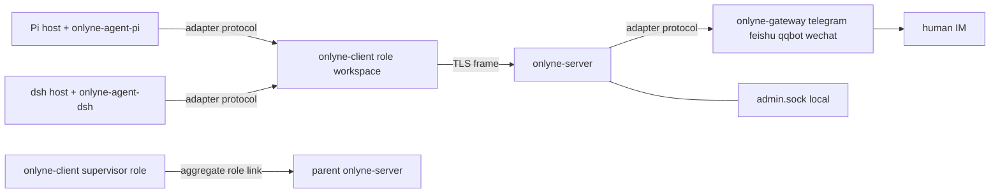

> **English reading copy.** This document is the English reading copy of the v1 plan. The authoritative detailed reference is the Chinese source at `docs/v1-PLAN.md`; if wording differs, follow that Chinese source.

# Onlyne v1.0.0 — Three-Process server / client / gateway Refactoring Execution Plan

## Context

Onlyne is currently a single-crate, workspace-scoped IM daemon (`onlyne` 0.6.0, 7688 lines in `src/`, with hard-coded adapter factories for four platforms in `src/adapters/`). Multi-agent orchestration is not in this repository; it lives entirely in the external standalone crate `harness/onlyne-swarm` (0.7.0, approximately 14k lines). The two are coupled through a `loopback` channel, with swarm metadata carried inside `text` using the `---swarm` body-header protocol (`harness/onlyne-swarm/PROTOCOL.md:1-6`). v1.0.0 refactors this into a **highly cohesive, low-integration, cross-machine-deployable, recursively networkable** agent communication component. Division of responsibility: `server` handles delivery routing, the ledger, protocol conversion, and gateway hosting; `client` is the one-role runtime per workspace and manages session lifecycle, process backends, and intents; coding-agent plugins and external IM gateways implement the same adapter protocol and attach on their respective sides. Human → IM → agent becomes the special case of “a gateway delivers to a role.” Compatibility is zero: old configuration, old DBs, and old wire formats all fail fast, and agents perform migration manually.

The terminal-state criteria are all in the **Verification** section, and every one is a directly runnable command.

## Locked decisions

Each item is an implementation constraint, not a suggestion.

| # | Decision |
|---|---|
| D1 | One client daemon per workspace; exactly one role per workspace; a role may run multiple sessions concurrently |
| D2 | All cross-workspace traffic goes through the server; clients never connect directly to one another |
| D3 | After a client disconnects: guarantee that running sessions reach a terminal state, persist outbound intents, and then sleep and reconnect. There is no offline delivery and no offline mesh |
| D4 | Unified message format = text + at most one inline image. All other attachment types, media download/transcoding, and Markdown semantic rendering leave the core |
| D5 | The server owns the ledger (routing, session-state projection, delivery queue, faults); the client owns execution authority (lifecycle reducer, intents, retries) |
| D6 | Workspace file synchronization, agent work products, and large files are not Onlyne's responsibility. To pass content across roles, put a link in the text and let the receiver fetch it |
| D7 | Merge `SessionBackend` (`spawn/attach/probe/close`) into the client; retain `orca`/`zellij`/`fake`, and delete the `herdr` stub |
| D8 | Wire format = a 4-byte big-endian length prefix + a UTF-8 JSON frame. One connection reuses request/response/event streams |
| D9 | Transport = TCP + TLS 1.3 (rustls), with server certificate fingerprint pinning, pre-registered ed25519 public keys, one key bound to one role, and ACL hard rejection on the server |
| D10 | Addressing = logical role names, resolved by the server. When the target is offline, control-plane messages are durably queued; `note` messages are rejected immediately |
| D11 | Tiered delivery semantics: control plane (`task/completion/control`) is at-least-once + `op_id` idempotency; observational plane (`report/event`) is at-most-once + cursor resync |
| D12 | Orchestration = hybrid: the server spec declares the role set and allowed edges (ACL), and the delivery action itself creates the task; there is no central dispatch and no `back_edges` scheduling table |
| D13 | Server configuration uses the file as the sole source of truth; `onlyne reload` / SIGHUP takes effect, with no runtime write API |
| D14 | Recursion: a child cluster exposes only an aggregate role to its parent server. An aggregate role is an ordinary role entry whose client is launched by the upper supervisor itself—there is zero federation code in the protocol |
| D15 | Supervisor = the user's cluster-operations agent: it talks to the user, assigns work, queries the ledger, and starts/stops clusters. It can run the `onlyne` CLI and has access to the local admin socket; the supervisor launches the server; the supervisor's pi process is managed by the user and terminal, and the supervisor has no lifecycle authority over servers it did not start/stop itself. In non-federated mode it is an unmanaged process: the `_supervisor` entry in the spec is the identity and ACL anchor (an admin `send` requires a registered `from` and `admin = true`), and its client never auto-starts; in federated mode its client connects to the parent server as an aggregate role |
| D16 | One adapter protocol mounted on both sides: the agent adapter process connects to the client, and the IM gateway process connects to the server. The four platform gateways are products of this repository |
| D17 | Delivery form = exactly three binaries: `onlyne-server`, `onlyne-client`, and `onlyne-gateway` (one independent process per platform) + a thin human-facing entry point, `onlyne` (which forwards to the corresponding local daemon). Splitting binaries by responsibility takes priority over the convenience of a single bin; scalability takes priority |
| D18 | All plugins are external: this plan delivers the protocol + SDK + conformance fixtures; rewriting `pi-onlyne` / `dsh-onlyne` is outside this plan |
| D19 | Subsystems removed by this plan are deleted from the corresponding old code at the same time; no compatibility aliases or dual-read paths remain |
| D20 | The server generates role workspaces from templates; generated output is a directory that can be relocated as a whole. Relocation to another machine is performed manually by the supervisor/user (cross-machine movement uses external file synchronization; Onlyne does not participate). A purely local, single-machine cluster is laid out in place under the local working directory according to the template hierarchy; generation never writes the spec |

## Target architecture



### 1. Repository and crate layout

Create a new Cargo workspace, change the root `Cargo.toml` to `[workspace]`, with these members and dependency boundaries:

```
Cargo.toml                      # [workspace] members = ["crates/*", "plugins/*"]
rust-toolchain.toml             # channel = "1.85"（对齐现 rust-version，Cargo.toml:6）
crates/
  onlyne-frame/                 # D8 帧编解码 + 连接复用；无业务依赖
  onlyne-proto/                 # Envelope/MsgKind/ReportKind/ControlOp/Event/Ops/ErrorCode + JSON Schema 生成
  onlyne-config/                # TOML 解析、schema 导出、env 密钥查找（源自 src/config.rs:16-505）
  onlyne-layout/                # 工作区/守护目录发现与布局（源自 src/workspace.rs，去掉 channels）
  onlyne-store/                 # server ledger DB + client local DB（同一 crate 两模块）
  onlyne-session/               # lifecycle reducer + SessionBackend（源：harness/onlyne-swarm）
  onlyne-net/                   # TLS 收发、ed25519 握手、ACL 判定、重连 backoff
  onlyne-adapter/               # 一份 adapter 协议的 Rust SDK（agent 侧与 gateway 侧共用）
  onlyne-server/                # bin 壳：路由 + 账本 + gateway 宿主 + admin.sock + spec
  onlyne-client/                # bin 壳：role 运行时 + dispatch + intent + adapter socket
  onlyne-gateway/               # bin 壳：四平台 gateway 宿主，按 --platform 只装配一家
  onlyne-cli/                   # 人机入口，只做本机 socket 转发与输出格式化
  onlyne-testkit/               # fake agent + fake gateway + 一致性 runner
plugins/
  onlyne-gateway-telegram/  onlyne-gateway-feishu/  onlyne-gateway-qqbot/  onlyne-gateway-weixin/
```

Dependency rules (violating them requires rework): `onlyne-proto` does not depend on tokio. `onlyne-session` contains only pure functions and the `SessionBackend` trait, and does not depend on `onlyne-store`. `onlyne-server` and `onlyne-client` do not depend on each other; they share only `proto/frame/net/store/config/layout`. `plugins/*` depend only on `onlyne-adapter` + `onlyne-proto`, and never on server-internal crates.

Binary boundaries (D17): the server does not compile any platform SDK (`teloxide`/`openlark`/`wechat-ilink`/`tokio-tungstenite`), nor does it compile `resvg`/`pulldown-cmark`. The gateway binary does not compile the ledger, router, or TLS server. `onlyne-client` does not compile any platform SDK. This guarantees scalability: a machine that runs only roles needs only `onlyne-client`.

### 2. Directory layout (zero compatibility; reject the old layout outright)

Server root (specified by `onlyne-server run --root <dir>`):

```
<root>/.onlyne/
  spec.toml              # 唯一中央真相（§5）
  state.db               # ledger，WAL 开启
  run/s                  # admin 本地 socket：Unix 为 UDS 0600；Windows 为 marker 文件 v1:onlyne-<32hex>，pipe 名 sha256 派生，owner-only SDDL
  run/server.pid
  logs/server.log
  keys/server.key        # ed25519 + TLS 私钥（PEM，0600）
  templates/<拓扑>/<role>/  # generate 的内容模板来源，层级即拓扑（§11；根可由 [server].template_root 改）
  ws/<拓扑>/<role>/    # generate 的默认输出（`--out` 可改）；这些目录允许被整体搬走，搬走后 server 不需要知道新位置
  cache/                 # gateway 侧渲染临时件（由 gateway 进程用绝对路径写入前锁）
```

Role workspace (client root):

```
<workspace>/.onlyne/
  config.toml            # role 身份、server endpoint、本地 plugin 列表
  client.db              # session 执行态、intent、inbox 游标
  run/s                  # 本机 client 本地 socket（adapter 插件 + onlyne CLI 入口；Windows 同 admin 的 marker+named pipe）
  run/                   # 只放 socket；1.0.1 起 client 前台运行，不写 pid 文件
  logs/client.log
  keys/role.key          # 本 role 私钥，对应 spec 中登记的公钥
  agent/<pkg>/           # generate 时 vendor 进来的外置 coding-agent 插件包副本（§11）
```

Discovery continues to use upward traversal (`src/workspace.rs:18-26`). However, `Workspace::bootstrap` rejects as soon as it sees an old-layout marker: `.onlyne/state.db` exists and contains a table named `io_cursors` or `loopback_idempotency`, or `.onlyne/channels/` exists. It then prints `onlyne: legacy workspace layout; v1.0.0 does not migrate` and exits with code 2.

### 3. Unified message format (`crates/onlyne-proto`)

There are two couplings to replace today. First is `MessageEnvelope.channel_id: String`: it is either an adapter key or the literal `"loopback"` (`src/core.rs:86-101`, `src/app.rs:354-396`). Second is swarm metadata: it is carried inside `text` through the `---swarm` header (`harness/onlyne-swarm/PROTOCOL.md:9-36`). Delete both.

```rust
pub const PROTOCOL_VERSION: u16 = 1;

#[derive(Serialize, Deserialize)]
#[serde(rename_all = "snake_case")]
pub enum Principal {
    Role { role: String, session: Option<String> },   // role 名；session 可选限定
    Gateway { gateway: String, channel: String, conversation: Option<String> },
    Cluster { cluster: String },                       // 仅 admin/联邦上报事件使用
}

#[derive(Serialize, Deserialize)]
#[serde(rename_all = "snake_case")]
pub enum MsgKind { Task, Completion, Note, Control }

#[derive(Serialize, Deserialize)]
#[serde(rename_all = "snake_case", tag = "op")]
pub enum ControlOp {
    Recycle  { task_id: String, reason: String },
    Probe    { task_id: String },
    Snapshot { task_id: String },
    Cancel   { task_id: String, reason: String },
}

#[derive(Serialize, Deserialize)]
#[serde(rename_all = "snake_case")]
pub enum Outcome { Done, Failed, Cancelled }

#[derive(Serialize, Deserialize)]
#[serde(rename_all = "snake_case")]
pub struct ImagePart { pub data_base64: String, pub mime: String, pub name: Option<String> }

#[derive(Serialize, Deserialize)]
#[serde(rename_all = "snake_case")]
pub struct Body { pub text: Option<String>, pub image: Option<ImagePart> }

#[derive(Serialize, Deserialize)]
#[serde(rename_all = "snake_case")]
pub struct Causality {
    pub task: String,               // uuid v4，任务族 id（今天 swarm 的 task_id）
    pub parent_task: Option<String>,// 由哪个任务激发（今天 transfer_send_to）
    pub reply_to: Option<String>,   // 被回复的 message id
    pub hop: u32,                   // 第几跳，自增
    pub attempt: u32,               // 重投次数
}

#[derive(Serialize, Deserialize)]
#[serde(rename_all = "snake_case")]
pub struct Envelope {
    pub protocol: u16,
    pub id: String,                 // uuid v4，发送方生成
    pub op_id: String,              // 幂等键：Control/Task/Completion 必填；Note 可空
    pub kind: MsgKind,
    pub from: Principal,
    pub to: Principal,
    pub causality: Option<Causality>,  // Task/Completion/Control 必填
    pub body: Body,
    pub ts: DateTime<Utc>,
    pub ttl_ms: Option<u64>,        // Note 过期即弃
    pub admin: bool,                // 必须发送 role 在 spec 中带 admin = true
}
```

Validation rules (hard rejection at construction time, returning `Error::Invalid` with the field name): at least one of `body.text` and `body.image` is non-empty; `text` has a UTF-8 limit of 1 MiB; decoded `image.data_base64` has a limit of 2 MiB; `mime` must be in `{"image/png","image/jpeg","image/gif","image/webp"}`; exceeding the limit reports `"image exceeds 2097152 bytes"`.

`op_id` has exactly one representation, consistent on every side: `"o-" + uuid_v4(发送方进程启动时生成)`. Retries reuse the same `op_id`. The idempotency fingerprint = `sha256_hex(serde_json::to_vec(&Envelope 去掉 id/ts/op_id))`. The conflict message is fixed as `"op_id conflict: request differs from durable receipt"` (retaining the semantics and wording from `src/store.rs:216-217`).

`kind` semantics:
- `Task` — delivered to a role, requiring it to create or reuse a session. A root submission and a downstream delegation differ only in `causality.parent_task`. The delivery action itself creates the task; there is no central dispatch (D12).
- `Completion` — a terminal receipt for a task. `causality.task` = the completed task, and `body.text` = a result summary (the first 200 characters go into the ledger's `out_head`, retaining `PROTOCOL.md:51-52`). `outcome` is placed in the `outcome` field of `ReportKind::Complete`; see §6.
- `Note` — free text. It creates no session and does not enter the queue; if the target is offline, reject it immediately with `recipient_offline`. Ordinary human→agent chat and agent-to-agent chatter both use it.
- `Control` — `recycle/probe/snapshot/cancel`. It is allowed only when `admin = true`, or when the initiator is the role that owns the task.

### 4. Frame protocol and connections

`crates/onlyne-frame` (there is no existing equivalent: today there is only NDJSON through `BufReader::lines()`, `src/ipc.rs:116,245-250`):

```rust
pub const MAX_FRAME_BYTES: usize = 8 * 1024 * 1024;
pub fn write_frame<W: AsyncWrite + Unpin, T: Serialize>(w: &mut W, v: &T) -> io::Result<()>;
pub async fn read_frame<R: AsyncRead + Unpin, T: DeserializeOwned>(r: &mut R) -> io::Result<Option<T>>;
```

One frame = `u32 big-endian 长度` + JSON of that length. If it exceeds `MAX_FRAME_BYTES`, send `error{code:"frame_too_large"}` and then close the connection.

Top-level frame discriminator (one connection reuses three streams):

```json
{"f":"req","id":"r1","op":"send","args":{...}}
{"f":"res","id":"r1","ok":true,"data":{...}}
{"f":"res","id":"r1","ok":false,"error":{"code":"acl_denied","message":"...","field":"to.role"}}
{"f":"ev","seq":41,"type":"session_state","data":{...}}
{"f":"ack","seq":41}
{"f":"ping","t":1699600000}
{"f":"pong","t":1699600000,"server_seq":42}
{"f":"bye","reason":"shutdown"}
```

`res.error.code` is a closed set, all lowercase with underscores: `invalid`, `unknown_op`, `acl_denied`, `unknown_role`, `recipient_offline`, `duplicate`, `conflict`, `unauthorized`, `forbidden`, `not_admin`, `frame_too_large`, `bad_frame`, `protocol_version`, `internal`. Today there are only two codes, `error` / `bad_json` (`src/ipc.rs:134,220,236`); replace both in this change.

Observational plane (D11): `ev` does not carry replay itself. The subscription body is `{op:"subscribe", since_seq, tiers, kinds}`. If no `ev` arrives for 10s, the client sends `ping`; `pong` returns `server_seq`. If the client falls behind by more than `resync_lag` (default 256), resubscribe with `subscribe` and `since_seq`. Event `seq` increases monotonically; after a server restart, the counter resumes from the `ledger`'s `events` table.

### 5. server spec (the sole source of truth)

All fields are in `<server-root>/.onlyne/spec.toml`; implementers must not add or remove any. `[server].stale_watch_secs` controls the scan interval of the stale-ledger observer, defaults to 60, and 0 disables the observer:

```toml
[server]
name = "cluster-a"
listen = "0.0.0.0:7811"
cert_pin = "sha256/..."          # server 证书 SPKI 指纹，client 侧核对
note_queue = false               # note 是否允许排队（默认 false，见 §3）
fault_history_days = 14
resync_lag = 256
heartbeat_timeout_ms = 30000
agent_package = ""              # 外置 coding-agent 插件包在本机的绝对路径，仅 generate 期用于占位符替换；空 = 模板不得使用 {{agent_package}}
template_root = ".onlyne/templates"   # 相对 server 根；generate 的模板来源

[[client]]
role = "planner"
key = "ed25519/AAAA..."
prose = """Read the incoming task, produce a concise completion reply, ..."""
admin = false
max_sessions = 3
reuse = true                     # 允许复用 idle 且无未完成 task 的 session
allowed_senders = ["*"]          # 谁能向本 role 投递
allowed_targets = ["builder", "reviewer"]
session_command = ["pi", "--session-id", "{session}"]
timeout = { ready_ms = 30000, idle_ms = 60000 }
intent = { attempts = 3, backoff_ms = [1000, 2000, 4000] }

[[client]]
role = "_supervisor"             # 上层看下来的 aggregate role 也写在这里
key = "ed25519/BBBB..."
aggregate = "cluster-b"          # 声明本 role 代表外部 cluster；纯标注，零特殊代码
allowed_senders = ["*"]
allowed_targets = ["_supervisor"]

[[gateway]]
id = "tg1"
platform = "telegram"
key = "ed25519/CCCC..."
enabled = true

[[route]]                        # 外部入站 → role（D16 的人→agent 特例）
gateway = "tg1"
channel = "telegram"
conversation = "1234"            # 省略 = 该 gateway 全部会话
to = { role = "planner" }

[[route]]
gateway = "tg1"
channel = "telegram"
to = { role = "_fallback" }      # 无 conversation 精确匹配时的兜底；顺序 = 文件顺序，first match wins
```

Loading semantics: `onlyne-server run` parses the entire file at startup. It refuses to start on an unknown key or type error and prints `spec.toml:<line>: <message>`. `onlyne reload` or `SIGHUP` reparses into a temporary structure; after validation succeeds, it atomically replaces the current structure, and `onlyne spec_diff` outputs only the diff. If validation fails, retain the old configuration and record `fault{kind:"spec_reload_failed"}`. There is no op for writing the spec at runtime (D13).

`prose` is the sole central source of role prompts. The client retrieves it with `welcome` when connecting and caches it in `client.db`. A prose change does not migrate running sessions. Local convention files such as each role's own `AGENTS.md` are unrelated to this mechanism.

ACL evaluation belongs in `onlyne-net`: `pub fn acl_allows(spec:&Spec, from:&Principal, to:&Principal, kind:MsgKind) -> Result<(), AclDeny>`, called **before** the ledger write. An `aggregate` role appears to the upper layer only in the spec of the server to which it belongs; the core delivery path has no aggregate branch (D14).

### 6. client: session lifecycle and process backend

The following implementations have already been verified; move them directly, do not rewrite them:

- Move `harness/onlyne-swarm/src/lifecycle.rs` (1447 lines: `AgentState{Booting,Ready,Running,Idle,Gone}` × `DeliveryState{None,Pending,Retrying,Accepted,Exhausted}` × `ResourceState{Detached,Attached,Closing,Closed}` × `RecoveryState{None,IdleWaiting,IdleFault,Draining}` × `Outcome` → `PublicLifecycle{Created,Working,Idle,Exited}`; 21 `LifecycleEvent` variants, each carrying `Version{generation,seq}`; the complete `apply()` function + `is_legal()` + table-driven tests 886-1447) unchanged into `crates/onlyne-session/src/lifecycle.rs`, changing references such as `use crate::db` to adapt to the local trait. Move the tests with it; do not reduce assertions.
- Move the `SessionBackend` trait / `Capabilities{spawn,attach,probe,close,focus,rename}` / `SpawnSpec{cwd,task_id,command,env,focus,rename}` / `SessionRef{task_id,backend,backend_ref:Value,generation}` / `ResourceProbe{alive,attached,detail}` / `CloseReason{Completed,Cancelled,Fault,Shutdown,Replaced,Operator}` from `harness/onlyne-swarm/src/runtime/mod.rs` to `crates/onlyne-session/src/backend/mod.rs`. Move `orca.rs`, `zellij.rs`, and `fake.rs`; delete `herdr.rs` (it is a documentation stub whose methods all return unsupported). Change `select_backend`'s probe order to `zellij → orca → fake`, and rename the environment variable to `ONLYNE_BACKEND`.
- Move the “reducer ↔ persistent ledger” bridge from `harness/onlyne-swarm/src/reconcile.rs` (`apply_persist`, `seed_created`, `stored_observation`, `to_versioned`, `backend_ref_json`, lines 90-310) to `crates/onlyne-session/src/reconcile.rs`. Delete all automatic policies: recovery-task generation, redelivery by `sweep_dead_terminals`, replay triggered by `hop_timeouts`, and automatic redelivery when `MAX_ATTEMPTS` is reached. Retain fact reduction, the monotonic `(generation,seq)` write gate, fault recording, and event emission (D15/D16's timeout_policy decision: the core only detects and only records a fault).
- Move the `on_ready`/`dispatch`/`session_alive`/`on_out`/`on_recycled` orchestration skeleton from `harness/onlyne-swarm/src/sched.rs` to `crates/onlyne-client/src/dispatch.rs`. The identity-matching key no longer uses `terminal_handle`; pass it through the environment instead (`ONLYNE_SESSION_ID`, `ONLYNE_TASK_ID`). At the same time, delete `sched.terminals: HashMap<String,String>` and the handle-matching logic in `replay_ready_history`—it does not hold across machines (see `src/sched.rs:334-404`, `src/events.rs:79-161`).

The mechanical flow after the client receives a Task: first check the `reuse` policy. If an idle session is not bound to a task, reuse it; otherwise call `backend.spawn(SpawnSpec{command: spec.session_command 渲染 {session}/{task}, env 注入 §7, cwd = workspace})`. Then record the `sessions` row. Next report `report{kind:"ready"}` to the server, and only afterward `deliver` the payload—retain today's ready-barrier causal order: ready first, delivery second (`src/sched.rs:334-404`).

Outbound intents (D3/D11) live in `client.db` as `intents(op_id PK, env_json, attempt, state ∈ {pending,retrying,accepted,exhausted}, next_attempt_at, receipt_json, last_error)`. Exponential backoff reads `intent.backoff_ms` from the spec, and the attempt count reads `intent.attempts`. On exhaustion, record `fault{kind:"intent_exhausted"}` locally and report `report{kind:"fault"}` at the same time; never silently discard the work.

Disconnect behavior (D3): after a connection failure or receiving `bye`, stop accepting new deliveries from the server (local `accept_new = false`). Running sessions continue to a terminal state; a completion produced at that terminal state is persisted as an intent and retried. After `accept_new=false`, do not spawn any new session. The client reconnects with backoff (1/2/4/8/…/60s capped), and after reconnecting successfully flushes intents in `seq` order.

### 7. Adapter protocol (D16, one protocol mounted on both sides)

Both sides use the same `onlyne-adapter` SDK and frame codec. Agent plugins connect to `<workspace>/.onlyne/run/s`; gateway processes connect to `<server-root>/.onlyne/run/s`. The admin socket and adapter socket reuse the same listener and split by `hello.kind` during the handshake: `agent` / `gateway` / `admin`.

Plugin → host:

```json
{"op":"hello","args":{"protocol":1,"plugin":"onlyne-agent-pi","version":"1.0.0","kind":"agent","capabilities":["register","report","inject","recycle"],"mount":{"role":"planner","session":"8b1c..."}}}
{"op":"welcome","...": true}
{"op":"report","args":{"kind":"heartbeat","task_id":"...","generation":1,"seq":14,"observed":{...}}}
{"op":"session_register","args":{"session_id":"8b1c...","pid":4212,"generation":1,"title":"swarm:planner:8b1c"}}
{"op":"assign_ack","args":{"task_id":"...","accepted":true,"reason":null}}
{"op":"send","args":{...Envelope...}}
{"op":"deliver","args":{"direction":"inbound","envelope":{...}}}   // 仅 gateway
{"op":"detach","args":{"reason":"operator"}}
```

Host → plugin: `welcome{role, prose, session_id, generation, server:{connected,cluster,name}}`, `assign{envelope, prose}` (agent side), `render_send{envelope}` (gateway side; the plugin performs platform-format conversion), `probe{}`, `recycle{task_id,reason}`, `config_get{key}`, and `bye{reason}`.

Capability negotiation: if `capabilities` does not contain `recycle`, the host can detect resource disappearance only through `probe`. Without `report`, the session enters `idle_fault` and records a fault. Without `assign` (a CLI-only agent), deliver the payload through stdin/arguments instead; determine the terminal state from the process exit code plus its final output line. `hello` times out after 5s; if another frame arrives before `hello`, return `error{code:"invalid",message:"hello required first"}` and disconnect.

The agent-side SDK must cover at least these abstractions; the list comes from observed differences between the two existing plugins (pi-onlyne vs dsh-onlyne): `configPath`, `registerTool`, `registerCommand`, `wakeUser` (pi `pi.sendUserMessage(...,{deliverAs:"followUp"})` / dsh `agent.followup(createUserMessage(...))`), `sendCustomEntry`, `on(turn lifecycle hooks)`, `exit(reason)`, `wrapResult`, `setActiveTools`, `setStatus/setTitle`, and `setModel/setThinkingLevel`. The SDK declares every item as an optional trait member; if the host lacks one, report the corresponding missing capability.

`onlyne-adapter` also publishes a machine-readable protocol specification: `crates/onlyne-adapter/PROTOCOL.md` and `onlyne-adapter.schema.json` (the latter exported by `onlyne-proto`'s schemars). External TS plugin repositories align with it (D18).

### 8. op vocabulary for the three delivery planes

client ↔ server (`op` is a closed set, with one `match` in `onlyne-server/src/router.rs`): `hello`, `send`, `pull`, `ack`, `report`, `session_sync`, `subscribe`, `query_ledger`, `query_sessions`, `query_roles`, `query_faults`, `control`, `bye`.

admin (local socket, `<server-root>/.onlyne/run/s`, permission 0600, the cluster trust root): read-only `status`, `roles`, `sessions`, `ledger`, `faults`, `watch`, `history`, `spec_diff`; operational actions `reload`, `send`, `control`, `repair_{inspect,adopt,rebind,retry,fail,close,ack}`. On the admin plane, `send`/`control` use `--from <role>` to specify the sending role, and record `admin = true` when writing the ledger. `send` still passes §5's `acl_allows` check (`from` must already be registered in the spec). When `control` uses the admin identity, it bypasses role-edge-table evaluation; role-plane `control` evaluation remains: owner identity or an edge with `admin = true`. This plane has zero policy: it contains no automatic redelivery, automatic recycling, or timeout decision logic; whether to repair is decided by the supervisor session.

gateway ↔ server: `hello`, `register_channel`, `deliver` (inbound), `render_send` (outbound), `health`, `typing` (optional capability), `bye`.

Delete all remaining legacy ops: `loopback`, `swarm_ready`, `swarm_recycled`, `swarm_busy`, `swarm_idle`, `mark_io_consumed`, `consume`, `start_adapter`, `stop_adapter`, `restart_adapter`, the old form of `fetch_history_page`, and verbatim pass-through of `onlyne client '<json>'` (`src/app.rs:166-232`, `src/cli.rs:119`). Waking oneself = sending a `note` to one's own role.

### 9. CLI vocabulary (`onlyne-cli`; output is always JSON, and `--json` is the default)

```
onlyne server start|stop|status|run|generate|roles|sessions|ledger|faults|watch|history|repair ...
onlyne client run|status|init|roles|sessions|watch|history
onlyne send --to <role> [--task <id>] [--text ...|--file -] [--image f.png] [--note]
onlyne reply --to <envelope-id> --text ...
onlyne complete --task <id> [--outcome done|failed|cancelled] --text ...
onlyne handoff --to <role> --task <id> --text ...
onlyne control --task <id> probe|snapshot   # recycle 与 cancel 同形，并带必填 --reason <text>
onlyne gateway run <telegram|feishu|qqbot|weixin> --server-root <dir> [--token ...]
onlyne gateway list|status|auth <platform> [...]      # auth = 原 onlyne auth 的 QR onboarding
onlyne who|ping|version|completions <zsh|fish>
# fake agent 不经 onlyne 转发：e2e 直接执行 onlyne-testkit 编出的 onlyne-agent-fake
```

Forwarding rules (`onlyne` itself contains no business logic): `onlyne server <verb>` → exec `onlyne-server <verb>`; `onlyne client <verb>` → exec `onlyne-client <verb>`; `onlyne gateway <verb>` → exec `onlyne-gateway <verb>`. Message verbs (`send`/`reply`/`complete`/`handoff`/`ack`/`reject`/`control`/`who`/`ping`) do not exec a daemon; instead, following the socket-resolution rules below, they connect directly to the corresponding Unix socket, send one frame, and print the response. The three daemon binaries are independently executable; `onlyne` is only a thin entry point.

Socket resolution rule (the only spelling): explicit `--socket <path>` override → `--server-root <dir>` resolves to `<dir>/.onlyne/run/s` (admin plane) → `--workspace <dir>` or the `.onlyne/run/s` discovered by walking upward from the current directory (client plane). If none exists → stderr is exactly `onlyne: no onlyne socket found; pass --socket, --server-root, or --workspace`, and the exit code is 3.

Admission-registration flow (aligned with D13's file-as-truth rule): `onlyne-client init --workspace W --role R --server-root S` generates `W/.onlyne/keys/role.key` (ed25519), reads the `[server]` section through S's admin socket and writes it into `W/.onlyne/config.toml`, and prints a directly pasteable spec fragment to stdout (the first line is exactly `[[client]]`, containing `role` and `key = "ed25519/<base64>"`). `init` itself never writes the spec file. The operator/supervisor appends the fragment to `spec.toml`, then runs `onlyne reload` to make it effective; an unregistered key receives `error{code:"unauthorized"}` when connecting.

### 10. DB schema (`crates/onlyne-store`)

`server.db` (SQLite, WAL, `busy_timeout = 5000`, serialized single writer):

```
roles(name PK, key TEXT NOT NULL, admin INT, max_sessions INT, spec_hash TEXT, updated_at TEXT)
sessions(task_id PK, role, session_id, generation INT, seq INT, public_lifecycle TEXT,
         agent_state TEXT, delivery_state TEXT, resource_state TEXT, recovery_substate TEXT,
         observed_json TEXT, updated_at TEXT)   -- client 投影镜像，写入受 (generation,seq) 单调门禁
ledger(msg_id TEXT PK, op_id TEXT UNIQUE, fingerprint TEXT, kind TEXT, from_json TEXT, to_json TEXT,
       task TEXT, parent_task TEXT, attempt INT, state TEXT, out_head TEXT, reason TEXT,
       enqueued_at TEXT, acked_at TEXT, body_json TEXT NOT NULL)
  -- state ∈ queued|in_flight|acked|rejected|expired；body_json 保留至 acked 后 retention_days（默认 14）再置 NULL
events(seq INTEGER PRIMARY KEY, type TEXT, data_json TEXT, created_at TEXT)   -- 观测面环形 + 持久化，retention 同上
faults(id INTEGER PK AUTOINCREMENT, task_id, role, session_id, generation, seq,
       desired_json, observed_json, intent, attempt, backend_ref, kind TEXT, reason TEXT,
       state TEXT, created_at TEXT)
inbox_cursors(role TEXT PK, last_msg_id TEXT, last_seq INT, updated_at TEXT)
```

`client.db`: `sessions` (local authority; fields match lifecycle storage, without lifecycle columns), `task(task_id PK, kind, parent_task, hop, attempt, task_state, opened_at, settled_at)` (the task's own record: the result is not a session dimension), `intents` (§6), `out_head_cache(task_id, head)`, `prose_cache(role, prose, spec_hash)`, and `config_cache(key,value)`.

Migration policy: at startup read `schema_marker(name PK, version INT, protocol_version INT)`, expecting `('onlyne-server',3,1)` / `('onlyne-client',2,1)`. If it does not match, or an old table is found (`io_cursors`, `loopback_idempotency`, `pending_replies`, or a `swarm` prefix), refuse to start and report `onlyne: unsupported schema; v1.0.0 does not migrate`.

### 11. Generation and placement of role workspaces (D20)

**Division of truth**: `spec.toml` governs protocol truth—role name, public key, ACL, prose, concurrency, timeouts, and `session_command`. `<server-root>/.onlyne/templates/<相对路径>/` governs content truth—everything in a role workspace except runtime files (`AGENTS.md`, `prompts/*.md`, `.pi/settings.json`, `.pi/onlyne.json`, and so on). Template content is opaque to Onlyne, with one exception: a template may contain a `.onlyne/config.toml` local-override fragment, merged with the derived values from §5; derived values take precedence.

**Command**:

```
onlyne server generate --root <server-root> [--template <相对路径>]... [--role <name>]...
                       [--out <dir>] [--force]
```

- `--out` defaults to `<server-root>/.onlyne/ws`. By default, traverse every `[[client]]` entry in `spec.toml` and generate one workspace for each, including a supervisor role entry with `aggregate`—it is also a local role in this cluster. `--template` / `--role` select a subset; when both are given, use their intersection. If the intersection is empty, report `onlyne: no role matches the requested templates/roles; available roles: <r1>, <r2>` (listing the candidate role names actually found under the template root at the end), exit with code 4, and write no files.
- There is only one template-to-role mapping rule: recursively search under `template_root` for a directory whose basename exactly equals the role name; that directory is the role's template, and its parent path is the topology location (`templates/dev/planner/` → role `planner`, topology `dev`). Multiple matches report `onlyne: template for role <r> is ambiguous: <p1>, <p2>`; no match reports `onlyne: no template directory named <r> under <template_root>`. Both cases exit with code 4 and write no files. `--template <相对路径>` explicitly selects one template, bypasses basename matching, and uses that template's parent path as the topology location.
- The output directory copies the template hierarchy: `<out>/<模板相对路径>/<role>/` (template `.onlyne/templates/dev/planner/` + role `planner` → `<out>/dev/planner/`). A single-machine cluster that stays in place is already arranged by topology; to move it elsewhere, the supervisor/user moves the entire directory.
- If a target file exists, its bytes differ from this render, and `--force` was not supplied, report `onlyne: refusing to overwrite <path>; pass --force` (naming that file), exit with code 4, and write no files; if the bytes are identical, skip without rewriting (mtime is unchanged). `--force` overwrites only template-content files and `.onlyne/config.toml`; generate `.onlyne/keys/role.key` only when it does not exist; existing `.onlyne/client.db`, `.onlyne/run/`, and `.onlyne/logs/` are **never overwritten**.
- Every generate creates a new independent ed25519 keypair for the role. The private key goes to `<ws>/.onlyne/keys/role.key` (0600); the public key appears only in the output spec fragment and generation manifest.

**Placeholder substitution** (closed set; an unrecognized `{{...}}` is an error listing the key name and file path, with exit code 4): `{{role}}`, `{{cluster}}`, `{{server_name}}`, `{{listen}}`, `{{cert_pin}}`, `{{admin}}`, `{{max_sessions}}`, `{{agent_package}}`. `{{agent_package}}` points to `[server].agent_package` (a local absolute path, read only once during this step): generate copies the entire package directory into `<ws>/.onlyne/agent/<pkg-name>/` (skipping the package's `.onlyne/`, `target/`, and `.git/`), and the generated `.pi/settings.json` references the copy with `.onlyne/agent/<pkg-name>`. Thus the plugin travels with the workspace when relocated; the method follows the old `sync.rs::copy_pi_onlyne_package` (152-163) and its settings-path rewrite (196-210), so the generated output does not contain that absolute path. If `agent_package` is empty while a template uses `{{agent_package}}`, report `onlyne: agent_package not set in spec.toml [server]`, exit with code 4; if the template does not use the placeholder, do not vendor the package.

**Hard relocatability constraint**: no generated file may contain a generation-time absolute path. After writing, scan the bytes of every output for the two prefix strings `out.canonicalize()` and `<server-root>`; if either is found, delete this output directory, report `onlyne: generated workspace embeds absolute path <path>`, and exit with code 4. All runtime paths are derived by the client from its own `--workspace` (`.onlyne/run/s`, `client.db`, `logs/`), while the server uses `listen` + `cert_pin`. Therefore, after moving the directory to any path on any machine, `onlyne client run` works directly.

**Single prose source**: the generated directory does not contain a prose copy. Prose is delivered only with `welcome`, and the client caches it in `prose_cache` in `client.db` (§5, §10).

**Output receipt**: print two parts to stdout. The first is a directly pasteable TOML `[[client]]` fragment (the first line is exactly `[[client]]`, containing `role` and `key = "ed25519/<base64>"`). The second is `<out>/.onlyne-generation.json`: `{"generated_at":"<rfc3339>","server_root":"<绝对路径仅此文件内>","roles":[{"role":"planner","dir":"dev/planner","key":"ed25519/...","template":"dev/planner"}]}`. `dir` is relative to `--out`; the supervisor uses it to launch each `onlyne client run --workspace <out>/<dir>`. generate never writes `spec.toml` (D13); the supervisor/user appends entries and runs `onlyne reload`.

**Division of labor with `onlyne-client init`**: `init` creates a minimal role workspace (only `.onlyne/{config.toml,keys/role.key}`) for the supervisor's own workspace and manual scenarios. `generate` = the output of `init` + template content + topology placement. The output layouts are identical field by field, and `client run` cannot tell the source.

**Replacement of the old mechanism**: `crates/onlyne-config/src/template.rs` reuses the hierarchical deep merge from `harness/onlyne-swarm/src/template.rs` (`merge_into` 102-121, `load_tree` 126-211's directory traversal and dotted-directory pruning 230-232) and the path-rewrite approach from `sync.rs::bootstrap_child` (165-217), deleting `WorkspaceTemplate.back_edges`/`model` (22-34), `normalize_edge` (73-100), `validate_edges` (240-254), the `.onlyne/swarm.workspace.jsonc` snapshot and its read chain (the model triplet is now carried by the spec's `session_command` and `env`). Delete `daemon.rs::ensure_all` (spawning one Onlyne daemon for every workspace, the entire 89-line file), and let the supervisor start `onlyne client run` instead. Merge `hierarchy.rs` (Orca folder ghost cleanup) into `crates/onlyne-session/src/backend/orca.rs`. Downgrade the three readiness gates of `swarm_ready_gaps` (`sync.rs:75-129`) (`[swarm]enabled`, `.pi/onlyne.json`'s `watch.autoStart`, and `.pi/settings.json` containing pi-onlyne) to template-validation hints during generate; the client no longer checks them at runtime.

## Approach

Execute in this order. At the end of every step, `cargo build` must pass, the tests added by that step must pass, and already-migrated crates must still compile. After step 3, crates communicate only through `onlyne-proto`, so work can proceed in parallel (steps marked `[parallel]`).

### S1. Remove legacy coupling and establish the workspace skeleton

1. Convert the root `Cargo.toml` to `[workspace]`, and move the entire existing `src/` into `crates/onlyne-legacy/src/` (temporary package name `onlyne-legacy`, referenced only during migration, deleted in S12). Then add the empty crates listed in §1, each containing only `lib.rs` + one smoke test.
2. Delete the three submodules `harness/onlyne-swarm`, `harness/pi-onlyne`, and `harness/dsh-onlyne` (`git rm <path>` + delete the corresponding sections from `.gitmodules`). Land the swarm source in `crates/onlyne-session/` with `git -C harness/onlyne-swarm show 1a2aefd:<file>` (retrieve it file by file when S3 needs it). Before deleting, confirm that `lifecycle.rs`, `runtime/{mod,orca,zellij,fake}.rs`, `reconcile.rs`, `sched.rs`, `db.rs`, and `proto.rs` have been copied into the tree. Note that the current `harness/pi-onlyne` checkout is at `origin/dev` 72e5fa6 (the parent repository's main-branch gitlink `75c6b0d` is unreachable from its remote); use it only as a protocol reference and do not migrate its code.
3. Change `build.rs` to workspace scope: move the schema-generation target to `crates/onlyne-proto/build.rs`.
4. Verify: `cargo build --workspace` passes.

### S2. Frames and protocol

1. Write `onlyne-frame`: §4's `write_frame`/`read_frame` (`tokio::io::AsyncReadExt::read_u32_be`), covering the oversize branch and testing partial packets and coalesced packets. The core has no existing equivalent (today there is only the line-delimited reader at `ipc.rs:116`).
2. Write `onlyne-proto`: all §3 types + the closed `Error` set + `Envelope::validate()`; `cargo run -p onlyne-proto --bin gen-schema` generates `onlyne-proto/schema/{envelope,spec,adapter,config-client}.schema.json`.
3. Table-driven tests cover three things: `Envelope` round trips, every error code is reachable, and `validate()`'s rejection messages for oversized text/image are asserted verbatim.

### S3. Move the session kernel

Move the three items from §6 (lifecycle / backend / reconcile bridge). Deletion list: `runtime/herdr.rs`; automatic recovery-task generation in `reconcile.rs`; the automatic-redelivery branch in `sched.rs::sweep_dead_terminals`; the branch in `hop_timeouts` that triggers replay (retain the branch that records a fault); and `events.rs::replay_ready_history` (`terminal_handle` matching does not hold across machines). `session_alive` follows only the `backend.probe` path; delete the bypass that treats a `handle` with the `stub-` prefix as alive (`src/sched.rs:594-611`). Verify: the complete lifecycle table tests pass unchanged; under the `fake` backend, assert the state progression `spawn→probe→close`.

### S4. Configuration, layout, and store

`onlyne-config` holds three structures (server spec, client config, plugin config), all TOML; retain `src/config.rs`'s `Env::secret` (indirect env lookup) and `$VAR` syntax. `onlyne-layout` removes channels, adds legacy detection, and exits 2 on a match. `onlyne-store` implements the two modules from §10, adds the `schema_marker` gate and monotonic `(generation,seq)` upsert, and copies the writing style from `harness/onlyne-swarm/src/db.rs:351-364`. Verify: `sqlite` rejects a sample DB with the old layout; a spec with a missing field or an unknown field reports an error with a line number.

### S5. Transport and admission `[parallel]`

`onlyne-net` provides: a TLS acceptor (self-signed + `cert_pin` fingerprint verification), `hello` challenge signing (the server sends 32 random bytes; the client/gateway signs with its private key; the server verifies with the public key registered in the spec), `acl_allows`, and a `backoff` utility (1/2/4/8/…/60s). Why write it new: the core has zero authentication today (`src/ipc.rs:70-249`; any local process can call `shutdown`), and there is no TLS/identity implementation to reuse. Tests: reject a wrong key, reject an unregistered public key, and reject a mismatched fingerprint; cover one match and one non-match for each of `allowed_senders` and `allowed_targets`.

### S6. Server runtime

`router.rs` (the §8 op match), `relay.rs` (`send` → ACL → persist to `ledger` → deliver via `pull` → settle via `ack`; retain `queued` when the target is offline, and whether `note` is dropped follows `note_queue`), `projection.rs` (persist `session_sync`/`report` mirrors and events), `faults.rs` (record and emit only, with no automatic repair), and `admin.rs` (admin socket: read-only queries + transactional ledger edits through `repair_*` + `watch` stream + `reload` + `spec_diff`). Verify: use two clients plus one role for triangular delivery; `onlyne server ledger` outputs the state sequence `queued→in_flight→acked`; resending the same `op_id` yields `duplicate` and returns the original receipt.

### S7. Role workspace generation and placement

Implement §11: `crates/onlyne-config/src/template.rs` (hierarchical traversal + deep merge + placeholder substitution + absolute-path scan), `crates/onlyne-server/src/generate.rs` (the `generate` op and CLI verb, writing `<out>/<层级>/<role>/` + the `[[client]]` fragment + `.onlyne-generation.json`). Test points: the output tree for two templates and two roles; a template that uses `agent_package` when it is unset reports the exact error; an output containing an absolute path is cleaned up and exits 4; `--force` does not touch `client.db`; after relocation to a new path, `client run` connects without changing anything (using §2's config path resolution assertions).

### S8. Client runtime `[parallel]`

`runloop.rs` (server connection, intent flush, D3 disconnect behavior), `adapter_socket.rs` (split agent/admin by `hello`, handle §7 ops, record a fault for a missing capability), `local_cli.rs` (local entry points for `send/reply/complete/handoff/control`, persisting intents), and `accept.rs` (ready barrier → reuse/spawn → assign the plugin → `ack`). Verify: with the `fake` backend + `onlyne-agent-fake --workspace <ws> --script ...`, one `Task` travels from the server → the plugin receives `assign` → the returning `Completion` changes the ledger to `acked`.

### S9. Adapter SDK and conformance fixtures

`onlyne-adapter`: frame client/server wrappers, `hello` negotiation, a `report` sender, `assign` dispatch, and capability-bit constants. `onlyne-testkit`: `FakeAgent` (a stdio plugin that injects/reports/completes/exits abnormally according to a script) and `FakeGateway` (stdin/stdout transport simulating one routable external conversation). The `conformance` runner covers: rejection of a frame before `hello`, missing `recycle` capability, rejection of an illegal `generation` in `report`, rejection of an oversized image in `send`, and idempotent intent retry after disconnect. Verify: `cargo test -p onlyne-testkit` + the runner is green for all three combinations of `FakeAgent`/`FakeGateway`/`fake` backend.

### S10. Split the gateway and unload the server side

1. `src/markdown.rs`, `src/media.rs` (`render_markdown_table_png`, `ffmpeg_convert`, `cache_bytes`, `sanitize`), and `src/auth.rs` (QR onboarding) → `crates/onlyne-gateway/kit/`.
2. `src/adapters/{telegram,feishu,qqbot,weixin}.rs` → `plugins/onlyne-gateway-<platform>/src/lib.rs`. Each implements `onlyne-adapter::GatewayPlugin`: on inbound, convert the platform event to `Envelope{kind:Note|Task, from:Principal::Gateway{...}}` and use `deliver`; on outbound, take the `Envelope` from `render_send`, perform platform rendering (markdown → card/HTML/text/table converted to PNG as `Body.image`), and call the platform API. Store only the minimum association needed for `reply_to`/`causality`; do not stuff platform details into `platform_metadata: Value` anymore (all four adapters currently put arbitrary JSON there, `src/core.rs:100`).
   Each platform crate is gated by a Cargo feature of `onlyne-gateway` (`telegram` / `feishu` / `qqbot` / `weixin`, default = all), with `--platform` responsible for runtime selection. A single-platform deployment can use `--no-default-features --features telegram` to link only one, preventing a platform SDK from entering a process that does not need it. The four SDKs never enter `onlyne-server` / `onlyne-client`.
3. During migration, also remove the verified shells and leaks; leave no old behavior:
   - All four `Adapter::list_conversations` implementations are `Ok(vec![])` (`src/adapters/telegram.rs:182-184`, `feishu.rs:126-128`, `qqbot.rs:217-219`, `weixin.rs:183-185`); downgrade this to an optional capability in the adapter protocol. If a platform cannot obtain a real conversation list, declare that it lacks the capability, and stop filling the `conversations` table as a side effect.
   - `Event::DeliveryUpdate` (`src/core.rs:129-134`) and `Event::Error` (`src/core.rs:160-163`) appear only in the enum definition and the string mappings in `src/ipc.rs:256,264`; no publisher exists anywhere in the repository. `AdapterHealth::Starting` (`src/core.rs:48-56`) is never constructed. Delete all three from `onlyne-proto`: the semantics of `DeliveryUpdate` move to ledger state events, and `Error` moves to `fault`.
   - `start_adapter` / `stop_adapter` / `restart_adapter` are shells that only return `{"started": false}` + `Event::Warning` (`src/app.rs:220-230`); delete them. The supervisor starts and stops gateway processes through the CLI/shell.
   - Raw platform payloads no longer enter the unified envelope. Today: `feishu.rs:544` stores the entire raw payload, `weixin.rs:415` stores `to_value(&msg.raw)`, `qqbot.rs:748,804` uses the `/onlyne/qq_scene` pointer in `platform_metadata` to select a scene, and `telegram.rs:320` stuffs in the chat title/username. Change this to a gateway-local association table `gateway_ref(channel, conversation, external_id, scene)` in the gateway's own DB; pass only `Principal::Gateway` and `reply_to` across processes.
4. Verify: in addition to `FakeGateway`, actually run `onlyne gateway run telegram` without credentials; the error message must include the missing env name, and the server records `fault{kind:"gateway_unconfigured"}` instead of panicking.

### S11. Recursive cluster path (verification work with zero new code)

According to D14/D15, there is only one place where code really needs to be written: the supervisor's client connects to the parent server with “the aggregate-role public key registered in the parent spec,” and `hello.args.mount.role` contains the aggregate name. This step delivers:
1. Add `onlyne cluster export-prose` to `onlyne-cli`: print this role's externally visible description so the upper layer can write it into its own prose. This gives the upper supervisor the child cluster's interface information.
2. Produce the documentation artifact `crates/onlyne-server/FEDERATION.md` (a protocol convention only, not runtime code): the aggregate role is simply a `[[client]]` entry in the parent spec; `allowed_targets` contains only roles visible to the parent; the child layer's internal topology never appears in the parent ledger.
3. See the “Two-cluster federation” case in Verification: deliveries to the aggregate in the parent ledger are visible only at the parent layer; the parent ledger's `body_json` contains no child-layer role name; and the parent completion's `out_head` contains no child-layer role name either.

### S12. Remove leftovers and close the cutover

Delete `crates/onlyne-legacy/`, all old files in `src/`, `docs/IPC.md`, `docs/CHANNEL_IO.md`, `docs/RICH_MEDIA.md` (FIFO/rich media no longer exist), the root `onlyne-config.schema.json` (replaced by the per-schema generated outputs), `examples/`'s `fifo/`, `broadcast/`, `multicast/`, `multi-channel/`, and `rich-media/` (these are only `send_message` CLI loops with no protocol content, `examples/shared/send-many.py:22-33`), and `scripts/pi-onlyne-longhaul.mjs`, which depends on old ops. Rewrite `.agents/skills/onlyne/SKILL.md` and `skills/onlyne-channel-smoke/SKILL.md` as one document according to the new CLI vocabulary. Rewrite `README.md` / `README.zh-CN.md` around the three-process model. Rewrite §0 of `AGENTS.md` (“Onlyne is not a workflow engine / agent runtime”), §5 (workspace layout), §6 (the minimal IPC op set), §11 (“no plugin systems”), and §12 (delivery strategy) to the v1.0.0 boundary: the server only delivers and does not orchestrate, orchestration belongs to roles and the supervisor, the adapter is mounted on both sides, and compatibility is zero.

## Critical files & anchors

| File | Anchors | Why it matters |
|---|---|---|
| `harness/onlyne-swarm/src/lifecycle.rs` (`git show` before deletion) | `apply()` 446-726, `is_legal()` 282-349, tests 886-1447 | The lifecycle kernel that must be moved unchanged; any “helpful simplification” would destroy its verified completeness |
| `harness/onlyne-swarm/src/reconcile.rs` | `apply_persist` 248-273, `seed_created` 288-310; `sweep_dead_terminals` (in `ipc.rs:232-301`) | Copy the bridge implementation verbatim; these are the precise points at which to delete automatic-redelivery policy |
| `src/app.rs` | `handle` 166-232 (old op vocabulary), `swarm_activity` 277-305, `start_channel_io` 139-156, `channel_in_loop` 398-455 | The op dispatch to delete, FIFO gating, and `---swarm` header splitting are all here; `adapter_bindings` 975-994 is how the four platforms read `bind_conversation_id`, replaced by `[[route]]` in §5 |
| `harness/pi-onlyne/src/index.ts` | `applyToolSurface` 359-368, `swarmSend` FIFO writes 271-296, inbound template 202 | The agent-side capability surface that the external plugin must reproduce, and the point where FIFO dependencies are removed |
| `harness/onlyne-swarm/src/sync.rs` | `INSTANCE_CONFIG` 8-45, `bootstrap_child` 165-217, `swarm_ready_gaps` 75-129 | The old workspace-generation model, replaced by §11's `generate` + template directories; deletion points are listed one by one at the end of §11 |

## Verification

Prerequisites: `cargo build --workspace`; `cd crates/onlyne-testkit && cargo build`. All e2e cases use `ONLYNE_BACKEND=fake` + a `fake` gateway; real platform credentials, Orca, and Zellij are forbidden.

1. **Single-machine end to end (primary evidence for the new behavior)**: script `crates/onlyne-testkit/e2e/local-task.sh`, using `set -euo pipefail`, with prerequisite `cargo build --workspace`:
   ```
   SRC=$(pwd); tmp=$(mktemp -d)
   "$SRC/target/debug/onlyne-server" init --root "$tmp/server" --listen 127.0.0.1:7899   # 写出含 [server] 段的 spec.toml 模板
   "$SRC/target/debug/onlyne-server" run --root "$tmp/server" &
   "$SRC/target/debug/onlyne" --server-root "$tmp/server" wait-ready                     # 轮询 admin status 至 ok=true，超时 10s 失败
   "$SRC/target/debug/onlyne-client" init --workspace "$tmp/planner" --role planner \
       --server-root "$tmp/server" > "$tmp/planner.spec.toml"
   cat "$tmp/planner.spec.toml" >> "$tmp/server/.onlyne/spec.toml"
   "$SRC/target/debug/onlyne" --server-root "$tmp/server" reload
   "$SRC/target/debug/onlyne-client" run --workspace "$tmp/planner" &
   "$SRC/target/debug/onlyne-agent-fake" --workspace "$tmp/planner" --script \
       "$SRC/crates/onlyne-testkit/scripts/echo-complete.json" &
   "$SRC/target/debug/onlyne" --server-root "$tmp/server" send --from planner --to planner --text "hello v1"
   ```
   Expected: the first line of `init` output is exactly `[[client]]` and contains `key = "ed25519/`, and it occurs before `wait-ready`; `send` prints one JSON line with `ok = true`, `data.task` is a uuid v4, and `data.state = "in_flight"`; subsequently, the `state` from `onlyne --server-root "$tmp/server" ledger --task <task>` eventually becomes `acked`, and `out_head` contains `hello v1`; `public_lifecycle = "exited"` and `outcome = "done"` from `onlyne ... sessions --task <task>`; `echo-complete.json` asserts that the `assign.prose` received by the fake agent equals the spec's `prose`.
2. **ACL hard rejection (regression for the admission model, must originate from a real client)**: set `allowed_targets = ["planner"]` for `builder` in the spec, register it as in case 1, start builder's client and fake agent, then
   `onlyne --workspace "$tmp/builder" send --to reviewer --text x`
   → Expected: `ok = false`, `error.code = "acl_denied"`, and `error.field = "to.role"`; the server's `ledger` has no new row; builder's `intents` table has no leftover row (the sender does not persist an intent after receiving a rejection).
3. **Idempotency and replay (hard evidence for at-least-once on the control plane)**: first manually fix an `op_id` according to §3, and send two identical `send` messages to the same role → the second is expected to have `ok = false`, `error.code = "duplicate"`, and `data` exactly equal to the first receipt (including the same `msg_id`). Then change `body.text`, reuse the same `op_id`, and resend → expect `error.code = "conflict"` and `error.message` exactly equal to `op_id conflict: request differs from durable receipt`. The two requests together produce exactly one row in `ledger`.
4. **Disconnect and recovery**: start server + client, submit 3 Tasks, then `kill -9` the client. The server log or `roles` query must show `state="offline"`, and the `queued` row must remain. After the client restarts, the 3 rows are redelivered in `seq` order; the three ledger rows are each `acked` exactly once; the `sessions` table has exactly 3 task rows (no duplicate session). A completion from a running session is persisted as a `pending` intent and delivered after reconnection.
5. **Two-cluster federation (recursion)**: parent server + planner role, child server + builder role; the child supervisor connects to the parent as aggregate role `cluster-b`. The parent executes `onlyne send --to cluster-b --text "P1 round trip"` → the child supervisor is expected to receive it as aggregate role and `ack` it (the parent ledger shows `state="acked"` and `from.role="cluster-b"`). The parent ledger contains only the aggregate-role row; the child layer's role names and prose do not appear by even one character.
6. **Gateway mounting consistency**: after `FakeGateway` registers, `onlyne gateway status` must report that `gateway` id and its `capabilities`. Deliver one `Task` to the gateway-bound conversation → the `FakeGateway` side receives a `deliver` frame. Send a `note` to an offline role → `error.code = "recipient_offline"`; after `ttl_ms` expires → `state = "expired"`.
7. **Legacy-layout rejection**: copy the `.onlyne/` directory from `origin/main` (`cf5cb8b`) (including `state.db` and `channels/`) to a temporary directory, and execute `onlyne-client init --workspace <dir>` → expect exit code 2, stderr exactly `onlyne: legacy workspace layout; v1.0.0 does not migrate`, and no files written.
8. **Full static gate**: `cargo fmt --check`, `cargo clippy --workspace --all-targets -- -D warnings`, `cargo test --workspace`; `cargo tree -p onlyne-client | grep -E 'teloxide|openlark|wechat-ilink|resvg'` must produce no output (gateway code has not leaked into the client binary). CI acceptance surface: `.github/workflows/ci.yml` has two jobs—`linux` (fmt/clippy/workspace test) and `windows` (`cargo test` for the core-crate subset). Both platforms are green (run 34977562567).
9. **Generation and relocation (primary evidence for D20)**:
   ```
   "$SRC/target/debug/onlyne" --server-root "$tmp/server" generate --out "$tmp/gen" > "$tmp/spec-frag.toml"
   cat "$tmp/spec-frag.toml" >> "$tmp/server/.onlyne/spec.toml"
   "$SRC/target/debug/onlyne" --server-root "$tmp/server" reload
   mkdir -p "$tmp/elsewhere" && mv "$tmp/gen/dev/builder" "$tmp/elsewhere/b1"     # 模拟搬到另一绝对路径
   "$SRC/target/debug/onlyne-client" run --workspace "$tmp/elsewhere/b1" &
   "$SRC/target/debug/onlyne-agent-fake" --workspace "$tmp/elsewhere/b1" --script "$SRC/crates/onlyne-testkit/scripts/echo-complete.json" &
   "$SRC/target/debug/onlyne" --server-root "$tmp/server" send --from planner --to builder --text "relocated"
   ```
   Expected: the first line of `generate` output is exactly `[[client]]`; `$tmp/gen/dev/builder/.onlyne/config.toml` exists, and `run/s` is not created during generation; `grep -rl "$tmp/gen" "$tmp/elsewhere/b1"` produces no output (the relocated directory contains no generation-time absolute path); the moved role still connects and `ack`s, and its ledger row has `state = "acked"`; rerunning with `--force` does not change the mtime of `$tmp/elsewhere/b1/.onlyne/client.db`.
16. **Headless e2e (1.1.0)**: script `crates/onlyne-testkit/e2e/exec-headless.sh`. The workspace `config.toml` contains `backend = "headless"` (a parse alias), while the process environment `ONLYNE_BACKEND=exec` takes precedence. `session_command` runs the fake agent; the stdout banner goes into `.onlyne/logs/session-<task>.log`; the ledger is `acked`; the session is `exited`/`done`; and the backend bytes in `client.db` are `exec`. Cases 4 and 15 have zero regression.

## Assumptions & contingencies

- A server role entry corresponds one-to-one with a client, and one client serves only one role. If implementation finds that a role needs multiple client instances, the fallback is to add `replicas = N` under the same role entry and select instances in round-robin; the addressing format does not change.
- `note_queue` is disabled by default (notes do not queue; if the target is offline, return `recipient_offline` immediately). This is the only product-biased default in §5.
- The plan changes only the Onlyne repository; changes to the `pi-onlyne` / `dsh-onlyne` plugin repositories are outside this plan (D18). If a synchronized change proves necessary, stop and report; do not make it opportunistically within this plan.
- Real platform credentials do not enter the repository: end-to-end verification for the four platform gateways follows S9 with `FakeGateway` + the platform `check()` dry-run.
- The `onlyne-agent-fake` binary is not counted in D17: it is a testkit artifact and is not released (exclude it with `--exclude` before `cargo publish`).
- If removing automatic redelivery from the migrated `lifecycle.rs` in S3 leaves a dead state (for example, `DeliveryState::Exhausted` has no exit), do not add an automatic transition: retain `Exhausted` as a terminal state and have the supervisor explicitly `retry` it through `control`.

---

# English executive mirror

This section is an English overview of the detailed design plan above. The Chinese source at `docs/v1-PLAN.md` is the authoritative detailed reference; if wording differs, follow that Chinese source.

## Purpose

Onlyne v1.0.0 refactors the current single-crate, workspace-scoped IM daemon into a cohesive, low-integration agent communication component that can run across machines and recurse into clusters. The server performs delivery routing, durable ledger management, protocol conversion, and gateway hosting. The client is the role runtime for a workspace and owns session lifecycle, process backends, and intents. Agent coding plugins and external IM gateways use the same adapter protocol on their respective sides. Human → IM → agent is the special case of a gateway delivering to a role. The product has zero compatibility: old configuration, databases, and wire versions fail fast, and migration is manual.

## Locked decisions

- **D1:** One client daemon per workspace, exactly one role per workspace, and concurrent sessions within that role.
- **D2:** All cross-workspace traffic goes through the server; clients never connect directly to one another.
- **D3:** After a client disconnects, running sessions reach a terminal state, outbound intents are persisted, and the client sleeps and reconnects. There is no offline delivery or offline mesh.
- **D4:** The unified message is text plus at most one inline image. Other attachments, media conversion, and Markdown rendering remain outside the core.
- **D5:** The server owns the routing ledger, session-state projection, delivery queue, and faults. The client owns execution authority: lifecycle reduction, intents, and retries.
- **D6:** Onlyne does not synchronize workspace files, agent artifacts, or large files. Cross-role content is a link in text and the receiver fetches it.
- **D7:** `SessionBackend` (`spawn/attach/probe/close`) belongs to the client. Keep `orca`, `zellij`, and `fake`; delete the `herdr` stub.
- **D8:** The wire format is a 4-byte big-endian length prefix followed by a UTF-8 JSON frame. One connection multiplexes requests, responses, and events.
- **D9:** Transport is TCP plus TLS 1.3 (rustls), with certificate pinning, pre-registered ed25519 public keys, one key per role, and ACL hard rejection on the server.
- **D10:** Addressing uses logical role names resolved by the server. Control-plane messages queue durably when the target is offline; `note` is rejected directly.
- **D11:** Control-plane delivery (`task/completion/control`) is at-least-once with `op_id` idempotency. Observational delivery (`report/event`) is at-most-once with cursor resynchronization.
- **D12:** Orchestration is hybrid: the server spec declares roles and allowed edges (ACL), while delivery itself creates a task. There is no central dispatcher or `back_edges` scheduling table.
- **D13:** The server file is the sole source of truth. `onlyne reload` and SIGHUP apply changes; there is no runtime write API.
- **D14:** A child cluster exposes only an aggregate role to its parent server. The aggregate is an ordinary role entry whose client is launched by the upper supervisor; federation requires no protocol-specific federation code.
- **D15:** The supervisor is the user's cluster operator: it talks to the user, assigns work, queries the ledger, and starts or stops clusters. It may run the `onlyne` CLI and use the local admin socket. The supervisor's own `pi` process belongs to the user and terminal, while it owns the lifecycle of servers it starts. In non-federated mode `_supervisor` is only an identity/ACL anchor and never auto-starts; in federated mode its client connects to the parent as the aggregate role.
- **D16:** One adapter protocol is mounted on both sides: agent adapters connect to the client, and IM gateways connect to the server. The four platform gateways are repository products.
- **D17:** Ship exactly `onlyne-server`, `onlyne-client`, and `onlyne-gateway` binaries (the latter is one process per platform), plus the thin `onlyne` human interface that forwards to the local daemon.
- **D18:** Plugins are external. This plan delivers the protocol, SDK, and conformance fixtures; rewriting `pi-onlyne` and `dsh-onlyne` is outside this plan.
- **D19:** Subsystems removed by this plan are deleted from old code at the same time; no compatibility aliases or dual-read paths remain.
- **D20:** The server generates role workspaces from templates. Generated directories are relocatable as a whole; moving them is a supervisor/user action, and generation never writes the spec.

## Process boundaries, workspace, session, and ledger

The server, client, and gateway are separate binaries. The server must not compile platform SDKs or rendering/media code; the client must not compile platform SDKs; and the gateway must not compile ledger, router, or TLS-server internals. The server owns the routing plane, the client owns local execution and outbound intents, and the gateway owns platform rendering and external-channel association. One shared adapter SDK and frame codec is used on both sides. Plugins connect to the role or server socket, and the admin socket is the local cluster trust root.

The server root contains `.onlyne/spec.toml` (protocol truth), SQLite ledger state, sockets, logs, keys, templates, generated workspaces, and gateway cache. A role workspace contains local config, `client.db` (execution state, intents, inbox cursor), sockets, logs, its role key, and vendored agent package content. Templates supply content truth; generated workspaces contain no generation-time absolute paths and can be moved or run on another machine. `spec.toml` is the only configuration source, applied by reload or SIGHUP.

A `Task` creates or reuses a client session according to `reuse`; the client records the session, reports `ready`, and only then delivers the payload. Running sessions continue across disconnects, but no new session is accepted while `accept_new = false`. Outbound intents are persisted in `client.db` with `op_id`, attempt, state, retry time, receipt, and last error, then flushed in `seq` order after reconnection. Exhaustion records a fault rather than silently dropping work.

The server ledger is keyed by message and `op_id`, with a fingerprint, causal fields, delivery state (`queued|in_flight|acked|rejected|expired`), output head, reason, and retained body. Server session rows are a monotonic `(generation,seq)` projection; the client database holds authoritative session state. ACL evaluation happens before the ledger write. Control/task/completion delivery is at-least-once and idempotent; report/event delivery is at-most-once and resumable by sequence cursor.

## Verification and compatibility

The exact executable evidence is in the `## Verification` section above. Its cases cover single-machine task completion, ACL rejection, idempotency, disconnect recovery, two-cluster federation, gateway mounting, legacy-layout refusal, the static gate, generation/relocation, and headless e2e. The original commands, expected states, error strings, paths, and numeric readings are unchanged there.

This is a clean cutover. A legacy workspace exits 2 with `onlyne: legacy workspace layout; v1.0.0 does not migrate`; an old schema marker is refused with `onlyne: unsupported schema; v1.0.0 does not migrate`. Old configuration keys, old wire versions, removed operations, and legacy layouts are not read as alternate forms. Protocol revision and schema changes use their version gates and explicit refusal behavior.

## English-to-Chinese navigation

Use `## Context` for the current boundary, `## Locked decisions` for D1–D20, `## Target architecture` for process and data semantics, `## Approach` for implementation order, `## Verification` for executable cases, and `## Assumptions & contingencies` for explicit contingencies. The Chinese plan at `docs/v1-PLAN.md` remains the authoritative detailed design reference.
