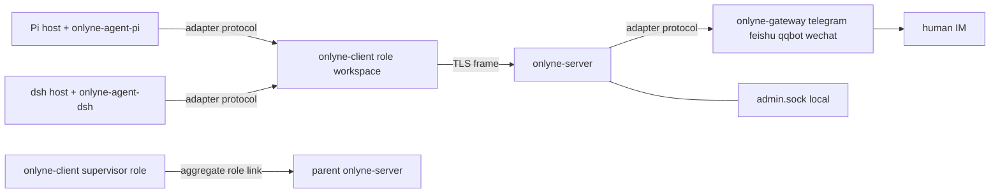

# Onlyne v1.0.0 — server / client / gateway 三进程重构执行计划

## Context

Onlyne 今天是单 crate 工作区级 IM daemon（`onlyne` 0.6.0，`src/` 7688 行，`src/adapters/` 四平台硬编码工厂），多 agent 编排完全在仓外的独立 crate `harness/onlyne-swarm`（0.7.0，约 14k 行）里，靠 `loopback` channel + 夹带在 `text` 里的 `---swarm` 正文头协议耦合（`harness/onlyne-swarm/PROTOCOL.md:1-6`）。v1.0.0 要把它重构成**高内聚、低集成、可跨机部署、可递归组网**的 agent 通信组件：`server` 做投递路由 + 账本 + 协议转换 + gateway 宿主；`client` 是每工作区一个的 role 运行时（session 生命周期、进程 backend、intent）；coding-agent 插件与外部 IM gateway 实现同一份 adapter 协议、挂载在不同侧。人→IM→agent 变成"gateway 投递给 role"的特例。零兼容：旧配置、旧 DB、旧 wire 一律 fail-fast，迁移由 agent 手工完成。

终态判据在 **Verification** 一节，全部为可执行命令。

## Locked decisions

每条都是实现约束，不是建议。

| # | 决定 |
|---|---|
| D1 | 每工作区一个 client daemon；一个 workspace 恰好一个 role；role 内可并发多 session |
| D2 | 跨工作区流量全部经 server 中转，client 之间不直连 |
| D3 | client 断连后：保证在跑的 session 走到终态、出向 intent 落盘、然后休眠重连。无离线投递、无离线 mesh |
| D4 | 统一消息格式 = 文本 + 至多一张内联图片。其余附件类型、媒体下载/转码、markdown 语义渲染全部离开核心 |
| D5 | server 持账本（路由、session 状态投影、投递队列、fault）；client 持执行态权威（lifecycle reducer、intent、重试） |
| D6 | 工作区文件同步、agent 工作产物、大文件全部不归 onlyne。跨 role 传内容 = 文本里写链接，接收方自取 |
| D7 | SessionBackend（spawn/attach/probe/close）并入 client；保留 `orca`/`zellij`/`fake`，删除 `herdr` 桩 |
| D8 | 线格式 = 4 字节大端长度前缀 + UTF-8 JSON 帧。一条连接复用 request/response/event |
| D9 | 传输 = TCP + TLS 1.3（rustls），server 证书指纹钉验，预登记 ed25519 公钥，一 key 绑一 role，ACL 在 server 硬拒 |
| D10 | 寻址 = 逻辑 role 名，server 解标。目标离线时控制面消息持久排队，`note` 类直接拒收 |
| D11 | 投递语义分级：控制面（task/completion/control）at-least-once + `op_id` 幂等；观测面（report/event）at-most-once + 游标 resync |
| D12 | 编排 = 混合：server spec 声明 role 集合与允许边（ACL），投递动作本身创建任务，无中央 dispatch、无 `back_edges` 调度表 |
| D13 | server 配置以文件为唯一真相，`onlyne server reload` / SIGHUP 生效，无运行期写 API |
| D14 | 递归：子 cluster 向父 server 只暴露 aggregate role。aggregate role 就是一个普通 role 条目，其 client 由上层 supervisor 自己拉起 —— 协议里零联邦代码 |
| D15 | supervisor = 用户的集群操作 agent：与用户对话，代用户派活、查账、启停集群。它能跑 `onlyne` CLI 并持有本机 admin socket 访问权；server 由 supervisor 拉起；supervisor 的 pi 进程归用户与终端管，归零它自己启停的 server 的生命周期管辖。非联邦模式下它就是野生进程：spec 里的 `_supervisor` 条目是身份与 ACL 锚点（admin `send` 要求 `from` 已注册且 `admin = true`），它的 client 从不自启；联邦模式下它的 client 以 aggregate role 身份连父 server |
| D16 | 一份 adapter 协议、两侧挂载：agent adapter 进程连 client，IM gateway 进程连 server。四平台 gateway 是本仓产物 |
| D17 | 交付形态 = 恰好三个二进制：`onlyne-server`、`onlyne-client`、`onlyne-gateway`（每个平台一个独立进程）+ 一个瘦人机入口 `onlyne`（转发到本机对应守护进程）。二进制按职责拆分优先于单 bin 便利，规模可扩展性优先 |
| D18 | 插件全部外置：本计划交付协议 + SDK + 一致性 fixture，pi-onlyne / dsh-onlyne 的重写不在本计划内 |
| D19 | 计划内删除的子系统，对应旧代码同时删除，不留兼容别名或双读路径 |
| D20 | role 工作区由 server 按模板生成；生成产物是可整体搬迁的目录，异地放置由 supervisor/user 手动完成（跨机靠外部文件同步，onlyne 不参与）；纯本机单机集群就按模板层级就地排布在本地工作目录；生成过程不写 spec |

## Target architecture



### 1. 仓库与 crate 布局

新建 Cargo workspace，根 `Cargo.toml` 改 `[workspace]`，成员与依赖边界：

```
Cargo.toml                      # [workspace] members = ["crates/*", "plugins/*"]
rust-toolchain.toml             # channel = "1.85"（对齐现 rust-version，Cargo.toml:6）
crates/
  onlyne-frame/                 # D8 帧编解码 + 连接复用；无业务依赖
  onlyne-proto/                 # Envelope/MsgKind/ReportKind/ControlOp/Event/Ops/ErrorCode + JSON Schema 生成
  onlyne-config/                # TOML 解析、schema 导出、env 密钥查找（源自 src/config.rs:16-505）
  onlyne-layout/                # 工作区/守护目录发现与布局（源自 src/workspace.rs，去掉 channels）
  onlyne-store/                 # server ledger DB + client local DB（同一 crate 两模块）
  onlyne-session/               # lifecycle reducer + SessionBackend（源：harness/onlyne-swarm）
  onlyne-net/                   # TLS 收发、ed25519 握手、ACL 判定、重连 backoff
  onlyne-adapter/               # 一份 adapter 协议的 Rust SDK（agent 侧与 gateway 侧共用）
  onlyne-server/                # bin 壳：路由 + 账本 + gateway 宿主 + admin.sock + spec
  onlyne-client/                # bin 壳：role 运行时 + dispatch + intent + adapter socket
  onlyne-gateway/               # bin 壳：四平台 gateway 宿主，按 --platform 只装配一家
  onlyne-cli/                   # 人机入口，只做本机 socket 转发与输出格式化
  onlyne-testkit/               # fake agent + fake gateway + 一致性 runner
plugins/
  onlyne-gateway-telegram/  onlyne-gateway-feishu/  onlyne-gateway-qqbot/  onlyne-gateway-weixin/
```

依赖规则（违反即返工）：`onlyne-proto` 不依赖 tokio；`onlyne-session` 纯函数 + `SessionBackend` trait，不依赖 `onlyne-store`；`onlyne-server` 与 `onlyne-client` 互不依赖，只共享 `proto/frame/net/store/config/layout`；`plugins/*` 只依赖 `onlyne-adapter` + `onlyne-proto`，永不依赖 server 内部 crate。

二进制边界（D17）：server 不编译任何平台 SDK（`teloxide`/`openlark`/`wechat-ilink`/`tokio-tungstenite`）与 `resvg`/`pulldown-cmark`；gateway 二进制不编译 ledger/router/TLS 服务端；`onlyne-client` 不编译任何平台 SDK。规模上可扩展性由此保证：一台只跑 role 的机器只需要 `onlyne-client`。

### 2. 目录布局（零兼容，旧布局直接拒绝）

server 根（由 `onlyne-server run --root <dir>` 指定）：

```
<root>/.onlyne/
  spec.toml              # 唯一中央真相（§5）
  state.db               # ledger，WAL 开启
  run/s                  # admin unix socket，0600，仅本机本用户
  run/server.pid
  logs/server.log
  keys/server.key        # ed25519 + TLS 私钥（PEM，0600）
  templates/<拓扑>/<role>/  # generate 的内容模板来源，层级即拓扑（§11；根可由 [server].template_root 改）
  ws/<拓扑>/<role>/    # generate 的默认输出（`--out` 可改）；这些目录允许被整体搬走，搬走后 server 不需要知道新位置
  cache/                 # gateway 侧渲染临时件（由 gateway 进程用绝对路径写入前锁）
```

role 工作区（client 根）：

```
<workspace>/.onlyne/
  config.toml            # role 身份、server endpoint、本地 plugin 列表
  client.db              # session 执行态、intent、inbox 游标
  run/s                  # 本机 client socket（adapter 插件 + onlyne CLI 入口）
  run/client.pid
  logs/client.log
  keys/role.key          # 本 role 私钥，对应 spec 中登记的公钥
  agent/<pkg>/           # generate 时 vendor 进来的外置 coding-agent 插件包副本（§11）
```

发现规则沿用向上走查（`src/workspace.rs:18-26`），但 `Workspace::bootstrap` 遇到旧布局标志（存在 `.onlyne/state.db` 且其中含表 `io_cursors` 或 `loopback_idempotency`，或存在 `.onlyne/channels/`）→ 打印 `onlyne: legacy workspace layout; v1.0.0 does not migrate` 并 exit code 2。

### 3. 统一消息格式（`crates/onlyne-proto`）

替换今天两类耦合：`MessageEnvelope.channel_id: String` 要么是 adapter key 要么是字面量 `"loopback"`（`src/core.rs:86-101`、`src/app.rs:354-396`），以及 swarm 元数据夹带在 `text` 里的 `---swarm` 头（`harness/onlyne-swarm/PROTOCOL.md:9-36`）。两者全部删除。

```rust
pub const PROTOCOL_VERSION: u16 = 1;

#[derive(Serialize, Deserialize)]
#[serde(rename_all = "snake_case")]
pub enum Principal {
    Role { role: String, session: Option<String> },   // role 名；session 可选限定
    Gateway { gateway: String, channel: String, conversation: Option<String> },
    Cluster { cluster: String },                       // 仅 admin/联邦上报事件使用
}

#[derive(Serialize, Deserialize)]
#[serde(rename_all = "snake_case")]
pub enum MsgKind { Task, Completion, Note, Control }

#[derive(Serialize, Deserialize)]
#[serde(rename_all = "snake_case", tag = "op")]
pub enum ControlOp {
    Recycle  { task_id: String, reason: String },
    Probe    { task_id: String },
    Snapshot { task_id: String },
    Cancel   { task_id: String, reason: String },
}

#[derive(Serialize, Deserialize)]
#[serde(rename_all = "snake_case")]
pub enum Outcome { Done, Failed, Cancelled }

#[derive(Serialize, Deserialize)]
#[serde(rename_all = "snake_case")]
pub struct ImagePart { pub data_base64: String, pub mime: String, pub name: Option<String> }

#[derive(Serialize, Deserialize)]
#[serde(rename_all = "snake_case")]
pub struct Body { pub text: Option<String>, pub image: Option<ImagePart> }

#[derive(Serialize, Deserialize)]
#[serde(rename_all = "snake_case")]
pub struct Causality {
    pub task: String,               // uuid v4，任务族 id（今天 swarm 的 task_id）
    pub parent_task: Option<String>,// 由哪个任务激发（今天 transfer_send_to）
    pub reply_to: Option<String>,   // 被回复的 message id
    pub hop: u32,                   // 第几跳，自增
    pub attempt: u32,               // 重投次数
}

#[derive(Serialize, Deserialize)]
#[serde(rename_all = "snake_case")]
pub struct Envelope {
    pub protocol: u16,
    pub id: String,                 // uuid v4，发送方生成
    pub op_id: String,              // 幂等键：Control/Task/Completion 必填；Note 可空
    pub kind: MsgKind,
    pub from: Principal,
    pub to: Principal,
    pub causality: Option<Causality>,  // Task/Completion/Control 必填
    pub body: Body,
    pub ts: DateTime<Utc>,
    pub ttl_ms: Option<u64>,        // Note 过期即弃
    pub admin: bool,                // 必须发送 role 在 spec 中带 admin = true
}
```

校验规则（构造期硬拒，返回 `Error::Invalid` 并带字段名）：`body.text` 与 `body.image` 至少一个非空；`text` UTF-8 上限 1 MiB；`image.data_base64` 解码后上限 2 MiB，`mime` 必须 ∈ `{"image/png","image/jpeg","image/gif","image/webp"}`，超限报 `"image exceeds 2097152 bytes"`。

`op_id` 生成规范（唯一写法，跨端一致）：`"o-" + uuid_v4(发送方进程启动时生成)`；重试沿用同一 `op_id`。幂等指纹 = `sha256_hex(serde_json::to_vec(&Envelope 去掉 id/ts/op_id))`，冲突文案固定 `"op_id conflict: request differs from durable receipt"`（沿用 `src/store.rs:216-217` 语义与措辞）。

`kind` 语义：
- `Task` —— 投递给 role 并要求产生/复用一个 session。根提交与下游转派只差在 `causality.parent_task`。投递动作即创建任务，无中央 dispatch（D12）。
- `Completion` —— 某 task 的终态回执，`causality.task` = 被完成的任务，`body.text` = 结果摘要（前 200 字进 ledger 的 `out_head`，沿用 `PROTOCOL.md:51-52`）。`outcome` 走 `ReportKind::Complete` 的 `outcome` 字段，见 §6。
- `Note` —— 自由文本，不建 session，不进队列（目标离线即 `recipient_offline` 拒收）。人→agent 的普通聊天与 agent 之间闲聊都用它。
- `Control` —— `recycle/probe/snapshot/cancel`，`admin = true` 或发起方为该 task 的属主 role 才放行。

### 4. 帧协议与连接

`crates/onlyne-frame`（无现成等价物：今天只有 `BufReader::lines()` 的 NDJSON，`src/ipc.rs:116,245-250`）：

```rust
pub const MAX_FRAME_BYTES: usize = 8 * 1024 * 1024;
pub fn write_frame<W: AsyncWrite + Unpin, T: Serialize>(w: &mut W, v: &T) -> io::Result<()>;
pub async fn read_frame<R: AsyncRead + Unpin, T: DeserializeOwned>(r: &mut R) -> io::Result<Option<T>>;
```

帧 = `u32 big-endian 长度` + 该长度的 JSON。超 `MAX_FRAME_BYTES` → 发 `error{code:"frame_too_large"}` 后关闭连接。

帧顶层判别体（一条连接复用三种流）：

```json
{"f":"req","id":"r1","op":"send","args":{...}}
{"f":"res","id":"r1","ok":true,"data":{...}}
{"f":"res","id":"r1","ok":false,"error":{"code":"acl_denied","message":"...","field":"to.role"}}
{"f":"ev","seq":41,"type":"session_state","data":{...}}
{"f":"ack","seq":41}
{"f":"ping","t":1699600000}
{"f":"pong","t":1699600000,"server_seq":42}
{"f":"bye","reason":"shutdown"}
```

`res.error.code` 取值封闭，全部小写下划线：`invalid`、`unknown_op`、`acl_denied`、`unknown_role`、`recipient_offline`、`duplicate`、`conflict`、`unauthorized`、`forbidden`、`not_admin`、`frame_too_large`、`bad_frame`、`protocol_version`、`internal`。替换今天只有 `error` / `bad_json` 两个码的现状（`src/ipc.rs:134,220,236`）。

观测面（D11）：`ev` 不自带重放；订阅体 `{op:"subscribe", since_seq, tiers, kinds}`，心跳 10s 无 `ev` 则客户端发 `ping`，`pong` 携带 `server_seq`，落后超 `resync_lag`（默认 256）→ 重新 `subscribe` 带 `since_seq`。事件 `seq` 单调，服务端重启后从 ledger `events` 表恢复计数起点。

### 5. server spec（唯一真相）

`<server-root>/.onlyne/spec.toml`，字段全集（实现者不得增删）：

```toml
[server]
name = "cluster-a"
listen = "0.0.0.0:7811"
cert_pin = "sha256/..."          # server 证书 SPKI 指纹，client 侧核对
note_queue = false               # note 是否允许排队（默认 false，见 §3）
fault_history_days = 14
resync_lag = 256
heartbeat_timeout_ms = 30000
agent_package = ""              # 外置 coding-agent 插件包在本机的绝对路径，仅 generate 期用于占位符替换；空 = 模板不得使用 {{agent_package}}
template_root = ".onlyne/templates"   # 相对 server 根；generate 的模板来源

[[client]]
role = "planner"
key = "ed25519/AAAA..."
prose = """Read the incoming task, produce a concise completion reply, ..."""
admin = false
max_sessions = 3
reuse = true                     # 允许复用 idle 且无未完成 task 的 session
allowed_senders = ["*"]          # 谁能向本 role 投递
allowed_targets = ["builder", "reviewer"]
session_command = ["pi", "--session-id", "{session}"]
timeout = { ready_ms = 30000, running_ms = 120000, idle_ms = 60000 }
intent = { attempts = 3, backoff_ms = [1000, 2000, 4000] }

[[client]]
role = "_supervisor"             # 上层看下来的 aggregate role 也写在这里
key = "ed25519/BBBB..."
aggregate = "cluster-b"          # 声明本 role 代表外部 cluster；纯标注，零特殊代码
allowed_senders = ["*"]
allowed_targets = ["_supervisor"]

[[gateway]]
id = "tg1"
platform = "telegram"
key = "ed25519/CCCC..."
enabled = true

[[route]]                        # 外部入站 → role（D16 的人→agent 特例）
gateway = "tg1"
channel = "telegram"
conversation = "1234"            # 省略 = 该 gateway 全部会话
to = { role = "planner" }

[[route]]
gateway = "tg1"
channel = "telegram"
to = { role = "_fallback" }      # 无 conversation 精确匹配时的兜底；顺序 = 文件顺序，first match wins
```

加载语义：`onlyne-server run` 启动时全量解析，任何未知键或类型错 → 拒绝启动并打印 `spec.toml:<line>: <message>`。`onlyne server reload` 或 `SIGHUP` → 重解析到临时结构体，校验通过后原子替换 + `--dry-run` 输出 diff；校验失败保留旧配置、记 `fault{kind:"spec_reload_failed"}`。运行期无任何写 spec 的 op（D13）。

`prose` 是 role 提示词的唯一中央真相，client 连接时随 `welcome` 拉取并缓存到 `client.db`；prose 变更不触发正在运行 session 的迁移。各 role 自定义 `AGENTS.md` 之类的本地约定文件与本机制无关。

ACL 判定实现：`onlyne-net` 提供 `pub fn acl_allows(spec:&Spec, from:&Principal, to:&Principal, kind:MsgKind) -> Result<(), AclDeny>`，在 ledger 落盘**之前**调用；`aggregate` role 对上层只出现在其自身所属 server 的 spec，核心投递路径无 aggregate 分支（D14）。

### 6. client：session 生命周期与进程 backend

直接搬迁已验证的实现，不要重写：

- `harness/onlyne-swarm/src/lifecycle.rs`（1447 行，`AgentState{Booting,Ready,Running,Idle,Gone}` × `DeliveryState{None,Pending,Retrying,Accepted,Exhausted}` × `ResourceState{Detached,Attached,Closing,Closed}` × `RecoveryState{None,IdleWaiting,IdleFault,Draining}` × `Outcome` → `PublicLifecycle{Created,Working,Idle,Exited}`，21 个 `LifecycleEvent` 变体各带 `Version{generation,seq}`，`apply()` 全函数 + `is_legal()` + 表驱动测试 886-1447）→ 原样进 `crates/onlyne-session/src/lifecycle.rs`，仅把 `use crate::db` 类引用改为本地 trait 适配。测试随行迁移，禁止缩减断言。
- `harness/onlyne-swarm/src/runtime/mod.rs` 的 `SessionBackend` trait / `Capabilities{spawn,attach,probe,close,focus,rename}` / `SpawnSpec{cwd,task_id,command,env,focus,rename}` / `SessionRef{task_id,backend,backend_ref:Value,generation}` / `ResourceProbe{alive,attached,detail}` / `CloseReason{Completed,Cancelled,Fault,Shutdown,Replaced,Operator}` → `crates/onlyne-session/src/backend/mod.rs`；`orca.rs`、`zellij.rs`、`fake.rs` 平移；`herdr.rs` 删除（全方法返回 unsupported 的文档桩）；`select_backend` 探测序改为 `zellij → orca → fake`，环境变量改名 `ONLYNE_BACKEND`。
- `harness/onlyne-swarm/src/reconcile.rs` 中"reducer ↔ 持久 ledger"的桥接（`apply_persist`、`seed_created`、`stored_observation`、`to_versioned`、`backend_ref_json`，行 90-310）→ `crates/onlyne-session/src/reconcile.rs`。删除其中的自动策略：recovery task 生成、`sweep_dead_terminals` 的重投、`hop_timeouts` 触发 replay、`MAX_ATTEMPTS` 到限自动重投。保留：事实归约、`(generation,seq)` 单调写入门禁、fault 记录与事件外发（D15/D16 之 timeout_policy 决定：core 只检测记 fault）。
- `harness/onlyne-swarm/src/sched.rs` 的 `on_ready`/`dispatch`/`session_alive`/`on_out`/`on_recycled` 编排骨架 → `crates/onlyne-client/src/dispatch.rs`。身份匹配键从 `terminal_handle` 改为 env 传递（`ONLYNE_SESSION_ID`、`ONLYNE_TASK_ID`），删除 `sched.terminals: HashMap<String,String>` 与 `replay_ready_history` 按 handle 匹配的逻辑（跨机不成立，见 `src/sched.rs:334-404`、`src/events.rs:79-161`）。

client 收到 Task 的机械流程：查 `reuse` 策略 → 有 idle 且未绑定 task 的 session 则复用，否则 `backend.spawn(SpawnSpec{command: spec.session_command 渲染 {session}/{task}, env 注入 §7, cwd = workspace})` → 记录 `sessions` 行 → 向 server 上报 `report{kind:"ready"}` 之后再 `deliver` 载荷（保留今天 ready barrier 的因果顺序：先 ready 后投递，`src/sched.rs:334-404`）。

出向 intent（D3/D11）：`client.db` 的 `intents(op_id PK, env_json, attempt, state ∈ {pending,retrying,accepted,exhausted}, next_attempt_at, receipt_json, last_error)`。指数退避取 spec 的 `intent.backoff_ms`，次数取 `intent.attempts`；耗尽 → 本地记 `fault{kind:"intent_exhausted"}` + 上报 `report{kind:"fault"}`，绝不静默丢弃。

断连行为（D3）：连接失败或 `bye` → 停止向 server 接受新投递（本地 `accept_new = false`）、在跑的 session 继续到终态、终态产生的 completion 走 intent 落盘重试、`accept_new=false` 后不再 spawn 新 session、退避重连（1/2/4/8/…/60s 封顶），重连成功后按 `seq` 顺序 flush intents。

### 7. adapter 协议（D16，一份协议两侧挂载）

同一套 `onlyne-adapter` SDK 与帧编解码；agent 插件连 `<workspace>/.onlyne/run/s`，gateway 进程连 `<server-root>/.onlyne/run/s`（admin socket 与 adapter socket 复用同一监听，握手期 `hello.kind` 分流：`agent` / `gateway` / `admin`）。

插件 → 宿主：

```json
{"op":"hello","args":{"protocol":1,"plugin":"onlyne-agent-pi","version":"1.0.0","kind":"agent","capabilities":["register","report","inject","recycle"],"mount":{"role":"planner","session":"8b1c..."}}}
{"op":"welcome","...": true}
{"op":"report","args":{"kind":"heartbeat","task_id":"...","generation":1,"seq":14,"observed":{...}}}
{"op":"session_register","args":{"session_id":"8b1c...","pid":4212,"generation":1,"title":"swarm:planner:8b1c"}}
{"op":"assign_ack","args":{"task_id":"...","accepted":true,"reason":null}}
{"op":"send","args":{...Envelope...}}
{"op":"deliver","args":{"direction":"inbound","envelope":{...}}}   // 仅 gateway
{"op":"detach","args":{"reason":"operator"}}
```

宿主 → 插件：`welcome{role, prose, session_id, generation, server:{connected,cluster,name}}`、`assign{envelope, prose}`（agent）/ `render_send{envelope}`（gateway，插件负责平台格式转换）、`probe{}`、`recycle{task_id,reason}`、`config_get{key}`、`bye{reason}`。

能力协商：`capabilities` 缺 `recycle` → 宿主只能靠 `probe` 判定资源消失；缺 `report` → 该 session 走 `idle_fault` 并记 fault；缺 `assign`（纯 CLI 型 agent）→ 载荷以 stdin/参数交付、终态以进程退出码 + 末行输出判定。`hello` 超时 5s，未 `hello` 即发其他帧 → `error{code:"invalid",message:"hello required first"}` 并断连。

agent 侧 SDK 必须覆盖的最小抽象面来自现有两插件的实测差异（pi-onlyne vs dsh-onlyne）：`configPath`、`registerTool`、`registerCommand`、`wakeUser`（pi `pi.sendUserMessage(...,{deliverAs:"followUp"})` / dsh `agent.followup(createUserMessage(...))`）、`sendCustomEntry`、`on(turn lifecycle hooks)`、`exit(reason)`、`wrapResult`、`setActiveTools`、`setStatus/setTitle`、`setModel/setThinkingLevel`。SDK 只声明这些为可选 trait 成员，宿主缺哪个就报能力缺失。

`onlyne-adapter` 同时发布一份机器可读协议规范 `crates/onlyne-adapter/PROTOCOL.md` 与 `onlyne-adapter.schema.json`（由 `onlyne-proto` 的 schemars 导出），供外置 TS 插件仓对齐（D18）。

### 8. 三个投递面 op 词表

client ↔ server（`op` 封闭集，`onlyne-server/src/router.rs` 一处 `match`）：`hello`、`send`、`pull`、`ack`、`report`、`session_sync`、`subscribe`、`query_ledger`、`query_sessions`、`query_roles`、`query_faults`、`control`、`bye`。

admin（本机 socket，`<server-root>/.onlyne/run/s`，权限 0600，是集群信任根）：只读 `status`、`roles`、`sessions`、`ledger`、`faults`、`watch`、`history`、`spec_diff`；运维动作 `reload`、`send`、`control`、`repair_{inspect,adopt,rebind,retry,fail,close,ack}`。admin 面上的 `send`/`control` 由 `--from <role>` 指定发信 role、落 ledger 时记 `admin = true`，仍然过 §5 的 `acl_allows` 判定（`from` 必须已在 spec 注册）。零策略：admin 面不含任何自动重投、自动回收、超时判定逻辑（修复由 supervisor session 决策）。

gateway ↔ server：`hello`、`register_channel`、`deliver`（入站）、`render_send`（出站）、`health`、`typing`（可选能力）、`bye`。

删除今天的全部残留 op：`loopback`、`swarm_ready`、`swarm_recycled`、`swarm_busy`、`swarm_idle`、`mark_io_consumed`、`consume`、`start_adapter`、`stop_adapter`、`restart_adapter`、`fetch_history_page` 的旧形态、`onlyne client '<json>'` 原样透传（`src/app.rs:166-232`、`src/cli.rs:119`）。唤醒自己 = 向自身 role 发 `note`。

### 9. CLI 词表（`onlyne-cli`，输出恒为 JSON，`--json` 是默认）

```
onlyne server start|stop|status|run|reload|generate|roles|sessions|ledger|faults|watch|history|repair ...
onlyne client run|start|stop|status|init|roles|sessions|watch|history
onlyne send --to <role> [--task <id>] [--text ...|--file -] [--image f.png] [--note]
onlyne reply --to <envelope-id> --text ...
onlyne complete --task <id> [--outcome done|failed|cancelled] --text ...
onlyne handoff --to <role> --task <id> --text ...
onlyne control recycle|probe|snapshot|cancel --task <id> [--reason ...]
onlyne gateway run <telegram|feishu|qqbot|weixin> --server-root <dir> [--token ...]
onlyne gateway list|status|auth <platform> [...]      # auth = 原 onlyne auth 的 QR onboarding
onlyne who|ping|version|completions <zsh|fish>
# fake agent 不经 onlyne 转发：e2e 直接执行 onlyne-testkit 编出的 onlyne-agent-fake
```

转发规则（`onlyne` 自身零业务逻辑）：`onlyne server <verb>` → exec `onlyne-server <verb>`；`onlyne client <verb>` → exec `onlyne-client <verb>`；`onlyne gateway <verb>` → exec `onlyne-gateway <verb>`；消息类动词（`send`/`reply`/`complete`/`handoff`/`control`/`who`/`ping`）不 exec 守护进程，按下面的 socket 解析规则直连对应 unix socket 发一帧并打印响应。三个守护进程二进制各自独立可执行，`onlyne` 只是薄入口。

socket 解析规则（唯一写法）：`--socket <path>` 显式覆盖 → `--server-root <dir>` 解析为 `<dir>/.onlyne/run/s`（admin 面）→ `--workspace <dir>` 或当前目录向上发现的 `.onlyne/run/s`（client 面）。三者都不存在 → stderr 逐字 `onlyne: no onlyne socket found; pass --socket, --server-root, or --workspace`，退出码 3。

准入登记流程（配合 D13 的文件唯一真相）：`onlyne-client init --workspace W --role R --server-root S` 生成 `W/.onlyne/keys/role.key`（ed25519），经 S 的 admin socket 读 `[server]` 段写入 `W/.onlyne/config.toml`，并向 stdout 打印一段可直接粘贴的 spec 片段（首行恰为 `[[client]]`，含 `role` 与 `key = "ed25519/<base64>"`）。`init` 本身绝不写 spec 文件。操作员/supervisor 把片段追加进 `spec.toml` 后执行 `onlyne reload` 生效；未登记的 key 连接时得到 `error{code:"unauthorized"}`。

### 10. DB 模式（`crates/onlyne-store`）

`server.db`（SQLite，WAL，`busy_timeout = 5000`，单写者串行化）：

```
roles(name PK, key TEXT NOT NULL, admin INT, max_sessions INT, spec_hash TEXT, updated_at TEXT)
sessions(task_id PK, role, session_id, generation INT, seq INT, public_lifecycle TEXT,
         agent_state TEXT, delivery_state TEXT, resource_state TEXT, recovery_substate TEXT,
         observed_json TEXT, updated_at TEXT)   -- client 投影镜像，写入受 (generation,seq) 单调门禁
ledger(msg_id TEXT PK, op_id TEXT UNIQUE, fingerprint TEXT, kind TEXT, from_json TEXT, to_json TEXT,
       task TEXT, parent_task TEXT, attempt INT, state TEXT, out_head TEXT, reason TEXT,
       enqueued_at TEXT, acked_at TEXT, body_json TEXT NOT NULL)
  -- state ∈ queued|in_flight|acked|rejected|expired；body_json 保留至 acked 后 retention_days（默认 14）再置 NULL
events(seq INTEGER PRIMARY KEY, type TEXT, data_json TEXT, created_at TEXT)   -- 观测面环形 + 持久化，retention 同上
faults(id INTEGER PK AUTOINCREMENT, task_id, role, session_id, generation, seq,
       desired_json, observed_json, intent, attempt, backend_ref, kind TEXT, reason TEXT,
       state TEXT, created_at TEXT)
inbox_cursors(role TEXT PK, last_msg_id TEXT, last_seq INT, updated_at TEXT)
```

`client.db`：`sessions`（本地权威，字段同 lifecycle 存储）、`intents`（§6）、`out_head_cache(task_id, head)`、`prose_cache(role, prose, spec_hash)`、`config_cache(key,value)`。

迁移策略：启动读 `schema_marker(name PK, version INT, protocol_version INT)`；期望 `('onlyne-server',1,1)` / `('onlyne-client',1,1)`；不匹配或发现旧表（`io_cursors`、`loopback_idempotency`、`pending_replies`、`swarm` 前缀）→ 拒绝启动，提示 `onlyne: unsupported schema; v1.0.0 does not migrate`。

### 11. role 工作区生成与放置（D20）

**真相分工**：`spec.toml` 是协议真相（role 名、公钥、ACL、prose、并发、超时、`session_command`）；`<server-root>/.onlyne/templates/<相对路径>/` 是内容真相 —— role 工作区里除运行期件以外的一切（`AGENTS.md`、`prompts/*.md`、`.pi/settings.json`、`.pi/onlyne.json` 等）。模板内容对 onlyne 不透明，唯一例外是模板里可放一个 `.onlyne/config.toml` 作为本地覆盖片段，与 §5 派生值合并（派生值优先）。

**命令**：

```
onlyne server generate --root <server-root> [--template <相对路径>]... [--role <name>]...
                       [--out <dir>] [--force]
```

- 默认 `--out = <server-root>/.onlyne/ws`；默认遍历 `spec.toml` 里全部 `[[client]]` 条目，每条生成一份工作区（含带 `aggregate` 的 supervisor role 条目——它在本集群里同样是本地 role）；`--template` / `--role` 取子集，同时给出时取交集，交集为空 → 报 `onlyne: no role matches the requested templates/roles`，退出码 4，不写任何文件。
- 模板到 role 的映射（唯一规则）：在 `template_root` 下递归找 basename 恰等于 role 名的目录，即该 role 的模板，其父路径就是拓扑位置（`templates/dev/planner/` → role `planner`，拓扑 `dev`）。多于一处匹配 → 报 `onlyne: template for role <r> is ambiguous: <p1>, <p2>`；零匹配 → 报 `onlyne: no template directory named <r> under <template_root>`；两者均退出码 4 且不写任何文件。`--template <相对路径>` 显式指定单个模板，绕过 basename 匹配，拓扑位置取该模板的父路径。
- 输出目录镜像模板层级：`<out>/<模板相对路径>/<role>/`（模板 `.onlyne/templates/dev/planner/` + role `planner` → `<out>/dev/planner/`）。单机集群原地不挪即按拓扑排好；异地由 supervisor/user 整目录搬走。
- 目标已存在且无 `--force` → 报 `onlyne: refusing to overwrite <path>; pass --force`，退出码 4，不写任何文件。`--force` 只覆盖 `.onlyne/config.toml`、`.onlyne/keys/role.key`（仅当不存在时生成）与模板内容文件；**永不覆盖**已存在的 `.onlyne/client.db`、`.onlyne/run/`、`.onlyne/logs/`。
- 每次 generate 为该 role 新生成独立 ed25519 keypair，私钥落 `<ws>/.onlyne/keys/role.key`（0600），公钥只出现在输出的 spec 片段与 generation manifest 里。

**占位符替换**（封闭集，出现未识别的 `{{...}}` → 报错并列出该键名与文件路径，退出码 4）：`{{role}}`、`{{cluster}}`、`{{server_name}}`、`{{listen}}`、`{{cert_pin}}`、`{{admin}}`、`{{max_sessions}}`、`{{agent_package}}`。`{{agent_package}}` 指向 `[server].agent_package`（本机绝对路径，只在本步骤被读一次）：generate 把该包目录整体复制进 `<ws>/.onlyne/agent/<pkg-name>/`（跳过包内 `.onlyne/`、`target/`、`.git/`），写出的 `.pi/settings.json` 以 `.onlyne/agent/<pkg-name>` 引用副本 —— 搬迁时插件随工作区一起走，这条做法沿用旧 `sync.rs::copy_pi_onlyne_package`（152-163）与其 settings 路径改写（196-210），因此产物内不含该绝对路径。`agent_package` 为空而模板用到 `{{agent_package}}` → 报 `onlyne: agent_package not set in spec.toml [server]`，退出码 4；模板未用到该占位符则不 vendor。

**可搬迁硬约束**：生成产物内任何文件都不得含生成时的绝对路径。实现：写完后对全部产物字节扫描 `out.canonicalize()` 与 `<server-root>` 两个前缀字符串，命中即删除本次输出目录、报 `onlyne: generated workspace embeds absolute path <path>`、退出码 4。运行期路径全部由 client 从自身 `--workspace` 推导（`.onlyne/run/s`、`client.db`、`logs/`），连接 server 靠 `listen` + `cert_pin`，因此目录搬到任何路径、任何机器都能直接 `onlyne client run`。

**prose 单点**：生成目录不写 prose 副本；prose 只在 `welcome` 时下发并由 client 缓存进 `client.db` 的 `prose_cache`（§5、§10）。

**输出回执**：stdout 打两段，一是可直接粘贴的 TOML `[[client]]` 片段（首行恰为 `[[client]]`，含 `role` 与 `key = "ed25519/<base64>"`），二是 `<out>/.onlyne-generation.json`：`{"generated_at":"<rfc3339>","server_root":"<绝对路径仅此文件内>","roles":[{"role":"planner","dir":"dev/planner","key":"ed25519/...","template":"dev/planner"}]}`。`dir` 是相对 `--out` 的路径，supervisor 逐条 `onlyne client start --workspace <out>/<dir>` 拉起。generate 从不写 `spec.toml`（D13），追加与 `onlyne server reload` 由 supervisor/user 完成。

**与 `onlyne-client init` 的分工**：`init` 造最小 role 工作区（只 `.onlyne/{config.toml,keys/role.key}`），供 supervisor 自身工作区与手工场景；`generate` = `init` 的产物 + 模板内容 + 拓扑放置。两者产物布局逐字段相同，`client run` 无法区分来源。

**替代的旧机制**：`crates/onlyne-config/src/template.rs` 复用 `harness/onlyne-swarm/src/template.rs` 的层级深合并（`merge_into` 102-121、`load_tree` 126-211 的目录走查与点目录剪枝 230-232）与 `sync.rs::bootstrap_child`（165-217）的路径改写思路，删除 `WorkspaceTemplate.back_edges`/`model`（22-34）、`normalize_edge`（73-100）、`validate_edges`（240-254）、`.onlyne/swarm.workspace.jsonc` 快照及其读取链（模型三元组改由 spec 的 `session_command` 与 `env` 承载）；删除 `daemon.rs::ensure_all`（替每个工作区 spawn 一个 onlyne daemon，89 行整文件），改由 supervisor 起 `onlyne client start`；`hierarchy.rs`（Orca folder ghost 清理）并入 `crates/onlyne-session/src/backend/orca.rs`；`swarm_ready_gaps`（`sync.rs:75-129`）的 readiness 三门（`[swarm]enabled`、`.pi/onlyne.json` 的 `watch.autoStart`、`.pi/settings.json` 含 pi-onlyne）降级为 generate 期的模板校验提示，client 运行期不再检查。

## Approach

按此顺序执行；每步结束必须 `cargo build` + 该步新增测试通过，且保持已迁入库可编译。步骤 3 之后各库间只经 `onlyne-proto` 通信，可并行推进（标注 `[可并行]`）。

### S1. 拆除旧耦合，立起 workspace 骨架

1. 根 `Cargo.toml` 转 `[workspace]`，把现 `src/` 整体移入 `crates/onlyne-legacy/src/`（临时包名 `onlyne-legacy`，仅供搬迁期引用，S12 删除）；新增 §1 列出的空 crate，每个只放 `lib.rs` + 一个 smoke 测试。
2. 删除 `harness/onlyne-swarm`、`harness/pi-onlyne`、`harness/dsh-onlyne` 三个 submodule（`git rm <path>` + 删 `.gitmodules` 对应段）；把 swarm 源码从 `git -C harness/onlyne-swarm show 1a2aefd:<file>` 落地到 `crates/onlyne-session/`（S3 用到时逐文件取），确保在删除前已把 `lifecycle.rs`、`runtime/{mod,orca,zellij,fake}.rs`、`reconcile.rs`、`sched.rs`、`db.rs`、`proto.rs` 复制入树。注意 `harness/pi-onlyne` 当前 checkout 在 `origin/dev` 72e5fa6（父仓 main 记录的 gitlink `75c6b0d` 在其远端不可达），仅作协议参考，不再搬迁代码。
3. `build.rs` 改为 workspace 级：schema 生成目标迁到 `crates/onlyne-proto/build.rs`。
4. 验证：`cargo build --workspace` 通过。

### S2. 帧与协议

1. 写 `onlyne-frame`：§4 的 `write_frame`/`read_frame`（`tokio::io::AsyncReadExt::read_u32_be`），超限分支 + 半包/粘包测试。核心无现成等价物（今天只有 `ipc.rs:116` 的行分隔读法）。
2. 写 `onlyne-proto`：§3 全部类型 + `Error` 封闭集 + `Envelope::validate()`；`cargo run -p onlyne-proto --bin gen-schema` 生成 `onlyne-proto/schema/{envelope,spec,adapter,config-client}.schema.json`。
3. 表驱动测试：`Envelope` 往返、每个错误码可达、`validate()` 对超限 text/image 的拒绝文案逐字断言。

### S3. session 内核搬迁

搬迁 §6 三项（lifecycle / backend / reconcile 桥接）。删除清单：`runtime/herdr.rs`、`reconcile.rs` 内自动 recovery task 生成、`sched.rs::sweep_dead_terminals` 的自动重投分支、`hop_timeouts` 中触发 replay 的分支（保留记录 fault 的分支）、`events.rs::replay_ready_history`（terminal_handle 匹配在跨机不成立）。`session_alive` 改为 `backend.probe` 唯一路径，删除 `handle` 以 `stub-` 前缀视为存活的旁路（`src/sched.rs:594-611`）。验证：lifecycle 全表测试原样通过；`fake` backend 下 `spawn→probe→close` 状态推进断言。

### S4. 配置、布局、store

`onlyne-config`（server spec + client config + plugin config 三结构体，TOML；沿用 `src/config.rs` 的 `Env::secret` env 间接取值机制与 `$VAR` 语法）、`onlyne-layout`（去 channels，加 legacy 检测 exit 2）、`onlyne-store`（§10，两模块 + `schema_marker` 门禁 + `(generation,seq)` 单调 upsert，写法照抄 `harness/onlyne-swarm/src/db.rs:351-364`）。验证：`sqlite` 打开旧布局样本 DB → 拒绝；spec 缺字段/未知字段 → 报错含行号。

### S5. 传输与准入 `[可并行]`

`onlyne-net`：TLS acceptor（自签 + `cert_pin` 指纹核对）、`hello` 挑战签名（server 发 32 随机字节，client/gateway 用私钥签，server 用 spec 登记公钥验）、`acl_allows`、`backoff` 工具（1/2/4/8/…/60s）。新增原因：核心今天零鉴权（`src/ipc.rs:70-249`，`shutdown` 任何本地进程可调），无 TLS/身份实现可复用。测试：错 key 拒、未登记公钥拒、指纹不符拒、`allowed_senders`/`allowed_targets` 命中与不命中各一例。

### S6. server 运行时

`router.rs`（§8 op match）、`relay.rs`（`send` → ACL → `ledger` 落盘 → `pull` 投递 → `ack` 结算；目标离线时 `queued` 保留并按 `note_queue` 决定 `note` 丢弃）、`projection.rs`（`session_sync`/`report` 落镜像与 events）、`faults.rs`（只记录 + 外发，无自动修复）、`admin.rs`（admin socket：只读查询 + `repair_*` 事务性 ledger 编辑 + `watch` 流 + `reload` + `spec_diff`）。验证：两 client + 一 role 的三角投递，`onlyne server ledger` 输出状态序列 `queued→in_flight→acked`；同一 `op_id` 重发 → `duplicate` + 返回原 receipt。

### S7. role 工作区生成与放置

实现 §11：`crates/onlyne-config/src/template.rs`（层级走查 + 深合并 + 占位符替换 + 绝对路径扫描）、`crates/onlyne-server/src/generate.rs`（`generate` op 与 CLI 动词，写 `<out>/<层级>/<role>/` + `[[client]]` 片段 + `.onlyne-generation.json`）。测试：两个模板两 role 的产出树；未设 `agent_package` 而模板用到 → 逐字报错；产物含绝对路径 → 清理并退出码 4；`--force` 不碰 `client.db`；搬到新路径后 `client run` 无改动即可连上（用 §2 的 config 解析路径断言）。

### S8. client 运行时 `[可并行]`

`runloop.rs`（server 连接、intents flush、断连按 D3 行为）、`adapter_socket.rs`（`hello` 分流 agent/admin、§7 op 处理、能力缺失记 fault）、`local_cli.rs`（`send/reply/complete/handoff/control` 的本机入口，落 intent）、`accept.rs`（ready barrier → 复用/spawn → assign 插件 → `ack`）。验证：`fake` backend + `onlyne-agent-fake --workspace <ws> --script ...` 下，一条 `Task` 从 server 抵达 → 插件收到 `assign` → `Completion` 回 ledger 变 `acked`。

### S9. adapter SDK 与一致性 fixture

`onlyne-adapter`：帧客户端/服务端封装、`hello` 协商、`report` 发送器、`assign` 分发、能力位常量。`onlyne-testkit`：`FakeAgent`（stdio 插件，按脚本注入/上报/完成/异常退出）与 `FakeGateway`（stdin/stdout 收发，模拟一个可路由的外部会话）；`conformance` runner 覆盖：`hello` 前发帧被拒、缺 `recycle` 能力、`report` 携带非法 `generation` 被拒、`send` 超限 image 被拒、断连后 intent 重试幂等。验证：`cargo test -p onlyne-testkit` + runner 对 `FakeAgent`/`FakeGateway`/`fake` backend 三种组合全绿。

### S10. gateway 拆分与 server 侧卸载

1. `src/markdown.rs`、`src/media.rs`（`render_markdown_table_png`、`ffmpeg_convert`、`cache_bytes`、`sanitize`）、`src/auth.rs`（QR onboarding）→ `crates/onlyne-gateway/kit/`。
2. `src/adapters/{telegram,feishu,qqbot,weixin}.rs` → `plugins/onlyne-gateway-<platform>/src/lib.rs`。每个实现 `onlyne-adapter::GatewayPlugin`：入站把平台事件转 `Envelope{kind:Note|Task, from:Principal::Gateway{...}}` 走 `deliver`；出站从 `render_send` 取 `Envelope`，做平台渲染（markdown→card/html/text/表格转 PNG 作 `Body.image`）后调平台 API；平台细节存 `reply_to`/`causality` 所需的最小关联，不再塞进 `platform_metadata: Value`（今天四个 adapter 都往里塞自由 JSON，`src/core.rs:100`）。
   每个平台 crate 由 `onlyne-gateway` 的 Cargo feature 门控（`telegram` / `feishu` / `qqbot` / `weixin`，default = 全部），`--platform` 做运行期选择；单平台部署可用 `--no-default-features --features telegram` 只链一家，避免平台 SDK 进入不需要的进程。四家 SDK 永不进入 `onlyne-server` / `onlyne-client`。
3. 搬迁时一并清掉已核实的空壳与泄漏，不留旧行为：
   - `Adapter::list_conversations` 四个实现全部 `Ok(vec![])`（`src/adapters/telegram.rs:182-184`、`feishu.rs:126-128`、`qqbot.rs:217-219`、`weixin.rs:183-185`）→ 在 adapter 协议里降级为可选能力；四平台若拿不到真实会话列表就声明无该能力，`conversations` 表不再作为副作用填充。
   - `Event::DeliveryUpdate`（`src/core.rs:129-134`）与 `Event::Error`（`src/core.rs:160-163`）只出现在枚举定义与 `src/ipc.rs:256,264` 的字符串映射里，全仓无 publisher；`AdapterHealth::Starting`（`src/core.rs:48-56`）从未被构造 → 三者从 `onlyne-proto` 删除，`DeliveryUpdate` 的语义由 ledger 状态事件承担，`Error` 由 `fault` 承担。
   - `start_adapter` / `stop_adapter` / `restart_adapter` 是返回 `{"started": false}` + `Event::Warning` 的空壳（`src/app.rs:220-230`）→ 删除，gateway 进程起停归 supervisor 用 CLI/shell 负责。
   - 平台原始负载不再进统一信封：今天 `feishu.rs:544` 存整包 raw payload、`weixin.rs:415` 存 `to_value(&msg.raw)`、`qqbot.rs:748,804` 靠 `platform_metadata` 里的 `/onlyne/qq_scene` 指针选场景、`telegram.rs:320` 塞 chat title/username。改为 gateway 本地关联表 `gateway_ref(channel, conversation, external_id, scene)` 存 gateway 自己的 DB，跨进程只传 `Principal::Gateway` 与 `reply_to`。
4. 验证：`FakeGateway` 之外，真实 `onlyne gateway run telegram` 在无凭据时报错文案含缺失 env 名，且 server 记 `fault{kind:"gateway_unconfigured"}` 而非 panic。

### S11. 递归集群路径（零新代码的验证性工作）

按 D14/D15，实现物只有一处：supervisor 的 client 用「父 spec 中登记的 aggregate role 公钥」连父 server，`hello.args.mount.role` 填 aggregate 名。本步骤交付：
1. `onlyne-cli` 增加 `onlyne cluster export-prose`（打印本 role 对外说明文本，供上层写进它自己的 prose），用于把子 cluster 的接口信息交给上层 supervisor。
2. 文档性产物 `crates/onlyne-server/FEDERATION.md`（协议约定，不是运行时代码）：aggregate role 在父 spec 中就是一个 `[[client]]` 条目、`allowed_targets` 只含父层可见 role、子层内部拓扑永不出现在父 ledger。
3. 验证见 Verification 的「两 cluster 联邦」用例：父层 ledger 里对 aggregate 的投递只有父层可见，父 ledger 的 `body_json` 不含任何子层 role 名，父层 completion `out_head` 不含子层 role 名。

### S12. 删除遗留与收口

删 `crates/onlyne-legacy/`、`src/` 全部旧文件、`docs/IPC.md`、`docs/CHANNEL_IO.md`、`docs/RICH_MEDIA.md`（FIFO/富媒体已不存在）、`onlyne-config.schema.json`（根，改由各 schema 生成物取代）、`examples/` 下 `fifo/`、`broadcast/`、`multicast/`、`multi-channel/`、`rich-media/`（这些只是 `send_message` 的 CLI 循环，无协议内容，`examples/shared/send-many.py:22-33`）以及依赖旧 op 的 `scripts/pi-onlyne-longhaul.mjs`。`.agents/skills/onlyne/SKILL.md` 与 `skills/onlyne-channel-smoke/SKILL.md` 按新 CLI 词表重写为一份；`README.md` / `README.zh-CN.md` 按三进程模型重写。`AGENTS.md` 的 §0（"Onlyne is not a workflow engine / agent runtime"）、§5（工作区布局）、§6（IPC 最小 op 集）、§11（"no plugin systems"）、§12（交付策略）改写为 v1.0.0 边界：server 只投递不编排、编排归 role 与 supervisor、adapter 两侧挂载、零兼容。

## Critical files & anchors

| 文件 | 锚点 | 为什么关键 |
|---|---|---|
| `harness/onlyne-swarm/src/lifecycle.rs`（删前 `git show`） | `apply()` 446-726、`is_legal()` 282-349、测试 886-1447 | 必须原样搬迁的生命周期内核；任何"顺手简化"都会破坏已验证的完备性 |
| `harness/onlyne-swarm/src/reconcile.rs` | `apply_persist` 248-273、`seed_created` 288-310；`sweep_dead_terminals`（在 `ipc.rs:232-301`） | 桥接写法照抄，自动重投策略精确删除点 |
| `src/app.rs` | `handle` 166-232（旧 op 词表）、`swarm_activity` 277-305、`start_channel_io` 139-156、`channel_in_loop` 398-455 | 要删除的 op 分发、FIFO 门控与 `---swarm` 头切分都在这里；`adapter_bindings` 975-994 是四平台 `bind_conversation_id` 的读法，被 §5 的 `[[route]]` 取代 |
| `harness/pi-onlyne/src/index.ts` | `applyToolSurface` 359-368、`swarmSend` FIFO 写 271-296、inbound 模板 202 | 外置插件必须复刻的 agent 侧能力面，也是 FIFO 依赖清除点 |
| `harness/onlyne-swarm/src/sync.rs` | `INSTANCE_CONFIG` 8-45、`bootstrap_child` 165-217、`swarm_ready_gaps` 75-129 | 旧工作区生成模型，被 §11 的 `generate` + 模板目录取代；删除点逐条列在 §11 末段 |

## Verification

前置：`cargo build --workspace`；`cd crates/onlyne-testkit && cargo build`。e2e 一律用 `ONLYNE_BACKEND=fake` + `fake` 网关，禁真实平台凭据、禁 Orca/Zellij。

1. 单机端到端（新行为主证）：脚本 `crates/onlyne-testkit/e2e/local-task.sh`，`set -euo pipefail`，前置 `cargo build --workspace`：
   ```
   SRC=$(pwd); tmp=$(mktemp -d)
   "$SRC/target/debug/onlyne-server" init --root "$tmp/server" --listen 127.0.0.1:7899   # 写出含 [server] 段的 spec.toml 模板
   "$SRC/target/debug/onlyne-server" run --root "$tmp/server" &
   "$SRC/target/debug/onlyne" --server-root "$tmp/server" wait-ready                     # 轮询 admin status 至 ok=true，超时 10s 失败
   "$SRC/target/debug/onlyne-client" init --workspace "$tmp/planner" --role planner \
       --server-root "$tmp/server" > "$tmp/planner.spec.toml"
   cat "$tmp/planner.spec.toml" >> "$tmp/server/.onlyne/spec.toml"
   "$SRC/target/debug/onlyne" --server-root "$tmp/server" reload
   "$SRC/target/debug/onlyne-client" run --workspace "$tmp/planner" &
   "$SRC/target/debug/onlyne-agent-fake" --workspace "$tmp/planner" --script \
       "$SRC/crates/onlyne-testkit/scripts/echo-complete.json" &
   "$SRC/target/debug/onlyne" --server-root "$tmp/server" send --from planner --to planner --text "hello v1"
   ```
   期望：`wait-ready` 前 `init` 输出首行恰为 `[[client]]` 且含 `key = "ed25519/`；`send` 输出一行 JSON，`ok = true`、`data.task` 是 uuid v4、`data.state = "in_flight"`；随后 `onlyne --server-root "$tmp/server" ledger --task <task>` 的 `state` 终为 `acked`、`out_head` 含 `hello v1`；`onlyne ... sessions --task <task>` 的 `public_lifecycle = "exited"` 且 `outcome = "done"`；`echo-complete.json` 里断言 fake agent 收到的 `assign.prose` 等于 spec 的 `prose`。
2. ACL 硬拒（准入模型回归，必须从真实 client 发出）：spec 里给 `builder` 设 `allowed_targets = ["planner"]`，按用例 1 的方式登记并起 builder 的 client 与 fake agent，然后
   `onlyne --workspace "$tmp/builder" send --to reviewer --text x`
   → 期望 `ok = false`、`error.code = "acl_denied"`、`error.field = "to.role"`，且 server `ledger` 无新行、builder 的 `intents` 表无残留行（发送侧在收到拒答后不落 intent）。
3. 幂等与重放（控制面 at-least-once 的硬证）：先用 §3 规范手工固定一个 `op_id`，对同一 role 连发两次内容相同的 `send` → 第二次期望 `ok = false`、`error.code = "duplicate"` 且 `data` 逐字等于首次的 receipt（含同一 `msg_id`）；再改 `body.text` 复用同一 `op_id` 重发 → 期望 `error.code = "conflict"`、`error.message` 逐字等于 `op_id conflict: request differs from durable receipt`，两次请求在 `ledger` 合计只有一行。
4. 断连与恢复：起 server + client，投 3 条 Task，`kill -9` client；server 日志/`roles` 查询出现 `state="offline"` 且 `queued` 行保留；client 重跑后 3 条按 `seq` 顺序补投、ledger 三条各 `acked` 一次、`sessions` 表 task 行数恰为 3（无重复 session）。在跑 session 的 completion 通过 intent 落 `pending`，重连后送达。
5. 两 cluster 联邦（递归）：父 server + planner role，子 server + builder role，子 supervisor 以 aggregate role `cluster-b` 身份连父；父层 `onlyne send --to cluster-b --text "P1 round trip"` → 期望子 supervisor 以 aggregate role 身份收到并 `ack`（父 ledger 出现 `state="acked"` 且 `from.role="cluster-b"`）；父层 `ledger` 只出现 aggregate role 行，子层 role 名与 prose 全不出现。
6. gateway 挂载一致性：`FakeGateway` 注册后 `onlyne gateway status` 报出该 `gateway` id 与 `capabilities`，一条 `Task` 投到 gateway 绑定的 conversation → `FakeGateway` 侧 `deliver` 帧抵达；`note` 投给离线 role → `error.code = "recipient_offline"`、`ttl_ms` 过期 → `state = "expired"`。
7. 旧布局拒绝：复制 `origin/main`（`cf5cb8b`）的 `.onlyne/`（含 `state.db` 与 `channels/`）到临时目录，`onlyne-client init --workspace <dir>` → 期望 exit code 2、stderr 逐字 `onlyne: legacy workspace layout; v1.0.0 does not migrate`、不写任何文件。
8. 全量静态门：`cargo fmt --check`、`cargo clippy --workspace --all-targets -- -D warnings`、`cargo test --workspace`；`cargo tree -p onlyne-client | grep -E 'teloxide|openlark|wechat-ilink|resvg'` 期望无输出（gateway 代码未泄漏进 client 二进制）。
9. 生成与搬迁（D20 主证）：
   ```
   "$SRC/target/debug/onlyne" --server-root "$tmp/server" generate --out "$tmp/gen" > "$tmp/spec-frag.toml"
   cat "$tmp/spec-frag.toml" >> "$tmp/server/.onlyne/spec.toml"
   "$SRC/target/debug/onlyne" --server-root "$tmp/server" reload
   mkdir -p "$tmp/elsewhere" && mv "$tmp/gen/dev/builder" "$tmp/elsewhere/b1"     # 模拟搬到另一绝对路径
   "$SRC/target/debug/onlyne-client" run --workspace "$tmp/elsewhere/b1" &
   "$SRC/target/debug/onlyne-agent-fake" --workspace "$tmp/elsewhere/b1" --script "$SRC/crates/onlyne-testkit/scripts/echo-complete.json" &
   "$SRC/target/debug/onlyne" --server-root "$tmp/server" send --from planner --to builder --text "relocated"
   ```
   期望：`generate` 输出首行恰为 `[[client]]`，`$tmp/gen/dev/builder/.onlyne/config.toml` 存在且 `run/s` 不在生成期创建；`grep -rl "$tmp/gen" "$tmp/elsewhere/b1"` 无输出（搬迁后目录内不含生成期绝对路径）；被搬走的 role 仍能连上并 `ack`，其 ledger 行 `state = "acked"`；`--force` 重跑不改动 `$tmp/elsewhere/b1/.onlyne/client.db` 的 mtime。

## Assumptions & contingencies

- server 的 role 条目与 client 一一对应；一个 client 服务一个 role。若实现期发现某 role 需要多 client 实例承载，回退做法：在同 role 条目下用 `replicas = N` + 轮询选实例，不改寻址格式。
- `note_queue` 默认关闭（note 不排队，目标离线直接 `recipient_offline`）。这是 §5 唯一带产品倾向的默认值。
- 计划只动 onlyne 仓库；`pi-onlyne` / `dsh-onlyne` 插件仓改造不在此计划（D18）。若发现必须同步改，停下报告，不在本计划内顺手做。
- 真实平台凭据不入库：四平台 gateway 的端到端验证按 S9 走 `FakeGateway` + 平台 `check()` dry-run。
- `onlyne-agent-fake` 二进制不在 D17 计数内：它是 testkit 产物，不参与发布（`cargo publish` 前用 `--exclude` 排除）。
- 若 S3 迁移的 `lifecycle.rs` 在删掉自动重投后出现死态（例如 `DeliveryState::Exhausted` 无出口），不新增自动转移：保留 `Exhausted` 为终态，由 supervisor 通过 `control` 显式 `retry`。
