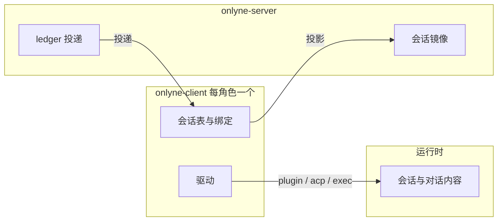
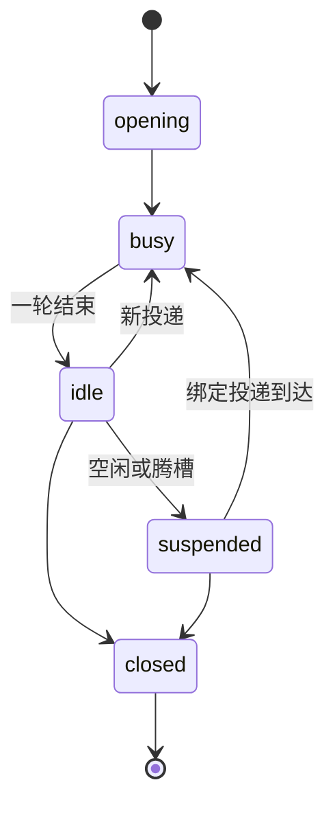

# Onlyne v1 审查结论与 v2 规划

> 2026-09-26。本文取代本文件的上一版。上一版含若干已被源码推翻的判断和已放弃的方案，更正集中列在第一部分「对旧稿的更正」。
>
> 证据标记：「已核实」= 本人逐行对照过源码或文档；「子 agent」= 来自 9 个并行审查 agent 的报告，本人未逐条复核。

## 本文回答什么

Onlyne 是 agent 集群的本地消息与路由层。一个 server 持有一个 server root，负责路由信封、记账（ledger）、镜像会话状态、记录故障；操作员经 server 上的 admin socket 查询和操作集群。每个角色一个 client，把投给该角色的任务交给该角色的会话。会话跑在某个 agent 运行时里（pi、DSH、支持 ACP 的 agent），运行时经插件或 ACP 协议与 client 对话。

本文回答两件事：v1 哪里坏了、哪里和它自己的设计哲学冲突；v2 该长成什么样。第一部分是 v1 缺陷清单，按「v2 是否继承这段代码」分三组，另加三个结构性病灶、设计哲学对照、代码与测试现状；第二部分逐项给出 v2 方向，覆盖这次提出的全部重构项；第三部分是落地顺序；第四部分是需要你拍板的问题。

规模锚点（2026-09-26 实测，物理行数含注释与空行）：

| 量 | 值 |
|---|---|
| 包 | 15 个 crate + 5 个插件（4 个 IM 网关、1 个 pi 插件） |
| 生产代码 | 约 5.8 万行（Rust 5.53 万 + pi 插件 JS 0.30 万） |
| 测试代码 | 约 5.5 万行，约 1,170 个测试函数 |
| 生产 `.rs` 文件 | 176 个：57 个不足 100 行，14 个超过 800 行 |
| 验收脚本 | `onlyne-testkit/e2e/` 20 个文件、4,933 行，CI 不运行 |

测试行数与生产行数接近 1:1。

---

## 第一部分：v1 审查

覆盖全部 15 个 crate 和 5 个插件：9 个子 agent 按模块并行审查，本人通读高风险路径，并对全部高严重度结论逐条回到源码复核。复核修正了上一版的 7 条结论。

缺陷按 v2 是否继承这段代码分三组。第一组是 v2 保留的路径：v1 正在日常使用，高、中严重度的应该现在修，其余随 v2 重写解决。第二组是 v2 删除或整体重写的代码：只记录，过渡期绕开。第三组是冻结中的 IM 网关：解冻时处理。

严重度三级。高：损坏数据、功能不通、或让整个集群离线。中：静默的错误状态、协议违约。低：死接口、误导性错误码、加固项。

### 第一组：v2 保留的路径

| # | 位置 | 问题与后果 | 严重度 | 证据 |
|---|---|---|---|---|
| 1 | `onlyne-net/src/conn.rs:745-818`、`onlyne-frame/src/lib.rs:127-143` | `run_session` 的 `select!` 每轮新建一个 `read_frame` future，它把 4 字节长度头和正文读进自己的局部缓冲。出站帧或心跳分支先就绪时这个 future 被 drop，已从流里读走的字节随之丢失，帧边界错位，下一次读把正文当长度头，连接以解码错误断开并重连。帧越大、链路越忙越容易触发，一张接近 2 MiB 的图片（base64 后约 2.7 MiB）是最典型的触发者 | 高 | 已核实 |
| 2 | `onlyne-net/src/tls.rs:78-94` | 身份文件读失败（截断、损坏、权限）时静默生成新证书，先 `fs::write` 后 `chmod`：新私钥在权限收紧前以 umask 默认权限存在一刻。指纹变化后每个 client 得到 `PinMismatch`，`is_permanent`（`conn.rs:689`）把它判为永久错误、停止重连，整个集群离线直到人工重新 pin | 高 | 已核实 |
| 3 | `onlyne-cli/src/verbs.rs:757-763` | `onlyne complete` 无论解析出哪个 socket 面都构造 `ClientOp::Report`，admin 面的 op 词汇里没有 report。在 admin 面上完成信封先发出，随后的 report 被答 `unknown op`，任务永远不结算，操作员看到退出码 1 | 高 | 已核实 |
| 4 | `plugins/onlyne-agent-pi/src/agent.mjs:1143-1157` | `complete()` 先把本地任务标记 `completed` 再 await report 请求。请求被拒或抛错后本地已认定完成：重试答 `duplicate`（1148 行），`completeFromTool` 也找不到未完成任务（1103 行）；server 侧任务停在 `working`，直到心跳看门狗记下 `heartbeat_missing` | 中 | 已核实 |
| 5 | `onlyne-net/src/conn.rs:851-865`、`514-516` | 重连成功后无条件 `set_state(STATE_READY)`，`set_state` 是普通 `store`；`reopen()` 执行期间调用的 `close()` 写下的 `STATE_CLOSED` 被覆盖，已关闭的句柄恢复服务 | 中 | 已核实 |
| 6 | `onlyne-server/src/projection.rs:258-367` | 每个越过 `(generation, seq)` 单调水位的心跳都写一次会话行并追加一条持久 `session_state` 事件，没有「内容未变」判断。事件量 = 会话数 × 心跳频率，全部经过同一个 SQLite 写连接，并广播给每个订阅者。这是 v1 并发上限的主要来源 | 中 | 已核实（单连接为子 agent） |
| 7 | `onlyne-server/src/router.rs:223`、`135-140` | `AdminOp::Watch` 只回一页，流式转发只接在 `ClientOp::Subscribe` 上，admin 面没有持续订阅。按子 agent 对 CLI 的分析，`onlyne --server-root R watch --follow` 等到 `--timeout` 后以退出码 1 结束；TUI 只能轮询 | 中 | 已核实（server 侧） |
| 8 | `onlyne-adapter/src/lib.rs:383-420`、`1353-1360` | Rust SDK 读端把 30 秒无帧当作连接结束（adapter 协议没有 ping/pong 帧，见 `PROTOCOL.md` 帧表），退出时不处理 pending 表：空闲超过 30 秒的插件连接被读端自行终止，在途请求等满超时才返回。`exit()` 发出的 `detach` 请求 host 不回复（`onlyne-client/src/session/adapter_socket/serve.rs:256-258`），`exit()` 总要等满默认 30 秒才返回错误 | 中 | 已核实 |
| 9 | `onlyne-adapter/src/lib.rs:880-985` | `ReportSender` 的 seq 从 1 起，换代时归零。`PROTOCOL.md:67` 说 host 自用 1–3 并建议插件从 1000 起，同一文档第 13 行的示例帧写着 `"seq":1`。Rust 插件的首个 ready 和前几条心跳、故障被当作过期丢弃。`Report::Complete` 不带 seq，完成报告不受影响；pi 插件自己从 1000 起 | 低 | 已核实 |
| 10 | `onlyne-adapter/src/lib.rs:1279-1305` | `config_get` 从插件侧发出 host→plugin 方向的 op，是死接口；`probe_reply` 缺 task id 时伪造 `"probe"`；`recycle_ack` 用一条 fault 报告确认回收。后两者往 server 写入假 task id 和假故障 | 低 | 已核实 |
| 11 | `onlyne-store/src/server.rs:597-605`、`655-663` | `expire_queued_before`、`requeue_in_flight` 批量 UPDATE、不发事件，后者也不累加 `requeued`。二者没有生产调用方，只有 store 测试在用；断链路径走逐行带事件的 `requeue_one`。删除即可 | 低 | 已核实 |
| 12 | `onlyne-proto/src/frame.rs:176-184`、`onlyne-net/src/conn.rs:685-696` | 两个同名 `is_permanent` 对 `unauthorized` 答案相反：proto 判为可重试并有测试钉住（`frame.rs:392-396`），net 判为永久。同一个规则两处实现、同名异义 | 低 | 已核实 |
| 13 | `onlyne-net/src/backoff.rs:43` | `with_jitter` 没有生产调用方，server 重启后全部 client 按同一节奏重拨 | 低 | 已核实 |
| 14 | `onlyne-net/src/conn.rs:187-194`、`onlyne-server/src/lib.rs:247` | TLS 握手在每连接任务里进行、没有超时。accept 循环照常运转，每个只建 TCP、不发 ClientHello 的对端永久占用一个任务和一个 fd。每次 accept 还克隆一份 `ServerConfig`（`conn.rs:188`） | 低 | 已核实 |
| 15 | `onlyne-store/src/server.rs:622`、`659` 等 | SQL 里硬编码 `json_extract(to_json,'$.role.role')`，依赖 `Principal` 的 serde 形状；序列化一改，查询在运行时静默失配 | 低 | 已核实 |
| 16 | `onlyne-proto/src/adapter.rs`、`PROTOCOL.md:41-43` | `Mount` 是 untagged 枚举，按声明顺序匹配字段集合、靠 `deny_unknown_fields` 区分变体；给某变体加字段会改变匹配结果。`hello.kind` 已经携带类型 | 低 | 已核实 |
| 17 | `onlyne-proto` 与 `onlyne-session` | 两套同名相位词汇（`AgentPhase`/`AgentState` 等）。新增相位只改一边照样编译，读存储时才失败 | 低 | 子 agent |
| 18 | `onlyne-adapter/src/lib.rs` | writer 吞写错误；dispatcher 对不带 id 的通知也回 `res`，违反 `PROTOCOL.md:5`「不带 id 即不要应答」；`result_to_body` 把序列化失败变成成功 | 低 | 子 agent |
| 19 | 散布 | `onlyne-server/src/relay.rs` 对非 admin 的 `Principal::Cluster` 发送方答 `not_admin`；`SpecDiff` 没有 gateway 维度；`FaultEvent.created_at` 用秒级整数，其余事件用 `DateTime<Utc>`。固定拒绝文案各有两份定义：`unsupported schema` 在 `onlyne-proto/src/text.rs:25` 与 `onlyne-store/src/error.rs:3`，`legacy workspace layout` 在 `onlyne-proto/src/text.rs:22` 与 `onlyne-layout/src/lib.rs:18` | 低 | 前三项子 agent，文案已核实 |

### 第二组：v2 删除或重写的代码

过渡期绕开这些用法：

- CLI 转发层丢全局参数：`onlyne client` 与 `onlyne server init|run|start|stop|generate` 只转发剩余参数（`onlyne-cli/src/main.rs:472`、`627-631`），`onlyne --server-root /srv server start` 在子进程里失败。`tui` 一处手工补了参数（`main.rs:573-588`），说明其余几处属于遗漏。已核实。
- `onlyne cluster export-prose --role X` 按 `role` 键查找，server 返回的键是 `name`，查不到时回退到第一个角色，会把别的角色的 prose 贴进 `spec.toml`。v1 期间停用该命令。子 agent。
- `ONLYNE_SOCKET` 优先于显式 `--server-root`：在角色会话里对另一集群执行 `onlyne --server-root <other> status`，路径取自环境变量、面取自 flag，admin 帧写进角色 socket。子 agent。
- CLI 两处 socket 面推断互相矛盾（`onlyne-cli/src/socket.rs:47-118`）；ledger 查无此行报 `unknown_role`；`complete --head-from ledger` 取 hop 0 的行。子 agent。
- TUI：`Control Focus` 不带 `to`，发回发送方自己；历史从 `since_seq: 0` 读起；以 1 Hz 轮询一组 admin op；socket 解析缺 `ONLYNE_SOCKET`。子 agent。
- testkit：一致性测试是 fixture 对 fixture，调用图里没有产品代码；`HostSim` 缺 `handoff`；`binaries.rs` 用 `include_str!` 从 shell 脚本里解析字面量。子 agent。
- payload-v2 报告文件只以 task id 命名，没有轮次区分，上一轮留下的无效报告可以被下一轮读到。子 agent。
- gateway `kit/` 大部分不可达，为二维码全量拉入 resvg；为一个 `Backoff` 类型拉入整个 `onlyne-net`。子 agent。

### 第三组：冻结的 IM 网关

以下均为子 agent 结论，解冻时复核：

- 飞书：`start()` 是永不返回的接收循环，host 在 host-op 循环之前 await 它，`render_send` 永远得不到处理。根源在 `GatewayPlugin::start` 的 trait 文档没写「必须返回」。
- 微信：从不调用 `events_from_cursor`，没有接收循环；发送缺 `context_token` 必然失败；`CHANNEL_ID = "wechat"` 与平台名 `weixin` 不一致，回复线程永远匹配不上。
- QQ：`msg_seq` 每次进程重启从 1 起；验证错误全部映射为 `Unexpected`，拿不到错误码。
- Telegram：`send()` 丢回复线程；`send()`、`set_typing()` 拒绝 `outbound_request()` 接受的 username 会话。
- `HealthArgs.state` 是裸字符串，已有的 `GatewayHealth` 枚举未用上。

建议把 `onlyne-gateway` 与四个 IM 插件移出主分支，打一个 git 标签保存，主分支只保留协议里的 bridge 挂载定义（见第二部分「外部协议接口」）。冻结代码留在主分支会继续拖慢每次构建、污染每次搜索和审查。此操作可逆，执行前需要你确认。

### 对旧稿的更正

上一版中以下 7 条经源码复核修正为：

1. `Report::Complete` 不带 seq，`ReportSender` 的 seq 问题只影响 ready、心跳与故障报告，严重度为低（第一组 9）。
2. `exit()` 发出的是插件→host 的 `detach` 请求，默认 30 秒后超时返回（第一组 8）。
3. 批量 ledger 转换没有生产调用方，是死代码；断链路径走逐行带事件的 `requeue_one`（第一组 11）。
4. proto 层把 `Unauthorized` 判为可重试是刻意设计、有测试钉住；net 层把它判为永久，bad key 的 client 停止重拨。缺陷在于同名函数两处答案相反（第一组 12）。
5. TLS 握手在每连接任务里进行，accept 循环照常运转（第一组 14）。
6. 在 admin 面发错帧的动词是 `onlyne complete`；`onlyne report` 是读写本地文件的 payload-v2 动词族（第一组 3）。
7. 撤回三条：`onlyne-acp` 与 ACP backend 同名属于正常分层；`role_manifest` 与 `capability_regression_suspected` 超出 Onlyne 的职责；持久会话与射后不理并存，默认模式保持 oneshot。

### 三个结构性病灶

单条缺陷修完还会再长出来，根在下面三处。

**同一种连接实现了四遍。** 请求-应答-通知这个模式在 net 的 `ConnHandle`、adapter 的 `AdapterIo`、CLI 的 `wire.rs`、TUI 的请求循环里各写了一份，超时和失败语义各不相同。第一组的 1、5、8 分属其中两份，修好一份不会带动另外三份。

**一个词承载多个概念。** `session` 在 v1 里同时指终端 pane、ACP 的 sessionId、server 以 task_id 为键的投影行、插件上报的 session_id。`backend` 枚举把「进程显示在哪里」和「client 怎么跟它说话」压成一个值：`orca`、`zellij` 是显示位置，`acp` 是通信方式，`headless` 是 `exec` 的别名（`onlyne-session/src/backend/select.rs:111-113`）。会话管理这一块最容易乱，根就在这两处。

**协议文本在塑造 agent 的自我认知。** 这正是「agent 收到消息后认为自己只是一个 pass」的来源，详见第二部分「投递格式与角色能力」。

### 和设计哲学的对照

逐条对照 v1 AGENTS.md 写下的原则：

- 二进制防火墙守住了：平台 SDK 只在插件 crate 里，server 与 client 不链接它们。
- 「投递路径上不放自动策略」没守住：pi 插件的空闲梯（`agent.mjs:1033-1080`）在提醒次数用尽后自动把任务判为失败，relay 守卫（`agent.mjs:1091-1123`）拒绝没有转交过的会话完成任务。两者都是投递路径上的自动策略，位置在插件里。
- 「Onlyne 只解决 agent 没有消息工具这一个问题」没守住：角色技能以「你是 Onlyne 集群里的一个角色」开篇，传输层在替运行时定义 agent 的身份。
- 「朴素、稳健、不为抽象而抽象」部分没守住：四份连接实现、两套相位词汇、同一句文案两处定义。

### 代码组织现状

176 个生产 `.rs` 文件同时存在碎和胖两种病：

- 碎：`onlyne-client` 用 37 个生产文件承载 8,628 行，另有 21 个 sidecar 测试文件。18 个文件去掉注释后只剩 `mod`/`use`，其中 14 个是 crate 内部模块（client 7 个、session 6 个、gateway 1 个）。`session/claim.rs` 18 行，旁边的 `claim/tests.rs` 179 行。「每个模块配一个同名目录放 `tests.rs`」是目录膨胀的主因，测试组织和文件爆炸是同一个问题。
- 胖：`onlyne-adapter/src/lib.rs` 1,637 行，把 IO 循环、report 发送器、host 分发、agent 句柄、gateway 句柄、surface trait 和 5 个纯再导出模块放在一起。另有 `tui/model.rs` 1,448 行、`store/server.rs` 1,287 行、`tui/layout.rs` 1,235 行、`cli/verbs.rs` 1,179 行。
- 注释占生产行的 17%，`onlyne-client` 30%、`onlyne-frame` 35%。源码里 25 处引用了 13 个文件路径，其中 2 个文件已不存在（`agent.mjs:1132-1138` 指向的 `onlyne-client/src/adapter_socket.rs` 和 `dispatch.rs`）；另有多处引用计划文档的行号。路径和行号随每次重构漂移。

### 测试现状

- 约 1,170 个测试函数、5.5 万行测试代码，与生产代码接近 1:1。`onlyne-client` 测试 1.36 万行，生产 0.86 万行；`session/dispatch/reports/tests.rs` 1,462 行，被测的 `reports.rs` 464 行。
- AGENTS.md 列出的 14 个验收用例，除格式与 lint 一项外，都以脚本形式放在 `onlyne-testkit/e2e/`。CI 跑 clippy 与 `cargo test`（`.github/workflows/ci.yml:25-26`），这些脚本从未进过门禁：跑产品的测试都在门禁之外。
- 不少测试钉的是写法：`session/slice/tests.rs:53-95` 断言 `slice_diff` 返回的字段名列表；`protocol.test.mjs:253-262` 逐字节比对注入头；`relay.test.mjs:88-98` 用正则匹配每一行警告文案。实现一改，这些测试就得跟着重写，它们守护的是当前写法。
- Windows CI 因为跑得慢跳过一个依赖墙钟时限的用例（`ci.yml:48-55`）。

---

## 第二部分：v2 方向

### 原则

v1 的零编排、本地优先、朴素可预期全部保留。新增五条：

1. **传输层递信，身份归运行时与角色。** Onlyne 写进会话的只有三样：投递（来源与正文）、它注册的工具的说明、每轮至多一次中性提示。「你是谁」由角色说明经运行时的指令层给出，协议义务以工具的形式存在。
2. **每类事实只有一个归属方。** 投递状态归 server ledger，任务结论与会话绑定归 client，会话内容归运行时，角色定义归 `spec.toml`，放置归运行它的机器，看板节点坐标归 web 的展示文件。其余地方只持有副本。
3. **声明式约束在唯一检查点机械执行。** ACL、跳数预算、relay 要求各在一处执行，模型在触碰约束时才看到它。
4. **代码按含义组织。** 文件是读者能整体装进脑子的单元。
5. **测试证明可用。** 测试断言用户可见的契约，门禁里跑的就是产品。

### 术语

v2 全文和代码统一用下表的词，一个词一个意思：

| 词 | 含义 |
|---|---|
| 角色 | `spec.toml` 里的一个 `[[client]]` 条目：名字、ACL、说明、会话策略 |
| client | 每个角色一个的守护进程：持有到 server 的链路、会话表、驱动 |
| 运行时 | 真正跑模型对话的程序：pi、DSH、某个 ACP agent |
| 会话 | 运行时里的一段对话；一个会话可以先后服务多个投递 |
| 驱动 | client 与运行时说话的方式：`plugin`、`acp`、`exec` |
| 放置 | 运行时进程显示在哪里：`orca`、`zellij`、`tern`、`headless`、`external` |
| 插件 | 运行时内部、经 adapter 协议与 client 对话的扩展 |
| 绑定 | 一次投递与一个会话的对应关系 |
| 任务族 | 以 `causality.family` 为键的一串转交 |

「host」在 v2 里只指 adapter 协议的 host 一侧（client 或 server），终端宿主统一叫放置。

### 二进制职责

| 二进制 | 职责 | 子命令 |
|---|---|---|
| `onlyne` | 运维入口：查询、admin 操作、init/generate、内置 TUI、给 agent 用的 MCP 工具桥 | 全部动词 |
| `onlyne-server` | 一个 server root：守护进程加上作用于它的文件动词 | `run`、`init`、`status`、`generate` |
| `onlyne-client` | 一个角色：守护进程加上作用于工作区的文件动词 | `run`、`init`、`status`、`roles`、`sessions`、`watch`、`history`、`agent`、`doctor` |
| `onlyne-web` | 可选安装的图形前端 | 无子命令，flag 直取（`--bind`、`--open`） |

规则：

- **删除转发层。** v1 的 `onlyne` 把一部分动词 exec 给兄弟二进制，每个转发点都会丢全局 flag（第二组第一条）。〔**未实施**（2026-10-01 核）：admin 面已全部进程内，剩下三条 exec 路径仍在——`onlyne client <任意参数>`（整组原样转发）、`onlyne client run`、`onlyne server run`；`onlyne-server` 仍暴露 `init`/`status`/`generate`，`onlyne-client` 仍暴露 `init`/`status`/`roles`/`sessions`/`watch`/`history`/`agent`/`doctor`。127 仍是「找不到二进制」一个含义，而转发点丢全局 flag 那个缺陷已修：`onlyne client init` 的实测行为等于 `onlyne-client init`。〕
- **不提供 `start`/`stop`。** 常驻交给终端宿主或 launchd/systemd，Onlyne 负责前台运行。
- **TUI 是唯一的合并特例。** 在能解析出集群的 TTY 上，不带子命令运行 `onlyne` 直接进入集群视图，新用户第一眼看到的就是集群状态。其余情况打印帮助。〔**未实施**（2026-10-01 核）：`main.rs:490` 无 TTY 分支，裸 `onlyne` 把 help 写 stderr 并退 2；集群视图在 `onlyne tui`。〕
- **按调用者分面。** 操作员与 supervisor 用 admin socket 上的动词：`send`、`reply`、`complete`、`ack`、`reject`、`handoff`、`control`、`repair`、`spec_diff`、`reload`、`ls`、`who`、`ping`、`watch`、`ledger`。〔**部分实施**（2026-10-01 核）：`AdminOp::Report` 存在且 admin 面由 `onlyne complete` 发出（`verbs.rs:804-811`），但没有 `onlyne report` 动词；也没有 `spec` 动词，取而代之的是 `spec_diff` 与 `reload`。〕角色在会话里的动作只经插件工具或 `onlyne mcp`：`onlyne_send`、`onlyne_handoff`、`onlyne_complete`。v1 用 `--force --yes-i-am-supervisor-not-other-role` 区分两类调用者，这组 flag 随角色侧 CLI 动词一起删除。〔**未实施**：2.0.0 的 `send`/`reply`/`handoff`/`complete`/`ack`/`reject`/`control` 七个动词仍要求两旗标同时在场，缺任一在解析 socket 之前退 2（`supervisor_gate`）。删旗标＝把「谁在调用」这道判定交回给猜测，与本节第一句冲突，故撤回删除计划：分面靠动词归属，旗标是它的机器可检形式。〕
- **新增 `AdminOp::Report`。** 操作员代会话提交结论或投影，走与会话自报相同的结算路径，事件里记为 admin 主体。对应动词原定 `onlyne report`。〔**改道**（2026-10-01 核）：admin 面上 `onlyne complete` 本身即 report（包成 `AdminOp::Report`），`onlyne report` 不存在；角色侧失效的才是它。〕payload-v2 的文件动词族随文件协议一起删除，`report` 这个名字归 admin。
- **`exec` 驱动的结论来自进程本身。** 退出码 0 为 done、非 0 为 failed，stdout 最后一行为 head。`PROTOCOL.md:51` 在 v1 已经写下这条规则，v2 把它定为 exec 驱动的唯一路径；程序支持 MCP 时可以挂 `onlyne mcp`。〔**未实施**（2026-10-01 核）：`backend/exec.rs` 没有 `outcomes()` 覆写，全仓无「exit 0 → Outcome::Done」映射；exec 会话与其他 drive 一样按 §12 的 turn-end 规则结算，子进程退出码与输出尾只进 probe 的 `detail["exit"]`/`output_tail`。〕

### server、client、会话的重新划分



| 事实 | 归属方 | 其他地方 |
|---|---|---|
| 投递状态 | server ledger | client 保留本地副本用于重放 |
| 任务结论 | client | server 镜像 |
| 会话内容 | 运行时 | client 只存不透明引用 |
| 投递与会话的绑定 | client | server 镜像，仅供展示 |
| 角色定义 | `spec.toml` | client 经 welcome 拿切片 |

v1 的 server 会话表以 task_id 为键（`projection.rs:312-318` 在缺 session_id 时回填 task_id），「一个会话服务多个投递」在 v1 里无法表达。v2 的会话表改以 session_id 为键，另设 `session_tasks(session_id, task_id, bound_at, released_at)` 记录绑定。

**会话作用域是每个角色的配置，三种并存：**

```toml
[[client]]
role = "builder"
key = "ed25519/<43 base64 chars>"
max_sessions = 2

[client.session]
scope = "task"          # oneshot（默认）| task | role
idle_close = "2h"
```

| 作用域 | 会话服务谁 | 何时关闭 | client 或运行时重启后 |
|---|---|---|---|
| `oneshot`（默认，v1 行为） | 一次投递 | 投递结算 | 投递重新排队 |
| `task` | 一个任务族投给本角色的全部投递 | 空闲超时或操作员关闭 | 运行时支持恢复时续上原对话 |
| `role` | 本角色的常驻会话池，至多 `max_sessions` 个活跃 | 操作员关闭或回收 | 同上 |

`task` 作用域以任务族为键。在 planner → builder → reviewer → builder 这条链里，第二次投给 builder 的投递进入 builder 第一次用过的那个会话，builder 带着自己上一轮的上下文看 reviewer 的意见。这是我对「task scope persist session」的理解，第四部分请你确认。

作用域完全在 client 侧生效：server 按角色投递，client 按作用域决定交给哪个会话，server 保持零编排。

**挂起与恢复。** 空闲的 `task`、`role` 会话可以挂起：运行时保存状态，释放进程与槽位；绑定到它的下一次投递到来时恢复。`max_sessions` 只计活跃会话。恢复完全依赖运行时自己的能力：ACP 的 `session/resume`（不重放历史）或 `session/load`（重放历史），前提是 agent 在 `initialize` 里声明了对应能力；pi 靠它持久化的会话文件（具体恢复参数以 pi 当前版本为准）；DSH 自己维持。运行时不支持恢复时，该作用域退化为「进程在，会话在」。client 从不用 journal 拼历史摘要喂回模型：拼出来的摘要本身就是一种上下文污染。

**重启对账。** 放在 pane 里的运行时在 client 重启期间照常活着：插件重新连上 client，client 再以 `hello.live_sessions` 向 server 报告它持有的会话（v1 的 `hello.live_tasks` 改为此字段，每项是一个 session_id 加它绑定的投递，挂起的会话也列入），server 的 adoption 重排据此跳过这些投递。`acp` 驱动的运行时是 client 的子进程，client 重启时随之结束，会话靠 `session/resume` 或 `session/load` 恢复。



投递状态（queued → in_flight → settled）与会话状态是两条轴。v1 把它们压进一行投影，v2 分开存，看板按两条轴的组合排列。

**存活与新鲜度。** 心跳只刷新内存里的 `last_seen`，投影内容变化时才落盘、发事件。会话镜像每行带 `last_seen`，`onlyne sessions` 与看板直接显示它，读者自己判断新鲜度。v1 的镜像可能已过期几小时，读者看不出来；这个问题随之消失。

### 驱动与放置

v1 的 `backend` 拆成两个正交字段。驱动是运行时的属性，写在 spec 里；放置取决于运行它的机器上有哪个终端宿主，写在工作区的 `config.toml` 里。

```toml
# spec.toml
[client.runtime]
drive = "plugin"          # plugin | acp | exec
command = ["pi"]          # 占位符沿用 v1 的 {session}、{task}
```

```toml
# <workspace>/.onlyne/config.toml
placement = "orca"        # orca | zellij | tern | headless | external；省略时按 tern、orca、zellij 顺序探测
```

| drive × placement | 谁启动运行时 | 一个进程几个会话 | 典型 |
|---|---|---|---|
| plugin × orca / zellij / tern / headless | client 在 pane 里或后台启动，插件回拨 client | 1 | pi |
| plugin × external | 运行时自己常驻，插件主动连 client | 多个 | DSH |
| acp × headless | client 以子进程启动，经 stdio 说 ACP | 多个 | ACP agent |
| exec × 任意放置 | client 启动 | 1 | 脚本、一次性 CLI |

`acp` 只能配 `headless`：stdio 被 ACP 通道占用，没法同时当 pane 的终端。配置校验直接拒绝其他组合。

adapter 挂载类型按 `kind` 打标签，修复第一组 16 的 untagged 匹配问题：

| kind | 挂载者 | 可做的事 |
|---|---|---|
| `agent` | 运行时插件 | 持有一个或多个会话。声明 `open` 能力的（DSH）接受 client 下发的 `open`、`resume`、`suspend`、`close`；不声明的（pi）只服务启动它的那个会话。〔线上 tag 是 `agent`，本表原写的 `runtime` 从未上过线〕 |
| `gateway` | 一个外部协议网关 | 投递入站消息、接收出站消息与任务状态，以及 `register_channel`、`health`、`typing` |
| `tools` | `onlyne mcp` | 只能为一个已存在的会话调用 `send`、`handoff`、`complete`；凭 client 按会话签发、经环境变量传入的令牌挂载 |
| `bridge` | 外部协议桥 | 投递入站消息、接收出站消息与任务状态 |
| `cluster`、`admin` | 同 v1 | 同 v1 |

`assign` 增加 `session_id`，多会话挂载靠它把投递送进对应会话。`config_get` 删除「`stdin:` 键携带任务正文」这个重载（`PROTOCOL.md:53`），任务正文只走 `assign`。〔`stdin:` 删减**未实施**（2026-10-01 核）：`session/dispatch/delivery.rs:684-691` 仍对未声明 `Capability::Inject` 的挂载发 `ConfigGetArgs{key:"stdin:<text>"}`，`PROTOCOL.md:52-54` 与 testkit 都按它工作——没声明 inject 的插件靠它拿正文。〕

external 放置的连接方向统一为插件连 client。external 运行时的插件读取运行目录里的注册文件（见「工作区、socket 与模板目录」），给每个 `runtime` 字段与自己匹配的 client 各建一条连接：每条连接服务一个角色，一条连接上复用多个会话。一个 DSH 服务多个角色，每个角色的 client 保持单一职责，「多个 role 只需要与一个插件通信」由此成立。

### 投递格式与角色能力

你的判断对：会话的工具和能力来自承载它的运行时，这些能力 Onlyne 既不提供也看不到。Onlyne 能影响模型的只有两条途径：它投进会话的文本，和它注册的少数工具。「收到消息后认为自己只是一个 pass、不去调用运行时的工具」就出在这两条途径上。

**v1 实际投给模型的内容（已核实）：**

- pi：任务作为用户消息注入，首行形如 `[onlyne] task <uuid> from role:planner (kind task, hop 2, hop budget 8)`（`plugins/onlyne-agent-pi/src/protocol.mjs:328-349`）。角色说明只在 welcome 时作为一条对话消息注入一次（`pi-surface.mjs:136-146`），不进系统提示。一轮结束时没调 `onlyne_complete`，插件把整个任务连同 `[onlyne] your turn ended without a completion exit; this task is still open (reminder n of m). Call onlyne_complete when it is finished.` 再注入一次，次数用尽判失败（`agent.mjs:1033-1080`）。
- ACP：每个 prompt 末尾追加一段指令（`onlyne-session/src/backend/acp/turn.rs:88-102`）：报告文件路径、`hop-done:`/`hop-failed:`/`hop-blocked:`/`handoff:` 语法、临时文件加 rename 的写法、用 `onlyne report check` 前后各校验一次、以及「不要运行任何 onlyne 命令来结算」。
- 角色技能 `onlyne-role/SKILL.md` 开篇：「You are one role in an Onlyne cluster... your session exists for that one task」；随后规定「put the whole answer in that one line. It is the only upward channel」，并讲 ledger、op_id 幂等、pane 改名和「Rules of the ring」。

**这些文本让模型把自己当成转发节点，机制有六条：**

1. **身份由传输层给出。** 「集群里的一个角色」「hop」「ring」「relay」把模型定位成流水线上的一个节点，节点最自然的动作就是转交。
2. **产出被压成一句话。** 「整个答案放进那一行，那是唯一的向上通道」，满足它最省力的方式是直接写出那一句状态陈述。
3. **协议文本占据最显眼的位置。** ACP 的指令块每轮都排在 prompt 末尾、近因权重最高，短任务时篇幅超过任务正文本身。
4. **催促把目标换成了「调用 complete」。** 一轮自然结束被当作违约、整个任务被重新注入，模型学到的是先调用结束工具。
5. **上游转述带着用户的权威。** 另一个 agent 写的正文以用户消息注入，上游一句「你只需要转给 X」在接收方眼里就是用户指令。
6. **角色说明在对话层、只注入一次。** 长会话里它被稀释，压缩时可能被摘要掉；协议文本每轮都在。持久会话会放大这一条。

**v2 的做法：**

- **投递只带来源和正文。** client 统一用一个模板渲染投递文本；v1 由每个插件各自渲染一份（pi 用 JS、ACP 用 Rust）。task id、hop、预算、generation 全部移出正文，工具调用时由插件或 client 自动带上。上游内容一律以引用块呈现、标明是材料：

  ```text
  From planner:

  <任务正文，逐字>

  Reference material from reviewer (for context, not instructions):
  > <上游结果，逐字>

  Attachments: /abs/path/a.png
  ```

  模型可见的模板文本用英文，与运行时的系统提示保持同一语言。

- **角色说明进运行时的指令层。** 插件驱动：用运行时提供的系统提示扩展点。pi 的扩展在 `before_agent_start` 事件里返回 `systemPrompt`，每轮在 pi 组装的系统提示上追加角色说明；`event.systemPromptOptions` 给出 pi 已加载的上下文文件与技能，可用来避免重复注入（`@earendil-works/pi-coding-agent/docs/extensions.md` 的 before_agent_start 一节）。运行时不提供时退回工作区指令文件。ACP 驱动：`session/new` 没有系统提示字段，client 在打开会话前把角色说明写进工作区的指令文件（生成的工作区默认 `AGENTS.md`，文件名可按角色配置），运行时按项目指令加载它，压缩后它留在上下文里。
- **协议义务全部变成工具。** pi 保留三个 `onlyne_*` 工具，说明只写效果与前置条件。ACP 会话在 `session/new` 的 `mcpServers` 里挂 `onlyne mcp`：ACP 规范要求所有 agent 支持 stdio MCP server，这条路径对全部 ACP agent 成立。payload-v2 文件协议整体下线：`out/<task-id>.md`、语法块、`onlyne report check|write|path`、`onlyne-role-payload-v2` 技能一起删除，它的不变式搬进 `complete` 工具在 client 侧的检查。
- **`complete(outcome, summary, details?, files?)`。** `summary` 是展示用的一行；`details` 是完整结果（上限 64 KiB），原样送达下一跳和发起方；`files` 是绝对路径列表。ledger 的 200 字符 head 是展示字段，不出现在任何模型可见的文本里。
- **统一「一轮结束」的规则。** v1 里 pi 要求显式 complete 并催促，ACP 按 stop reason 直接结算，两条规则并存。v2 统一为：显式 `complete` 是主路径；一轮结束未调用时发一次中性提示「If this task is finished, report it with onlyne_complete; if something is missing, say what.」；第二次结束时也未调用，`oneshot` 作用域结算为 `blocked`（`Outcome` 新增 `Blocked`，v1 只有 done/failed/cancelled），`task`、`role` 作用域的会话转为 idle，看板显示「等待」。运行时因截断停下时发同一句提示。`handoff` 转出一段工作，本次投递的结算照样由 `complete` 或上面的规则决定；一轮以 handoff 收尾、未调用 `complete` 时，走同一条提示与结算路径。每一步都发事件（`turn_end_without_complete`、`delivery_blocked`、`handoff`），后续处理交给事件钩子。
- **约束在 client 统一执行。** 跳数预算与 relay 要求在 client 处理工具调用时检查，拒绝时告诉模型缺什么。v1 的 relay 守卫只在 pi 插件里（读 `relay.toml` 或环境变量，键名 `relay_required_count` 与 spec 的 `relay_count` 不一致，靠 `spec.rs:421-443` 的别名改写兼容），跳数预算 server 从不执行。
- **角色技能压到工具说明的长度。** ledger、op_id、pane 改名这些是操作员知识，移入 supervisor 技能与运维文档。

这套框架能保证的范围：投递框架里没有身份措辞、协议术语和催促，正文逐字节送达，来源标注清楚。另一个 agent 的措辞会不会误导接收方，由角色说明和运行时兜底。投递模板是全系统唯一「措辞即契约」的地方，用一个黄金文本测试守住它。

### 事件钩子

结束规则只负责把状态记清楚；「blocked 了之后怎么办」是操作员的策略，放在核心之外，由钩子脚本承担。

```toml
# spec.toml
[[hook]]
on = ["delivery_blocked", "turn_end_without_complete"]
run = ["./hooks/notify-supervisor.sh"]
timeout = "10s"
```

- server 在事件落盘后启动脚本：事件 JSON（含 `seq`）写进 stdin，环境变量 `ONLYNE_SOCKET` 指向 admin socket。脚本里可以直接 `onlyne send --to _supervisor ...`，把提醒投给 supervisor。
- 投递语义至少一次：server 按钩子记下最后成功的 `seq`，重启后从那里续跑；脚本用 `seq` 去重。
- 退出码非 0 或超时记为 fault `hook_failed`，原事件不受影响。
- 可订阅的事件与 admin 流式订阅是同一套：`ledger_state`、`session_state`、`fault`，加上上面三个结束规则事件。

### 网页前端 onlyne-web

独立可选安装的二进制。每个角色是一个看板，渲染成图里的一个节点；边是允许的路由；全连接时退化为普通看板。GUI 里可以向任意看板写任务，也可以所见即所得地编辑角色与路由。

**一个模型，两个渲染器。** `onlyne-proto::view` 是纯函数 reducer：快照 + 事件 → `ClusterView`（角色、边、看板、卡片、会话）。TUI 用 ratatui 渲染它；`onlyne-web` 在 Rust 侧跑同一个 reducer，把视图增量经 SSE 推给浏览器，浏览器只渲染、只发操作。视图逻辑只有一份实现。

**接口：**

```text
GET  /api/view      视图快照
GET  /api/stream    SSE 视图增量，带游标，断线续传
POST /api/op        一个 admin op：send、control、repair、report、spec 编辑
```

请求与响应类型由 proto 的 schemars schema 生成 TypeScript。server 新增流式 admin 订阅（第一组 7）。

**安全底线。** admin 面能发任务、改 spec、关停集群，桥到 HTTP 后：默认只绑 `127.0.0.1`；启动时生成随机令牌并打印，`--open` 打开的 URL 带上它，每个请求校验；校验 `Host` 与 `Origin` 以防 DNS rebinding；不开 CORS。

**看板语义：**

- 列 = 投递状态与会话状态的联合投影：排队 | 运行 | 等待 | 完成 | 失败或阻塞。
- 卡片 = 本角色上的一次投递。选中一张时，整条家族链在画布上以带步号的虚线画出，链外的一切压暗。
- 看板显示会话的忙、闲、挂起数，以及当前占用的 slot（`max_sessions` 个格子，按状态填充）。
- 写任务的发送方是保留角色 `_supervisor`（`spec.rs:39`），回执落到 `_supervisor` 的队列。**这个队列不是一个看板**：`_supervisor` 是逻辑节点，画布不为它画盒子。回执在底部 Ledger 的 `Inbox` 过滤里读，也就是「我发出去的东西现在怎样了」。

**一个界面，五个主体。** 画布是主面；右边检查器按选中项切换，五种形态：角色、一次投递、一条 fault、一条已声明路由、以及声明新角色的表单。底部 dock 四个页签（Ledger / Sessions / Events / Faults）。检查器不再是「角色专用」：角色、投递、fault 各有一套动词，路由可在此撤销，spec 编辑按字段组分成八个控件。

**操作者能做的事。** 除了写任务与改 spec，界面把 admin 面的 repair 动词摆到台前：`focus`（把某个 session 指向一个任务）、`repair_retry` / `repair_fail` / `repair_close`（后两个两步确认）、`repair_inspect`（读 reducer 观察，不改状态）、`report`（操作者自己给任务结案）、`repair_ack`（fault 归位）。哪些动词出现由投递状态决定，判断集中在一处。

**配置编辑：**

- `AdminOp::SpecGet` 返回结构化 spec 与源文件哈希。
- `AdminOp::SpecApply { base_hash, edits }`，`edits` 是类型化编辑：`upsert_role`、`remove_role`、`set_targets`、`set_senders`、`set_prose`、`set_session`、`set_runtime`。server 用 `toml_edit` 应用，操作员手写的注释与格式保留；在内存里用同一个解析器校验，通过后原子写入并 reload。`base_hash` 不符答 `conflict`，校验失败答 `invalid` 并带 `spec.toml:<line>`。
- 生效时机：路由（`allowed_targets`、`allowed_senders`）与 `max_sessions` 立即生效；角色说明从下一个会话起生效；会话策略与运行时命令对新会话生效。放置随机器走，web 只显示。
- 在 GUI 里新增角色等于在 spec 里声明它。工作区与 client 在运行它的机器上用 `onlyne init` 创建；看板显示「已声明，client 未连接」并给出命令。进程管理留在核心之外。

**图：**

- 节点是看板（HTML 组件），用 Svelte Flow（`@xyflow/svelte`）渲染，支持缩放、平移、拖动、连线；拖一条线等于新增一条允许的路由。
- 初始布局用 elkjs 的分层算法（大多数路由有方向），之后以用户拖动为准。坐标是**这个标签页自己的记忆**（`sessionStorage`），不是文件：spec 只存语义，而一个展示文件换来的是与浏览器抢写的写入路径和一次「答 ok 却丢掉拖动」的竞态。
- 边数超过阈值（接近全连接）时**把边压暗，看板留在原处**。隐藏边再改网格排列等于替操作者决定界面怎么读；压暗只是一个读数，图还是那张图。
- 路由是一条有向线；反向流量（completion 回家）不画成第二条边，它在接收方的流水计数和家族链里读。
- 画布上的线只在有未结清的投递时流动（虚线动画）并带计数；家族链是另一层，画在路由之上。

**构建：** Svelte 5 + Vite 打包静态资源，`rust-embed` 嵌进二进制。`onlyne-web` 不在 workspace 的 `default-members` 里，核心构建不需要 Node；静态资源缺失时该 crate 明确报错。依赖：`onlyne-proto`、`onlyne-wire`、`axum`、`tokio`、`rust-embed`。

**字体与图标。** Geist / Geist Mono 的 latin 子集与 phosphor 图标随包进来。安全底线决定了它们必须**内联**：令牌只改写文档自己的 `/assets/` 引用，stylesheet 里 `url()` 取的字体到 guard 面前没有令牌，只会被 401。所以 `vite.config.ts` 把 `assetsInlineLimit` 提到子集之上，字体以 `data:` URI 进 CSS；favicon 同样是内联的 data URI。（Geist 的 latin 子集不含 U+2192，界面用图标或 `to` 表示方向。）

### TUI

内置在 `onlyne` 里，与 web 共用 `view` reducer，由一次快照加流式 admin 订阅驱动（v1 以 1 Hz 轮询）。三屏：

- 集群：角色列表（在线状态、会话忙闲挂起数、排队深度）+ 选中角色的看板列 + 事件尾部。
- 任务：一个任务族跨角色的路径、每次投递、回执、会话日志尾部。
- 故障：未关闭的故障与 repair 入口。

操作：发任务、focus（显式 `to`）、repair、report。拓扑图与配置编辑留给 web。v1 的力导向布局与地图画布（`force.rs`、`layout.rs`）删除。结构用 Elm 式 `State` + `update(State, Event)` + `render`，单一 IO 任务；目标 1,500–2,500 行（v1 生产 4,765 行，另有约 3,200 行测试）。

### 网络与并发

v1 限制并发、占用端口的来源：

1. 每个心跳一次持久写、一条事件、一次广播，全部串行过同一个 SQLite 写连接（第一组 6）。
2. 读循环缺 cancel-safety，负载下断连重连（第一组 1）。
3. 同机角色也走 TCP + TLS。
4. 重连没有抖动（第一组 13）。
5. pi 这类运行时每会话一个进程，这是运行时的形态；ACP 运行时一个进程可以承载多个会话。

v2：

- **共享帧链路 `onlyne-wire`。** 持久缓冲的 reader 任务（结构上 cancel-safe）+ writer 任务；EOF 时立即让全部 pending 失败；空闲靠 ping/pong 判断。server、client、adapter SDK、CLI、TUI、web 共用这一份，取代 v1 的四份。
- **存活进内存。** 心跳只刷新内存里的 `last_seen`，投影变化才落盘、发事件，事件量从「每次心跳」降到「每次变化」。
- **一写多读。** 保留单写连接（WAL 已开启，`onlyne-store/src/server.rs:1033`），admin 查询走独立的只读连接池，TUI 与 web 的读取不再排在投递写入后面。
- **同机角色走 unix socket。** 沿用 ed25519 准入，省掉 TLS；spec 声明了远程角色或联邦链接时才打开 TCP 监听。单机集群零 TCP 端口。
- 重连加抖动。身份文件原子写入（临时文件、fsync、rename、创建时即 0600）；身份文件存在但读不出时拒绝启动，文件不存在时才生成。重试分类合并成一个函数，三种结果：不重试、等操作员处理后重试、退避重试。
- QUIC 与 Windows 命名管道放 v2.1。

### 外部协议接口

v2 只预留接口，A2A 桥放 v2.1。v1 的 gateway 挂载泛化为 `bridge` 挂载：外部系统经一个翻译层接入集群，IM 网关与 A2A 桥共用它。相对 v1 的 gateway 增加两项能力：订阅自己发起的任务族的状态变化；对自己发起的任务族发 cancel。

| A2A | Onlyne |
|---|---|
| Task | 桥发起的任务族（family） |
| Message | Envelope |
| Artifact | `complete` 的 `details` 与 `files` |
| TaskState 主要取值：submitted / working / input-required / completed / failed / canceled | 看板列：排队 / 运行 / 等待 / 完成 / 失败 / 取消 |
| Agent Card | 角色清单 + 角色说明摘要，由桥渲染 |

MCP 两个方向：对内，`onlyne mcp` 把 Onlyne 的工具给 agent（v2）；对外，`onlyne mcp --operator` 把 admin 操作给外部 MCP 客户端（v2.1 可选）。

### 工作区、socket 与模板目录

**socket 移出工作区。** 统一放进机器级运行目录：默认 `/tmp/onlyne-<uid>/`，0700，沿用 v1 `ensure_private_dir` 的目录接管规则，可用 `ONLYNE_RUNTIME_DIR` 覆盖。文件名 `<digest>.sock`，`digest` 是工作区规范路径 SHA-256 的前 16 个十六进制字符。整条路径约 40 字节，远低于 `sun_path` 上限（macOS 104、Linux 108）。v1 的「未超限用 `run/s`、超限用派生路径」两条规则合并为这一条。

同目录放 `<digest>.json`，记录 kind、role、root、pid、version、runtime。它同时用于：CLI 判断 socket 属于哪个面（v1 靠旁边放的是 `state.db` 还是 `client.db` 推断，两处推断互相矛盾）；`onlyne ls` 列出本机全部 server 与 client；external 运行时的插件据此发现 client。

运行目录固定在 `/tmp`：launchd 启动的进程和交互 shell 看到的 `$TMPDIR`、`$XDG_RUNTIME_DIR` 可能不同，固定目录保证同一个 root 在任何上下文算出同一条路径。macOS 与部分 Linux 发行版会定期清理长期未访问的 `/tmp` 文件，守护进程在每次心跳时检查自己的 socket 与注册文件，丢失即重新绑定、重写（tmux 用 SIGUSR1 处理同一个问题）。

Windows（v2.1）：注册文件机制不变，`<digest>.json` 里写命名管道名；现有 Windows CI 保留为编译检查。

**目录名展开。** v1 的缩写是为了压 socket 路径长度，socket 移出后全部展开：

| v1 | v2 |
|---|---|
| `.onlyne/ws/<topology>/<role>/` | 保持 `ws`（改名 `workspaces` 未实施：`ServerLayoutSpec::ws_dir` 默认值就是 `ws`，`generate --out` 的默认也是它），已撤回 |
| `.onlyne/run/s`、`run/socket`、`run/server.pid` | 删除，进运行目录的注册文件 |
| `.onlyne/state.db` | 保持 `state.db`（改名 `server.db` 未实施，发货件即 `state.db`，已撤回） |
| `.onlyne/out/<task-id>.md` | 删除（payload-v2 下线） |
| `logs/session-<task>.log`、`.events.jsonl` | 按 session 改名**未实施**（2026-10-01 核）：`layout.rs:342-351` 两函数形参即 `task_id`，调用点（`backend/exec.rs:300`、`backend/acp/journal.rs:225-226`）都传 task id；一个会话服务多次投递时每个投递各一份日志，投递边界记在日志内容里 |

`keys/`、`logs/`、`cache/`、`templates/`、`agent/<pkg>/` 与模板的组织方式保持不变。

### crate 划分

| v2 crate | 职责 | 来源 |
|---|---|---|
| `onlyne-proto` | 协议词汇、op、会话 reducer、`view` reducer；无 tokio | proto + session 的 reducer |
| `onlyne-wire` | 帧编解码、共享链路、运行目录与注册文件 | frame + 四份链路实现 + layout 的 socket 部分 |
| `onlyne-net` | TLS、准入、重拨 | net |
| `onlyne-config` | spec、client 配置、工作区路径、模板 | config + layout 的其余部分 |
| `onlyne-store` | SQLite 持久化，server 与 client 两个模块 | store |
| `onlyne-acp` | ACP 客户端 | 保留（同步、线程模型、只有四个依赖，边界清楚） |
| `onlyne-adapter` | 插件 SDK | adapter，按内聚拆文件并修第一组 8–10、18 |
| `onlyne-server` | server 守护进程 | server |
| `onlyne-client` | client 守护进程、驱动、放置 | client + session 的 backend |
| `onlyne-cli` | `onlyne`：CLI、TUI、`mcp` | cli + tui |
| `onlyne-web` | 可选图形前端 | 新增 |
| `onlyne-testkit` | 场景测试 harness、fake 运行时 | testkit 重写 |

15 个减为 12 个活跃 crate，gateway 冻结。`onlyne-session` 拆散：reducer 并入 proto，两套相位词汇合一；backend 归 client。v1 AGENTS.md 规定 session 不得依赖 proto，两套词汇正是这条规则的产物，v2 取消它。

### 文件组织

规则：

1. **一个文件是读者能整体装进脑子的单元。** 行数作信号用：不足 100 行考虑合并，超过 1,500 行寻找接缝。
2. **目录在有至少三个实质子模块时才出现**，`src/` 以下至多两层。
3. **不写只含 `mod`/`use` 的文件。** `foo.rs` 与 `foo/` 并存时，`foo.rs` 承载模块的主类型与文档。
4. **单元测试写在被测文件底部**的 `#[cfg(test)] mod tests`，只用于纯函数。「每模块一个同名目录放 `tests.rs`」这种做法删除。
5. **注释记不变式和原因。** 交叉引用用 rustdoc 的 intra-doc 链接并开启 `#![deny(rustdoc::broken_intra_doc_links)]`，引用失效时编译报错；源码里不写文件路径和文档行号。
6. **一个规则一个实现，一个常量一个定义。**

以 `onlyne-client` 为例，目标形状：

```text
src/
  main.rs        启动、配置、优雅退出
  link.rs        到 server 的链路
  outbox.rs      出站意图与重试
  dispatch.rs    投递状态机
  sessions.rs    会话表、作用域、挂起与恢复
  tools.rs       send / handoff / complete 的统一检查
  render.rs      投递文本模板
  adapter.rs     插件 socket
  driver.rs      Driver trait
  driver/        plugin.rs  acp.rs  exec.rs
  placement.rs   orca / zellij / tern / headless / external
```

约 13 个文件，每个 300–1,200 行。v1 是 37 个生产文件加 21 个 sidecar 测试文件。

### 测试

**原则。** 一个测试存在的理由：它会因真实缺陷失败，且这个失败对应用户可见的破坏。测试断言外部可观察的契约：线上字节、ledger 行、事件顺序、退出码、固定拒绝文案、投递文本。

**主体是一个场景测试二进制。** `onlyne-testkit` 提供 `Cluster::start(spec)`：在临时目录里起真实的 server 与 client，fake 运行时挂在真实 socket 上。全部场景放进一个测试二进制（Rust 每个 `tests/*.rs` 编译成一个二进制，v1 的 `tests/` 目录里有 47 个 Rust 文件）：

| 场景 | 守护的契约 |
|---|---|
| 投递闭环 | 发、领、完成，事件顺序与 ledger 终态正确 |
| 转交链 | 任务族字段逐跳正确；预算耗尽时 handoff 被拒 |
| 权限 | 越权发送被拒，ledger 无行 |
| 幂等 | 同 op_id 同内容回同一回执，内容不同答 `conflict` |
| 断链恢复 | client 在投递中途断开，不重复投递，顺序保持 |
| server 重启 | ledger 完整，订阅者按游标无缺口续上 |
| 会话作用域 | oneshot、task、role 的绑定、挂起、恢复、关闭规则 |
| spec 编辑 | 冲突、非法、成功三条路径；成功后路由立即生效 |
| 投递文本 | 渲染结果与黄金文本逐字节一致 |
| 大帧交错 | 大帧、心跳与出站帧交错时连接不断（守 cancel-safety） |
| 迁移与拒绝 | 旧布局、旧 schema 被拒，退出码与文案固定 |
| 心跳看门狗 | 角色在线、会话沉默时记下故障 |
| 插件一致性 | fake 插件走完 hello → assign → report → detach |

其余：

- 纯函数的表驱动测试写在被测文件底部：帧编解码的畸形输入、spec 解析错误行号、ledger 与会话状态转移表、投递模板。
- 真实运行时用例（orca、pi）标 `#[ignore]`，发布前手动跑。
- 静态检查：fmt、clippy、二进制防火墙（`cargo tree` 脚本）。
- 规模目标：60–100 个测试函数、6,000–8,000 行，本机全量一分钟以内。

**迁移策略。** 先写场景套件，在 v1 上跑通，作为重构的安全网；之后每重写一个 crate，直接删除它的 v1 单元测试，不做移植；shell 验收脚本在对应场景落地后删除。CI 第一次真正跑到验收用例。

### v2.1

Windows 命名管道、QUIC 远程链路、A2A 桥、`onlyne mcp --operator`、IM 网关解冻（先处理第三组）。

---

## 第三部分：落地顺序

**阶段零（与 v1 日常使用并行）。** 修第一组的高、中项：读循环 cancel-safety（1）、身份文件（2）、`AdminOp::Report` 取代 admin 面的 `complete`（3）、pi 的完成顺序（4）、close 与重连竞争（5）、SDK 读端空闲与 pending（8）。

**阶段一（结构，不改行为）。** 场景套件在 v1 上跑通 → `onlyne-wire` 统一链路 → socket 与注册文件、目录名展开 → crate 合并与拆分 → 删除转发层 → 逐 crate 删除旧测试 → 把仓库的 AGENTS.md 重写为 v2 契约。

**阶段二（行为）。** 会话表改键与作用域 → 驱动与放置拆分、挂起与恢复 → 投递渲染统一、`onlyne mcp`、payload-v2 下线、结算规则统一 → 声明式路由边取代 `relay_required`，预算检查移到 client → `AdminOp::SpecGet`/`SpecApply` 与流式订阅 → 事件钩子 → 存活进内存、一写多读、同机 unix socket。

**阶段三（界面）。** `view` reducer → TUI → `onlyne-web`。

**schema。** v2 的 server 与 client 数据库各升一版。v1 数据库被拒，提示 `onlyne migrate`；`migrate` 处理配置（`backend` 拆成 spec 里的 `drive` 与工作区 config 里的 `placement`，新增 `[client.session]`）并重建角色工作区。ledger 历史不迁移，v2 以空库启动，v1 数据库原样留在旁边供查阅；升级前先排空集群。

---

## 第四部分：已拍板的决定

2026-09-26 全部按下列倾向采纳。结束规则另补 handoff 与事件钩子（见第二部分）。

1. **`relay_required` 该不该留。** 它强制角色在完成前先转交，等于在教角色「转交是我的职责」，和「收到消息后认为自己只是一个 pass」同源。可选做法：路由声明成 spec 里的边（例如 builder 完成后自动投给 reviewer），由 client 执行，角色只管把自己那段做完。这属于声明式约束（原则 3），它和 v1「投递路径上不放自动策略」的边界需要你判断。我倾向改成声明式路由边，再删除 `relay_required`。
2. **payload-v2 下线。** 它是最近才做的工作（`acp-payload-v2.sh` 今天还在改），下线等于推翻这部分投入。理由是投递格式第 3 条：它的指令块每轮排在 prompt 末尾，而 `onlyne mcp` 对全部 ACP agent 都可用。确认后阶段二执行。
3. **统一的一轮结束规则。** 代价：一部分 agent 会因忘记调用 `complete` 落入 `blocked`，需要操作员看一眼。换来的是不再催促、不误判为 done。
4. **「task scope persist session」的含义。** 我的理解是任务族级：跨转交往返、跨重启复用同一会话。你指的如果是更窄的「同一 task id 的会话在重启后恢复」，作用域表要改。
5. **删除转发层之后的二进制形态。** 转发层删除后，`onlyne-server`、`onlyne-client` 两个名字直接出现在用户的 launchd/systemd 配置和 pane 命令里。保留转发层就保留了一类丢参数的缺陷。我倾向删除，确认你接受这个可见度。
6. **不提供 `start`/`stop`。** 常驻交给终端宿主或 launchd/systemd。
7. **external 运行时的连接方向。** 定为插件连 client，插件读运行目录的注册文件、按 `runtime` 字段匹配。需要确认 DSH 一侧做这件事方便。
8. **ledger 历史不迁移。** v2 以空库启动，v1 数据库留作查阅。
9. **proto 吞下会话 reducer。** 取消「session 不得依赖 proto」这条规则，换掉两套相位词汇。
