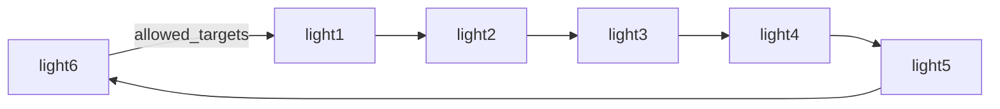

# Running lights

Six roles in one closed ring, one token, and twelve hops. Each role takes the token,
hands a *new task of the same family* to its neighbour with `onlyne handoff`, and settles
its own task; the last hop spends the chain's hop budget and answers `done`. Nothing here
is a model, a chat platform, or the Orca app: one server, six fake-backend clients, six
scripted agents, all on the loopback socket.

```bash
ONLYNE_BACKEND=fake BIN_DIR=target/debug bash crates/onlyne-testkit/e2e/running-lights.sh
```

The run takes about fifteen seconds, prints the twelve ledger rows below, and ends with
`PASS running-lights`.

## The ring



Each `[[client]]` entry names its two neighbours and no one else:

```toml
[[client]]
role = "light1"
allowed_senders = ["light6", "light2"]
allowed_targets = ["light2", "light6"]
```

`allowed_targets` carries the edge the token takes forward and the edge the receiver's
completion travels back on; `allowed_senders` is the matching half, because
`Spec::acl_edges` emits a pair only when both sides agree. A chord is refused before the
token moves: `light1` addressing `light4` answers `acl_denied` on `from.role`, and no
ledger row is written.

`light6` is both the ring's last hop and the token's origin, so the send that starts the
lights (`send --to light1`) is the wrap-around edge the ring already allows. That is why
the example needs no seventh role, no extra client, and no extra ACL pair.

## What an agent does per hop

Every light runs the same script, `crates/onlyne-testkit/scripts/running-light.json`:

```json
{"hello": {"capabilities": ["register", "report", "inject", "recycle"]},
 "repeat": true,
 "steps": [{"wait_assign": true},
           {"assert_prose_equals": "running lights"},
           {"echo_field_to": {"path": "assign.envelope.causality.hop", "file": "hops.log"}},
           {"report": "ready"},
           {"sleep_ms": 900},
           {"handoff": {"to": "{next_role}",
                       "text": "running-lights token, hop {next_hop}",
                       "max_hop": 11}},
           {"complete": {"outcome": "done", "head_from": "assign_body"}}]}
```

`handoff` runs the product's own `onlyne handoff` against the role's client socket, so the
next task is built by the shipped path: it reads the parent row back, hangs the new task
under `parent_task`, and sets `hop` to the parent's hop plus one. `max_hop` is the whole
stop condition — the agent that meets a task at hop 11 keeps it instead of passing it on,
which is what makes a twelve-task chain out of an eleven-hop budget. `{next_role}` is the
one value the script cannot name itself, so it arrives in the spawn environment
(`ONLYNE_NEXT_ROLE`), beside the workspace the agent was started with.

The `sleep_ms` is the light itself: while a role works the token, its session holds the
`working` state, which is what the TUI draws.

## The ledger the ring leaves behind

`onlyne --server-root <dir> ledger` shows twelve `task` rows, all `acked`, each one naming
its parent and its depth. The case prints exactly this table:

```text
hop  from     to       state  task      parent    head
0    light6   light1   acked  59e27563  -         running-lights token, hop 0
1    light1   light2   acked  99a92e33  59e27563  running-lights token, hop 1
2    light2   light3   acked  f6fbf866  99a92e33  running-lights token, hop 2
3    light3   light4   acked  a43fa53b  f6fbf866  running-lights token, hop 3
...
11   light5   light6   acked  c2418c5a  dfdd83a3  running-lights token, hop 11
```

Each task also gets a `completion` row back to the role that sent it, so the settled
ledger holds twenty-four rows: twelve tasks and their twelve receipts. `onlyne handoff`
reads `hop` off the parent row and writes the next one, which is why the column moves
`0..11` with no hole and why `parent_task` walks the chain from `hop 0` to `hop 11`. The
two ends are the ring closing on itself: `hop 0` starts at `light6`, which is where the
token comes back to at `hop 5` and `hop 11`.

## Two frames of the moving light

`onlyne-tui --once` renders one frame as plain text. The light is the `◐` glyph — a session
in the working state — inside a role's box. These are two real frames from one run, three
seconds apart:

```text
frame A, hop 1 in flight
│╭─light1*───────╮║  ╭─light2*───────╮   ╭─light3────────╮   ╭─light4────────╮   ╭─light5────────╮  ║╭─light6────────╮ │
││ 59e27563 ● 1s │╬═▶│ 99a92e33 ◐ 1s │══▶│               │══▶│               │══▶│               │═╗▶│               │ │
││               │╝  │               │   │               │   │               │   │               │ ╚▶│               │ │

frame B, hop 4 in flight
│╭─light1*───────╮║  ╭─light2*───────╮   ╭─light3*───────╮   ╭─light4*───────╮   ╭─light5*───────╮  ║╭─light6────────╮ │
││ 59e27563 ● 4s │╬═▶│ 99a92e33 ● 3s │══▶│ f6fbf866 ● 2s │══▶│ a43fa53b ● 1s │══▶│ af857e69 ◐ 1s │═╗▶│               │ │
││               │╝  │               │   │               │   │               │   │               │ ╚▶│               │ │
```

`◐` marks the role holding the token; `●` is a session that has already settled. Across the
two frames the light moves `light2` to `light5` while the ledger's one `in_flight` row moves
`light1 -> light2` to `light4 -> light5` — the same edge the graph highlights.

The `*` beside a name is not the light. A settled session stays warm for reuse, so every
role that has already served a task keeps its star for the rest of the run — by frame B
five roles carry one. That is why the case reads the `◐` and the ledger together instead of
trusting the star, and why the two frames it captures are always a different role.

## Where the pieces live

| piece | file |
| --- | --- |
| the case | `crates/onlyne-testkit/e2e/running-lights.sh` |
| the agent script | `crates/onlyne-testkit/scripts/running-light.json` |
| the script DSL (`handoff`, `repeat`, `echo_field_to`) | `crates/onlyne-testkit/src/lib.rs` |
| `handoff` and the hop it writes | `crates/onlyne-cli/src/verbs.rs` (`handoff_causality`) |
| hop persisted and read back | `crates/onlyne-store/src/server.rs`, `crates/onlyne-server/src/relay.rs` |
| the graph | `crates/onlyne-tui/src/layout.rs` |
