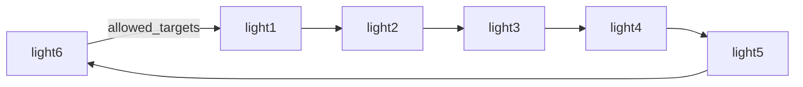

# Running lights

Six roles form one closed ring. One token travels twelve hops. Each role takes the token, hands a
*new task of the same family* to its neighbour with `onlyne handoff`, then settles its own task.
The last hop spends the chain's hop budget and answers `done`. Nothing here is a model, a chat
platform, or the Orca app: one server, six fake-backend clients, six scripted agents, all on the
loopback socket.

```bash
ONLYNE_BACKEND=fake BIN_DIR=target/debug bash crates/onlyne-testkit/e2e/running-lights.sh
```

The run takes about fifteen seconds. It prints the twelve ledger rows below and ends with
`PASS running-lights`.

## The ring



Each `[[client]]` entry lists its two neighbours and nobody else:

```toml
[[client]]
role = "light1"
allowed_senders = ["light6", "light2"]
allowed_targets = ["light2", "light6"]
```

`allowed_targets` holds two edges: the one the token takes forward, and the one the receiver's
completion travels back on. `allowed_senders` is the matching half. `Spec::acl_edges` emits a pair
only when both sides agree. A chord never moves: `light1` addressing `light4` answers `acl_denied`
on `from.role`, and no ledger row is written.

`light6` is both the ring's last hop and the token's origin. The send that starts the lights
(`send --to light1`) is therefore the wrap-around edge the ring already allows. So the example
needs no seventh role, no extra client, and no extra ACL pair.

## What an agent does per hop

Every light runs the same script, `crates/onlyne-testkit/scripts/running-light.json`:

```json
{"hello": {"capabilities": ["register", "report", "inject", "recycle"]},
 "repeat": true,
 "steps": [{"wait_assign": true},
           {"assert_prose_equals": "running lights"},
           {"echo_field_to": {"path": "assign.envelope.causality.hop", "file": "hops.log"}},
           {"report": "ready"},
           {"sleep_ms": 900},
           {"handoff": {"to": "{next_role}",
                       "text": "running-lights token, hop {next_hop}",
                       "max_hop": 11}},
           {"complete": {"outcome": "done", "head_from": "assign_body"}}]}
```

`handoff` runs the product's own `onlyne handoff` against the role's client socket, so the shipped
path builds the next task. It reads the parent row back, hangs the new task under `parent_task`, and
sets `hop` to the parent's hop plus one. `max_hop` is the whole stop condition: the agent that meets
a task at hop 11 keeps it instead of passing it on. That is what turns an eleven-hop budget into a
twelve-task chain. `{next_role}` is the one value the script cannot name itself, so it arrives in
the spawn environment (`ONLYNE_NEXT_ROLE`), beside the workspace the agent was started with.

The `sleep_ms` is the light itself. While a role works the token, its session holds the `working`
state, and that is what the TUI draws.

## The ledger the ring leaves behind

`onlyne --server-root <dir> ledger` shows twelve `task` rows, all `acked`. Each row names its parent
and its depth. The case prints exactly this table:

```text
hop  from     to       state  task      parent    head
0    light6   light1   acked  59e27563  -         running-lights token, hop 0
1    light1   light2   acked  99a92e33  59e27563  running-lights token, hop 1
2    light2   light3   acked  f6fbf866  99a92e33  running-lights token, hop 2
3    light3   light4   acked  a43fa53b  f6fbf866  running-lights token, hop 3
...
11   light5   light6   acked  c2418c5a  dfdd83a3  running-lights token, hop 11
```

Each task also gets a `completion` row back to the role that sent it, so the settled ledger holds
twenty-four rows: twelve tasks and their twelve receipts. `onlyne handoff` reads `hop` off the
parent row and writes the next one. That is why the column moves `0..11` with no hole, and why
`parent_task` walks the chain from `hop 0` to `hop 11`. The two ends are the ring closing on
itself: `hop 0` starts at `light6`, and that is where the token comes back to at `hop 5` and
`hop 11`.

## Two frames of the moving light

`onlyne-tui --once` renders one frame as plain text. The light is the `◐` glyph, a session in the
working state, inside a role's box. These are two real frames from one run, three seconds apart:

```text
frame A, hop 1 in flight
│╭─light1*───────╮║  ╭─light2*───────╮   ╭─light3────────╮   ╭─light4────────╮   ╭─light5────────╮  ║╭─light6────────╮ │
││ 59e27563 ● 1s │╬═▶│ 99a92e33 ◐ 1s │══▶│               │══▶│               │══▶│               │═╗▶│               │ │
││               │╝  │               │   │               │   │               │   │               │ ╚▶│               │ │

frame B, hop 4 in flight
│╭─light1*───────╮║  ╭─light2*───────╮   ╭─light3*───────╮   ╭─light4*───────╮   ╭─light5*───────╮  ║╭─light6────────╮ │
││ 59e27563 ● 4s │╬═▶│ 99a92e33 ● 3s │══▶│ f6fbf866 ● 2s │══▶│ a43fa53b ● 1s │══▶│ af857e69 ◐ 1s │═╗▶│               │ │
││               │╝  │               │   │               │   │               │   │               │ ╚▶│               │ │
```

`◐` marks the role holding the token. `●` is a session that has already settled. Between the two
frames the light moves `light2` to `light5`. The ledger's one `in_flight` row moves with it,
`light1 -> light2` to `light4 -> light5` — the same edge the graph highlights.

The `*` beside a name is not the light. A settled session keeps its star for the rest of the run, so by frame B five roles carry one. That is why the case reads the `◐` and the ledger together and never trusts the star, and why the two frames it captures always show a different role.

## Where the pieces live

| piece | file |
| --- | --- |
| the case | `crates/onlyne-testkit/e2e/running-lights.sh` |
| the agent script | `crates/onlyne-testkit/scripts/running-light.json` |
| the script DSL (`handoff`, `repeat`, `echo_field_to`) | `crates/onlyne-testkit/src/lib.rs` |
| `handoff` and the hop it writes | `crates/onlyne-cli/src/verbs.rs` (`handoff_causality`) |
| hop persisted and read back | `crates/onlyne-store/src/server.rs`, `crates/onlyne-server/src/relay.rs` |
| the graph | `crates/onlyne-tui/src/layout.rs` |

# 中文

## 流水灯

六个角色组成一个闭合的环。一个令牌经过十二次跳转。每个角色接管令牌，使用
`onlyne handoff` 将*同一族的新任务*移交给它的邻居，然后结算自己的任务。
最后一次跳转用完链路的跳转预算并返回 `done`。这里没有模型、聊天平台或 Orca
应用：一个服务器、六个 fake-backend 客户端和六个脚本化代理，全部运行在
loopback socket 上。

```bash
ONLYNE_BACKEND=fake BIN_DIR=target/debug bash crates/onlyne-testkit/e2e/running-lights.sh
```

运行大约需要十五秒。它会打印下面的十二条 ledger 记录，并以
`PASS running-lights` 结束。

## 环


每个 `[[client]]` 条目只列出它的两个邻居：

```toml
[[client]]
role = "light1"
allowed_senders = ["light6", "light2"]
allowed_targets = ["light2", "light6"]
```

`allowed_targets` 包含两条边：令牌向前经过的那条边，以及接收方返回
`completion` 时经过的那条边。`allowed_senders` 是与之匹配的另一半。只有双方
达成一致时，`Spec::acl_edges` 才会输出这一对。弦边永远不会传递：若 `light1`
向 `light4` 发起寻址，`from.role` 会返回 `acl_denied`，并且不会写入任何
ledger 记录。

`light6` 既是环上的最后一次跳转，也是令牌的起点。因此，启动流水灯的发送
（`send --to light1`）正是环已经允许的回绕边。因此，这个示例不需要第七个角色、
额外客户端或额外的 ACL 对。

## 代理在每次跳转时做什么

每个流水灯都运行同一个脚本 `crates/onlyne-testkit/scripts/running-light.json`：

```json
{"hello": {"capabilities": ["register", "report", "inject", "recycle"]},
 "repeat": true,
 "steps": [{"wait_assign": true},
           {"assert_prose_equals": "running lights"},
           {"echo_field_to": {"path": "assign.envelope.causality.hop", "file": "hops.log"}},
           {"report": "ready"},
           {"sleep_ms": 900},
           {"handoff": {"to": "{next_role}",
                       "text": "running-lights token, hop {next_hop}",
                       "max_hop": 11}},
           {"complete": {"outcome": "done", "head_from": "assign_body"}}]}
```

`handoff` 使用产品自身的 `onlyne handoff`，并针对角色的 client socket 运行，
因此发布版本的路径会构建下一个任务。它回读父记录，将新任务挂在
`parent_task` 下，并将 `hop` 设置为父任务的 hop 加一。`max_hop` 是整个停止
条件：在 hop 11 遇到任务的代理会保留该任务，而不会继续传递。正是这一点将十一跳
预算变成包含十二个任务的链。`{next_role}` 是脚本无法自行指定的唯一值，因此它会
通过 spawn 环境（`ONLYNE_NEXT_ROLE`）传入，与启动代理时使用的工作区相邻。

`sleep_ms` 本身就是流水灯。当角色处理令牌时，其 session 会保持 `working`
状态，TUI 绘制的正是这个状态。

## 环留下的 ledger

`onlyne --server-root <dir> ledger` 会显示十二条 `task` 记录，全部处于
`acked` 状态。每条记录都注明其父任务和深度。该用例会准确打印下表：

```text
hop  from     to       state  task      parent    head
0    light6   light1   acked  59e27563  -         running-lights token, hop 0
1    light1   light2   acked  99a92e33  59e27563  running-lights token, hop 1
2    light2   light3   acked  f6fbf866  99a92e33  running-lights token, hop 2
3    light3   light4   acked  a43fa53b  f6fbf866  running-lights token, hop 3
...
11   light5   light6   acked  c2418c5a  dfdd83a3  running-lights token, hop 11
```

每个任务还会得到一条指回发送角色的 `completion` 记录，因此结算后的 ledger
共有二十四条记录：十二个任务及其十二份回执。`onlyne handoff` 从父记录读取
`hop` 并写入下一条记录。因此，这一列会无缺口地经过 `0..11`，而
`parent_task` 会沿链从 `hop 0` 走到 `hop 11`。两端正是环重新闭合之处：
`hop 0` 从 `light6` 开始，而令牌也会在 `hop 5` 和 `hop 11` 回到这里。

## 移动流水灯的两个画面

`onlyne-tui --once` 会将一个画面渲染为纯文本。流水灯是 `◐` 字形，代表角色
框内处于 working 状态的 session。下面是同一次运行中相隔三秒的两个真实画面：

```text
frame A, hop 1 in flight
│╭─light1*───────╮║  ╭─light2*───────╮   ╭─light3────────╮   ╭─light4────────╮   ╭─light5────────╮  ║╭─light6────────╮ │
││ 59e27563 ● 1s │╬═▶│ 99a92e33 ◐ 1s │══▶│               │══▶│               │══▶│               │═╗▶│               │ │
││               │╝  │               │   │               │   │               │   │               │ ╚▶│               │ │

frame B, hop 4 in flight
│╭─light1*───────╮║  ╭─light2*───────╮   ╭─light3*───────╮   ╭─light4*───────╮   ╭─light5*───────╮  ║╭─light6────────╮ │
││ 59e27563 ● 4s │╬═▶│ 99a92e33 ● 3s │══▶│ f6fbf866 ● 2s │══▶│ a43fa53b ● 1s │══▶│ af857e69 ◐ 1s │═╗▶│               │ │
││               │╝  │               │   │               │   │               │   │               │ ╚▶│               │ │
```

`◐` 标记持有令牌的角色。`●` 表示已经结算的 session。在这两个画面之间，
流水灯从 `light2` 移到了 `light5`。ledger 中唯一的 `in_flight` 记录也随之移动，
从 `light1 -> light2` 变为 `light4 -> light5`——正是图中高亮显示的那条边。

名称旁边的 `*` 不是流水灯。已结算的 session 会在本次运行的余下时间里保留其
星号，因此到画面 B 时已有五个角色带有星号。这就是该用例会同时读取 `◐` 和
ledger、从不信任星号的原因，也是它捕获的两个画面始终显示不同角色的原因。

## 各部分所在的位置

| 部分 | 文件 |
| --- | --- |
| 该用例 | `crates/onlyne-testkit/e2e/running-lights.sh` |
| 代理脚本 | `crates/onlyne-testkit/scripts/running-light.json` |
| 脚本 DSL（`handoff`、`repeat`、`echo_field_to`） | `crates/onlyne-testkit/src/lib.rs` |
| `handoff` 及其写入的 hop | `crates/onlyne-cli/src/verbs.rs`（`handoff_causality`） |
| hop 的持久化与回读 | `crates/onlyne-store/src/server.rs`、`crates/onlyne-server/src/relay.rs` |
| 图 | `crates/onlyne-tui/src/layout.rs` |
